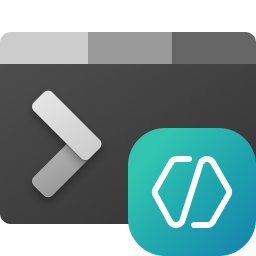
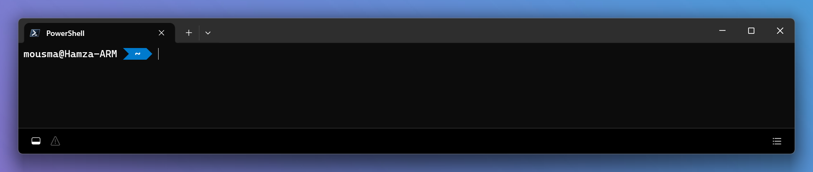
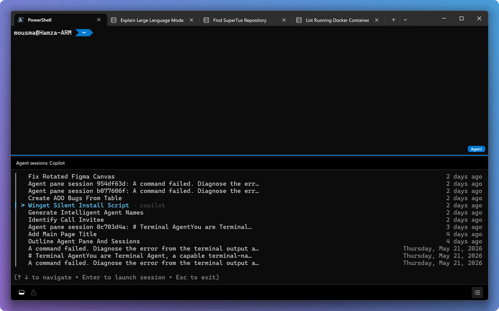

<p align="center">
    <picture>
      
    </picture>
</p>

# Welcome to the Intelligent Terminal repo

<details>
  <summary><strong>Table of Contents</strong></summary>

- [What is Intelligent Terminal?](#what-is-intelligent-terminal)
- [Installing and running Intelligent Terminal](#installing-and-running-intelligent-terminal)
  - [Microsoft Store](#microsoft-store-recommended)
  - [WinGet](#winget)
  - [Downloads](#downloads)
- [Get Started](#get-started)
- [Features](#features)
  - [Agent Status Bar](#agent-status-bar)
  - [Agent Pane](#agent-pane)
  - [Agent Management](#agent-management)
  - [Error Detection](#error-detection)
  - [Command Palette](#command-palette)
- [Keyboard Shortcuts](#keyboard-shortcuts)
- [Configuration](#configuration)
- [Data & Privacy](#data--privacy)
- [Building the Code](#building-the-code)
- [Additional Notes](#additional-notes)
- [Feedback](#feedback)
- [Contributing](#contributing)
- [Code of Conduct](#code-of-conduct)
- [Security](#security)
- [Telemetry](#telemetry)
- [Trademarks](#trademarks)

</details>

<br />

## What is Intelligent Terminal?

Intelligent Terminal is an experimental fork of [Windows Terminal](https://github.com/microsoft/terminal) with native agent integration.

[GitHub Copilot](https://github.com/features/copilot/cli/) is the default agent CLI, but it works with any [Agent Client Protocol (ACP)-compatible](https://agentclientprotocol.com/get-started/agents) agent CLI. All you need is to install your preferred agent CLI on your PC, and Intelligent Terminal should detect it.

Everything else about Intelligent Terminal is the same as [Windows Terminal](https://aka.ms/terminal-docs): tabs, profiles, themes, settings, shells, and keyboard shortcuts all work the way you expect.

---

## Installing and running Intelligent Terminal

> [!NOTE]
> Intelligent Terminal requires Windows 10 version 22H2 or later, or Windows 11.

You also need a supported agent CLI and subscription. [GitHub Copilot](https://github.com/features/copilot/cli/) is the default.

### Microsoft Store (recommended)

Install the [Intelligent Terminal from the Microsoft Store](ms-windows-store://pdp/?productid=9NMQC2SSJX24).
This allows you to always be on the latest version when we release new builds
with automatic upgrades.

### WinGet

[winget](https://github.com/microsoft/winget-cli) users can download and install
the latest Intelligent Terminal release by installing the `Microsoft.IntelligentTerminal`
package:

```powershell
winget install --id Microsoft.IntelligentTerminal -e
```

### Downloads

| Distribution | Architecture | Link |
|--------------|:------------:|------|
| App Installer | x64, arm64, x86 | [Download](TODO: insert link) |

---

## Get Started

### Install
Grab Intelligent Terminal from the [Microsoft Store](#microsoft-store-recommended), [WinGet](#winget), or [Downloads](#downloads).

### Pick your agent
On first launch, you'll choose your agent. Intelligent Terminal auto-detects [ACP-compatible](https://agentclientprotocol.com/get-started/agents) agent CLIs already on your machine (GitHub Copilot, Codex, Gemini, and others). If none are found, it defaults to GitHub Copilot CLI and installs it for you.

### Sign in
If you aren't already authenticated, the agent pane walks you through it.

### Go
Start asking questions. The agent has context on your shell output, no copy-pasting needed.

---

## Features

### Agent Status Bar

<p align="center">
  
</p>

The agent status bar sits at the bottom of the window and gives you quick access to everything agent-related. On the left: the agent pane toggle and the error detection icon, which lights up when a fixable error is detected. On the right: the agent management icon that opens your session management panel. It's a persistent, minimal control surface so you're never more than one click away from your agents.

### Agent Pane

<p align="center">
  
</p>

The core interaction in Intelligent Terminal is the agent pane: a context-aware, dedicated, configurable, docked pane with your agent CLI of choice. The pane has context on your shell output so there's no copy-pasting needed. This works across all your favorite shells in Terminal.

Show or hide the agent pane anytime with <kbd>Ctrl+Shift+.</kbd>. It's there when you need it and out of the way when you don't. Ask it to explain an error, then follow up with "try a different flag" and it keeps the thread going. If the agent needs to do multiple or complex tasks, it will spin up background tasks in new tabs so your active shell stays focused.

### Agent Management

<p align="center">
  
</p>

When you're running multiple agents across tabs or kicking off background tasks, you need a way to keep track of everything. The agent management panel gives you that at a glance. Click the agent icon in the status bar or press <kbd>Ctrl+Shift+/</kbd> to open it.

You'll see all your active agents and their current status, plus past sessions you can jump back into. Pick up a workflow where you left off, check on a long-running task, or dismiss completed ones.

### Error Detection

<p align="center">
  
</p>

When a command fails, Terminal picks it up. An indicator appears in the agent status bar: "Error detected." That opens the agent pane with the error context already loaded. The agent explains what happened and can suggest or auto-run the best fix.

Intelligent Terminal has a permission model you control: "always ask" (default), "ask once per agent," or "always allow for trusted agents." It's the same suggest-and-confirm approach as VS Code GitHub Copilot.

### Command Palette

<p align="center">
  
</p>

The Command Palette is another quick way to kick off an agent task. Type `?` followed by your prompt and Intelligent Terminal injects context from the active pane and starts the agent in a background tab so your shell isn't blocked.

```
? why did my build fail
```

---

## Keyboard Shortcuts

All shortcuts are customizable through terminal settings.

| Shortcut | Action |
|----------|--------|
| <kbd>Ctrl+Shift+.</kbd> | Toggle the agent pane |
| <kbd>Ctrl+Shift+/</kbd> | Open agent management |
| <kbd>Ctrl+Shift+P</kbd> | Open Command Palette (type `?<prompt>` to start an agent task, which will launch the prompt in a new tab with your chosen agent) |

---

## Configuration

Everything is configurable through terminal settings, under "Agent" settings.

<p align="center">
  
</p>

| Setting | Options |
|---------|---------|
| Agent and model | GitHub Copilot (default), or any ACP-compatible agent CLI, including custom or local agents. Configurable for both the agent pane and command palette. |
| Pane placement | Top, Bottom (default), Left, Right |
| Permission | Always ask (default), Ask once per agent, Always allow |
| Auto error detection | Give the agent pane the ability to catch and suggest fixes to errors automatically |

---

## Data & Privacy

Intelligent Terminal is a **local transport layer**. It passes your prompts and shell context to your selected agent CLI over stdio/ACP. Terminal does not call any cloud APIs itself, does not store conversation data to disk, and does not mediate or inspect what the agent CLI does with your data. 

### What data flows through Terminal

- Your prompts (what you type in the agent pane or command palette)
- Shell output context (recent command output shared with the agent for context)
- Basic environment metadata (shell type, OS version)

All of this is held in memory for the active session only and discarded when the session ends.

### Where your data goes depends on your agent CLI

| Agent CLI | Data routing | Terms |
|-----------|--------------|-------|
| [GitHub Copilot](https://github.com/features/copilot/cli/) (default) | GitHub backend | [GitHub Copilot Trust Center](https://resources.github.com/copilot-trust-center/). Enterprise protections (e.g., zero data retention) apply for eligible plans. |
| Third-party or custom agent CLIs | Determined by the agent vendor | Governed by that vendor's terms, not Microsoft or GitHub agreements. |

> [!NOTE]
> Terminal cannot guarantee data protections for third-party agent CLIs. When you select an agent, you're choosing where your data goes. Review your agent vendor's privacy policy before use. For more information on how to use GitHub Copilot responsibly, see [Responsible use of GitHub Copilot](https://docs.github.com/en/copilot/responsible-use/copilot-in-windows-terminal).

### Controls

- Choose your agent CLI at any time in Settings > Agent
- Disable auto error detection to prevent shell output from being sent automatically
- Intelligent Terminal always asks before running commands on your behalf

Intelligent Terminal only collects usage data and sends it to Microsoft to help improve our products and services. Read our [privacy statement](https://go.microsoft.com/fwlink/?LinkID=824704) to learn more. See [PRIVACY.md](./PRIVACY.md) for details and instructions on how to disable telemetry.

---

## Building the Code

Building Intelligent Terminal is the same as building Windows Terminal. See the [Developer Guidance](https://github.com/microsoft/terminal#developer-guidance) section of the Windows Terminal README for prerequisites, build instructions, and debugging steps.

---

## Additional Notes

### Why a separate app?

Intelligent Terminal ships as a separate app and installs next to your existing Windows Terminal. If you don't want agents in your terminal, nothing changes for you. With this model, we can learn, experiment, and iterate with you, the community, on what this evolution might look like without breaking your existing Windows Terminal flows.

### Terminal Chat deprecation

Intelligent Terminal is built from your feedback. We are focused on delivering agents based on the way developers actually use agents today. With this release, we are deprecating Terminal Chat in Canary. If you're currently using Terminal Chat, we recommend switching to Intelligent Terminal.

---

## Feedback

Intelligent Terminal is in an experimental stage. If you have a feature request or find a bug, [submit an issue](https://github.com/microsoft/terminal/issues) on the GitHub repository.

---

## Contributing

We are excited to work alongside you, our amazing community, to build and enhance Intelligent Terminal!

**Before you start work on a feature/fix**, please read & follow the [Windows Terminal Contributor's Guide](https://github.com/microsoft/terminal/blob/main/CONTRIBUTING.md). The contribution process is the same.

---

## Code of Conduct

This project has adopted the [Microsoft Open Source Code of Conduct](https://opensource.microsoft.com/codeofconduct/). For more information, see the [Code of Conduct FAQ](https://opensource.microsoft.com/codeofconduct/faq/) or contact [opencode@microsoft.com](mailto:opencode@microsoft.com) with any additional questions or comments.

---

## Security

If you believe you have found a security vulnerability in this repository, please report it following the instructions in [SECURITY.md](./SECURITY.md).

---

## Trademarks

This project may contain trademarks or logos for projects, products, or services. Authorized use of Microsoft trademarks or logos is subject to and must follow [Microsoft's Trademark & Brand Guidelines](https://www.microsoft.com/en-us/legal/intellectualproperty/trademarks/usage/general). Use of Microsoft trademarks or logos in modified versions of this project must not cause confusion or imply Microsoft sponsorship. Any use of third-party trademarks or logos is subject to those third-party's policies.
