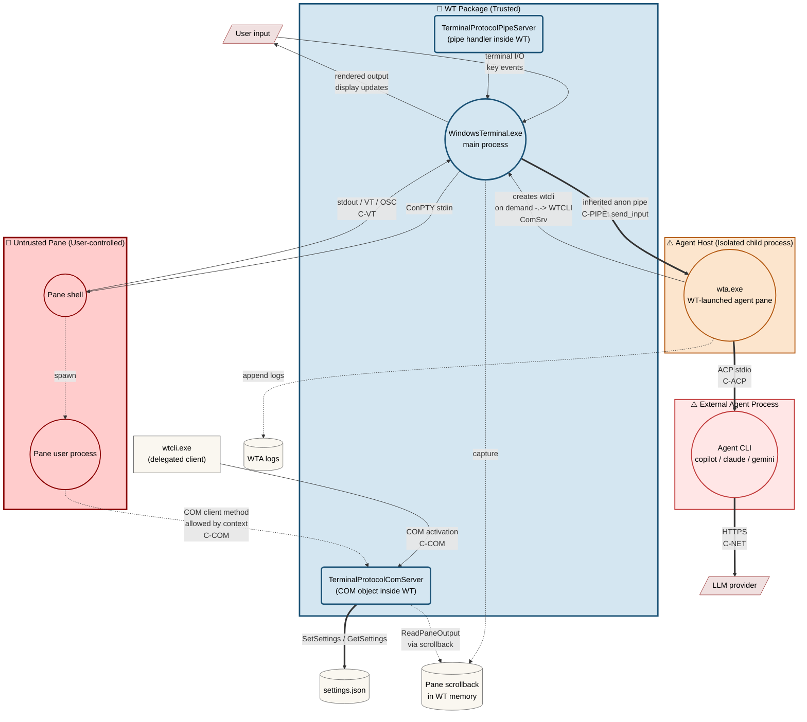

# Intelligent Terminal - Security Model & Threat Analysis

| Field | Value |
|---|---|
| **Document status** | Draft v1.1 |
| **Last updated** | 2026-05-11 |
| **Audience** | Microsoft internal security review |
| **Component** | Windows Terminal fork with embedded AI agents (WT + WTA + WTCLI) |

---

## 1. Executive Summary

Intelligent Terminal embeds AI agents into Windows Terminal. The security-sensitive capability is that agents can drive the user's terminal workflow: read pane output, create tabs or panes, and send input into shells.

The current model has two WT control planes:

1. **Terminal-scoped COM (`IProtocolServer`)** - used by `wtcli.exe`, WTA's fallback channel, and any direct COM client in an allowed activation context. This remains the main residual risk because it still exposes reads and several mutations.
2. **Per-WTA capability pipe** - an inherited anonymous pipe pair created by WT when it launches WTA. Direct shell input is routed here, not through COM.

Highest-priority residual risks:

| Risk | Why it matters | Current state |
|---|---|---|
| **Settings mutation over COM** | `SetSettings` can persistently weaken future agent behavior, including confirmation policies and agent command selection. | COM method exists; stock `wtcli.exe` has no verb, but a custom allowed COM client can call it. |
| **Create/split over COM** | `CreateTab` / `SplitPane` can spawn attacker-chosen commands as WT children. | Still exposed through COM and stock `wtcli.exe`. |
| **Prompt injection** | Capability transport proves that WTA is authorized; it does not prove the LLM's requested action is safe. | Confirmation policy exists, but defaults are currently `auto` and are not fully propagated/enforced. |
| **Scrollback/log disclosure** | Pane output and WTA logs can contain tokens, source code, prompts, or command output. | Redaction is not implemented. |

Key security claim: **shell input is capability-gated by inherited kernel handles**. An attacker that only has terminal-scoped COM access cannot directly forge the `send_input` pipe method. This does not remove the remaining COM mutation surface.

---

## 2. System Overview

### 2.1 Components

| Component | Process | Identity / boundary notes |
|---|---|---|
| **WT** (`WindowsTerminal.exe`) | Long-lived UI host | Packaged desktop app running at medium integrity in the current configuration. Package-local paths are storage layout, not a low-privilege isolation boundary. |
| **WTA** (`wta.exe`) | Agent-pane TUI / delegate orchestrator | Packaged and co-located with WT. Shell-control authorization is the inherited pipe handle, not package identity. |
| **Agent CLI** | `copilot`, `claude`, `gemini`, `codex`, custom | Third-party child process spawned by WTA. Treated as semi-trusted. |
| **WTCLI** (`wtcli.exe`) | CLI client to WT protocol | Package-private binary. Direct launch from ordinary external processes is denied by WindowsApps policy in tests, but a pane-launched process can call COM directly. |
| **TerminalProtocolComServer** | COM server inside WT | Registered as a local server class; exposes reads and several mutations. |
| **TerminalProtocolPipeServer** | Per-WTA pipe server inside WT | Accepts only pipe methods such as `hello` and `send_input` today. |

### 2.2 Communication channels

| Channel | Endpoints | Transport | Security control today |
|---|---|---|---|
| **C-COM** | `wtcli` / direct COM caller <-> WT | COM `IProtocolServer` (`CLSCTX_LOCAL_SERVER`) | Windows packaged-COM / terminal activation policy before method execution. Tested: ordinary external callers and arbitrary same-package callers were denied; Intelligent Terminal pane children were allowed. `WT_COM_CLSID` is a branding-routing hint only, not a secret or gate. |
| **C-PIPE** | WTA <-> WT | Two unidirectional anonymous pipes (one per direction), JSON-RPC over 4-byte little-endian frames | **Primary control:** kernel handle inheritance via `STARTUPINFOEX` + `PROC_THREAD_ATTRIBUTE_HANDLE_LIST` ensures only the launched WTA receives the handles. **Defense-in-depth:** WT-side handles are marked non-inheritable, and WTA scrubs `WT_PROTOCOL_PIPE_R/W` env vars and clears `HANDLE_FLAG_INHERIT` on its own copies so future grandchildren cannot inherit them. |
| **C-ACP** | WTA <-> Agent CLI | JSON-RPC over parent-created stdio pipes | No separate auth. The Agent CLI is intentionally trusted with its stdio handles. |
| **C-NET** | Agent CLI <-> LLM provider | HTTPS | Provider-managed auth/TLS; user data may leave the host. |
| **C-VT** | Shell <-> WT | ConPTY VT stream, including OSC marks | Not authenticated; pane output is attacker-controllable when the pane process is malicious. |
| **C-FS** | Processes <-> disk | `settings.json`, WTA logs | NTFS ACLs and package-local storage layout. This is not a sandbox boundary. |

### 2.3 Typical process tree

```text
WindowsTerminal.exe
+-- ConPTY -> user shell(s)
+-- ConPTY -> wta.exe agent pane
|   +-- Agent CLI
+-- hidden wta.exe delegate process(es)
    +-- Agent CLI
```

Per `TerminalPage`, there is at most one persistent shared agent-pane WTA. Delegation can create short-lived hidden WTA processes.

### 2.4 Data-flow diagram



Reading the DFD: the practical pane attacker path is `InPane -> COM -> WT/settings/scrollback`. The bold capability path is `WT <-> WTA` over inherited pipe handles; today it only carries direct shell input. Agent prompt context can flow from pane output to scrollback, through COM reads, through WTA and the Agent CLI, and then to the LLM provider.

### 2.5 Control-plane split

| Method group | COM (`IProtocolServer`) | Stock `wtcli.exe` verb | Per-WTA pipe |
|---|---:|---:|---:|
| `Authenticate`, `GetCapabilities` | yes | yes | `hello` only |
| `ListWindows/Tabs/Panes`, `ReadPaneOutput`, `GetActivePane`, `GetProcessStatus` | yes | yes | no |
| `GetSettings`, `GetSessionVariable` | yes | no current verb | no |
| `CreateTab`, `SplitPane`, `ClosePane`, `FocusPane`, events | yes | yes | no |
| `SetSessionVariable`, `SetSettings` | yes | no current verb | no |
| Direct shell input | no | no | yes |

This split is intentional only for shell input. The remaining COM mutations are residual risk until migrated to the per-WTA pipe or otherwise restricted.

---

## 3. Trust Boundaries and Assets

### 3.1 Trust boundaries

| Boundary | Flows | Enforcement |
|---|---|---|
| **WT <-> pane shell** | ConPTY stdin/stdout | ConPTY process isolation. WT injects terminal metadata such as `WT_SESSION`, `WT_PROFILE_ID`, and sometimes `WT_COM_CLSID`. |
| **WT <-> WTA pipe** | `send_input` and future capability-gated methods | Inherited kernel handles. Numeric env vars alone are not capabilities; invalid fake handles fail during inherit-flag clearing or I/O, and a valid unrelated handle still does not connect to WT. |
| **WTA <-> Agent CLI** | ACP stdio | Parent-created pipes. The Agent CLI is semi-trusted, so further leakage from that process is inside the Agent CLI trust boundary. |
| **WT <-> COM callers** | `IProtocolServer` calls | Platform COM activation policy. The practical allowed attacker context observed so far is a process launched inside an Intelligent Terminal pane. |
| **All <-> filesystem** | settings and logs | NTFS ACLs. Package-local storage affects location, not privilege isolation. |

### 3.2 Assets

| Asset | Sensitivity | Notes |
|---|---|---|
| Shell stdin | Critical | Ability to execute commands as the user. |
| `settings.json` | Critical | Can change agent binaries, delegate behavior, and confirmation policy. |
| Pane scrollback | Sensitive | May include secrets, command output, source, or copied file contents. |
| Process environment | Sensitive | May include customer secrets. `WT_COM_CLSID` itself is non-secret routing metadata. |
| WTA logs | Sensitive | Can include prompts, command lines, partial responses, and token-shaped data. |
| Inherited pipe handles | Sensitive | Possession grants per-WTA shell-input capability. |

---

## 4. Threat Actors

| Actor | Capability | Main goal |
|---|---|---|
| **In-pane process** | Runs as the user in a terminal pane; can read env, spawn processes, and use network. In tests, pane children could activate WT COM even without package identity. | Attack other panes, persist, or exfiltrate data. |
| **Prompt-injected LLM** | Can ask the semi-trusted Agent CLI/WTA to perform harmful actions. | Convert untrusted text into agent action. |
| **Compromised Agent CLI** | Runs as WTA child with normal user privileges and ACP stdio access. | Drive WT operations exposed to WTA. |
| **Drive-by settings modifier** | Can write `settings.json` through filesystem or COM. | Persistently weaken future AI-session controls. |
| **Stale protocol client** | Uses older `wtcli` / COM projection against newer IDL. | Mostly DoS or accidental misuse. |

Out of scope: kernel exploits, compromise of WT's own binaries, malicious logged-in user, and physical access.

---

## 5. Key Data Paths

### 5.1 Shell input path

```text
LLM / Agent CLI
  -> WTA RoutedChannel
  -> inherited pipe JSON-RPC send_input
  -> TerminalProtocolPipeServer
  -> TerminalPage target lookup by WT_SESSION GUID
  -> TermControl / ControlCore
  -> ConPTY stdin
```

Security guarantees:

| Step | Guarantee |
|---|---|
| WTA -> WT pipe | Only a process possessing the inherited handles can write valid frames to this channel. |
| Pipe method dispatch | Current allow-list accepts `hello` and `send_input`; unknown methods are rejected (`TerminalProtocolPipeServer.cpp:229,240`). |
| Target routing | `session_id` must parse as a non-empty GUID and match a pane by `Pane::FindPaneBySessionId`. |
| Final write | `ControlCore` honors read-only mode before writing to the connection (`src/cascadia/TerminalControl/ControlCore.cpp`, `SendInput` / `_sendInputToConnection`). |

Non-guarantee: if the Agent CLI or LLM is prompt-injected and WTA is authorized, the pipe correctly carries the malicious request. This must be controlled by confirmation, insert-only mode, rate limiting, and prompt hygiene.

### 5.2 Settings mutation paths

Two distinct paths can persistently change AI policy and agent selection:

**Path A — via COM:**
```text
in-pane process
  -> custom COM client
  -> IProtocolServer::SetSettings
  -> settings.json
  -> future WTA session reads weakened policy / attacker command
```

**Path B — direct file write (also reachable from a compromised Agent CLI):**
```text
attacker-controlled user-context process (in-pane shell, Agent CLI, etc.)
  -> overwrite %LOCALAPPDATA%\...\settings.json
  -> future WTA session reads weakened policy / attacker command
```

Path A is the highest-priority residual *architecture* risk, because it bypasses any future per-WTA capability gating that we add to other mutations. Stock `wtcli.exe` does not expose a `set-settings` verb, but the COM method remains callable by a custom COM client in an allowed terminal-launched COM context.

Path B is not a new privilege — the attacker already runs as the user — but it shares the *consequence* (persistently weakening AI policy without any in-band confirmation). Both paths therefore need the same meta-confirmation / policy-gating mitigation; technical controls limited to one path are insufficient.

---

## 6. Threat Table

| Threat | Category | Severity | Current control / gap |
|---|---|---:|---|
| COM caller spoofing | Spoofing | High | `Authenticate(token)` ignores its argument and unconditionally sets `_authenticated = true`. Only `Subscribe` and `SendEvent` enforce `_authenticated` (`TerminalProtocolComServer.cpp:738,757`); every read and every mutation method bypasses it. Platform COM activation policy is therefore the only effective gate. |
| `SetSettings` over COM | Tampering / EoP | Critical | JSON is validated and backups are created, but no user confirmation or per-WTA capability gate is enforced. |
| `CreateTab` / `SplitPane` arbitrary commandline | Tampering / EoP | High, Critical if cross-integrity method access is ever allowed or the user accepts UAC elevation | Same-integrity WT gives same-user process creation and persistence. Elevated WT cross-integrity access was denied in tests when requesting `IProtocolServer`, but should remain a regression test. |
| `ReadPaneOutput` over COM | Information disclosure | High | Returns arbitrary scrollback; no redaction. |
| `GetSettings` / topology reads | Information disclosure | Medium | Reveals settings, cwd, pids, pane and tab topology. |
| COM DoS | Denial of service | Medium | No per-method rate limit; tab/pane churn can exhaust user-visible resources. |
| Pipe handle leakage to grandchildren | Spoofing / EoP | High | **Primary control:** `PROC_THREAD_ATTRIBUTE_HANDLE_LIST` confines inheritance to the WTA-side handles; arbitrary grandchildren do not get them by default. **Defense-in-depth:** WT-side handles are non-inheritable, and WTA strips `WT_PROTOCOL_PIPE_R/W` and clears `HANDLE_FLAG_INHERIT` before spawning the agent CLI. Future spawn-site changes that re-enable broad `bInheritHandles=TRUE` without an explicit handle list would defeat the primary control. |
| Fake pipe handle env vars | Spoofing | Medium | Env vars are not capabilities. Fake or unrelated numeric handles do not connect to WT and fail during handle setup or I/O. |
| Oversized or malformed pipe frames | Tampering / DoS | Low | Both sides use 4-byte length frames with a 64 KiB cap. |
| Prompt-injected Agent CLI action | Tampering | High | Transport auth cannot solve this. Defaults are currently permissive (`auto`), and policy is not fully propagated. |
| Malicious Agent CLI binary | Supply chain / EoP | Medium | Built-in agent IDs can resolve through PATH / known locations; custom commands are explicit but not identity-pinned. |
| WTA logs contain secrets | Information disclosure | Medium | Logs are local files with no redaction or rotation guarantee. |
| Direct `settings.json` file write | Tampering | Critical | Inherits filesystem ACL behavior; no meta-confirmation for policy changes. |
| Crafted OSC marks for Autofix | Tampering | Medium | OSC 133 is shell-controlled. Execution still depends on agent recommendation and user interaction, but prompt injection remains relevant. |

### Notes on elevation

`CreateTab` / `SplitPane` must be described carefully:

| Scenario | Impact |
|---|---|
| Normal non-elevated WT | Same-user process creation, persistence, and detection evasion. Not a privilege gain. |
| Attacker already inside elevated WT pane | Additional admin child process creation. This is admin-level persistence, not a new elevation because the caller is already admin. |
| Medium-integrity external caller to elevated WT | Tested `IProtocolServer` activation returned `E_ACCESSDENIED`; keep as regression coverage because WT does not set an explicit `CoInitializeSecurity` descriptor. |
| Elevated profile selected | User-assisted elevation if the attacker can trigger a UAC-backed elevated profile and the user approves. |

### Note on `PROC_THREAD_ATTRIBUTE_HANDLE_LIST`

When `bInheritHandles=TRUE` is used with `PROC_THREAD_ATTRIBUTE_HANDLE_LIST`, inheritance is constrained to the listed handles. This is safer than `bInheritHandles=TRUE` without an explicit handle list; it is not safer than inheriting no handles at all.

---

## 7. Mitigations

| Mitigation | Status | Covers |
|---|---|---|
| Move direct shell input off COM and into the per-WTA inherited pipe | Implemented | Direct keystroke injection by COM/`wtcli` callers |
| Migrate critical mutations (`SetSettings`, `CreateTab`, `SplitPane`, `SetSessionVariable`, `ClosePane`, `FocusPane`) to per-WTA capability gating or add equivalent caller restriction | Planned | Main COM residual risk |
| Require confirmation for sensitive operations and for edits to confirmation policy itself | Partial / not enforcement-complete | Prompt injection, settings persistence |
| Default `aiIntegration.confirmation.inputOperations` and `createOperations` to `prompt` on fresh install | Not implemented; current defaults are `auto` | Prompt-injection blast radius |
| Strip `WT_PROTOCOL_PIPE_R/W` env vars and clear `HANDLE_FLAG_INHERIT` immediately in WTA | Implemented | Grandchild handle leakage |
| Length-framed pipe protocol with 64 KiB cap | Implemented | Pipe parser and memory DoS |
| Structured audit logging with WTA pid, source pane, target pane, and action type | Partial | Repudiation and incident response |
| Redact secrets in scrollback context and WTA logs | Roadmap | Exfiltration to LLM/log files |
| Insert-only mode for shell input recommendations | Partial | Reduces accidental execution; not universal for all `send_input` calls |
| Per-turn rate limit for shell-input calls | Roadmap | Agent runaway / prompt-injection loops |
| Pin or verify built-in Agent CLI binary identity | Partial | Agent CLI supply chain |
| Autofix opt-in / first-run hardening | Not implemented; `autoFixEnabled` defaults to `true` | Surprise background analysis and prompt-injection exposure |

---

## 8. Residual Risks

1. **Terminal-scoped COM mutation surface.** Until critical mutations move off COM or receive equivalent authorization, a pane-context COM caller can affect other panes and future AI behavior.
2. **Prompt injection.** The pipe proves the caller has WTA's capability; it does not prove the LLM request is safe.
3. **Settings persistence.** `settings.json` can persistently weaken confirmation policy and agent selection.
4. **Scrollback exfiltration.** `ReadPaneOutput` can pass sensitive pane text to WTA and then to the Agent CLI / LLM provider.
5. **Log disclosure.** WTA logs may contain prompts, partial responses, and command lines.
6. **Handle leak regression.** Current handle hygiene is strong, but future WTA spawn-site changes can reintroduce leaks if they enable broad handle inheritance.
7. **Platform-dependent COM security.** Cross-integrity COM behavior should be regression-tested with the real `IProtocolServer` IID or a harmless method such as `GetCapabilities`; `IUnknown`-only activation is not sufficient evidence.

---

## 9. Hardening Roadmap

| Priority | Item |
|---|---|
| **P0** | Move `SetSettings`, `CreateTab`, and `SplitPane` behind per-WTA capability gating or equivalent explicit authorization. |
| **P0** | Change fresh-install confirmation defaults from `auto` to `prompt`; enforce policy in WTA launch/runtime paths. |
| **P1** | Add meta-confirmation for changes to `aiIntegration.confirmation.*` and agent command settings. |
| **P1** | Add structured audit logging and log rotation. |
| **P1** | Add redaction for pane context and WTA logs. |
| **P1** | Add per-turn shell-input rate limiting. |
| **P2** | Migrate read methods (`ReadPaneOutput`, `GetSettings`, topology reads) after mutation methods. |
| **P2** | Tighten built-in Agent CLI resolution and binary identity checks. |
| **P3** | Consider explicit COM security descriptor / caller allow-list once legitimate callers are reduced. |

---

## 10. Open Questions

1. Should WT or helper processes run with a more restricted token or lower integrity level?
2. Can Agent CLI identity be verified without breaking user-installed CLI workflows?
3. Are WTA logs ever collected by telemetry or support tooling? If yes, redaction becomes mandatory rather than best effort.
4. Should `settings.json` ACLs be tightened beyond inherited per-user filesystem defaults?
5. How should third-party scripts that previously expected direct shell-input automation be handled?
6. Should WT set an explicit `CoInitializeSecurity` descriptor for the COM server instead of relying on platform defaults?

---

## 11. References

- `src/cascadia/TerminalApp/WtaProcessLauncher.{h,cpp}` - pipe creation and WTA launch
- `src/cascadia/TerminalApp/TerminalProtocolPipeServer.{h,cpp}` - inherited-pipe JSON-RPC server
- `src/cascadia/TerminalConnection/ConptyConnection.{h,cpp}` - agent-pane WTA launch with inherited handles
- `src/cascadia/WindowsTerminal/TerminalProtocolComServer.{h,cpp}` - COM surface
- `src/cascadia/TerminalProtocol/TerminalProtocol.idl` - protocol interface
- `wta/src/shell/wt_channel/pipe_channel.rs` - WTA inherited-pipe client
- `wta/src/shell/wt_channel/routed_channel.rs` - pipe-vs-COM method routing
- `wta/src/shell/wt_channel/cli_channel.rs` - `wtcli` fallback transport
- `src/tools/wtcli/main.cpp` - CLI surface
- STRIDE methodology
