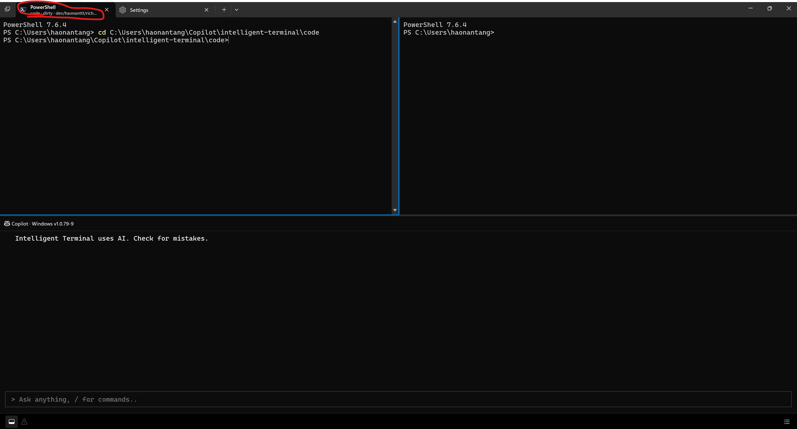
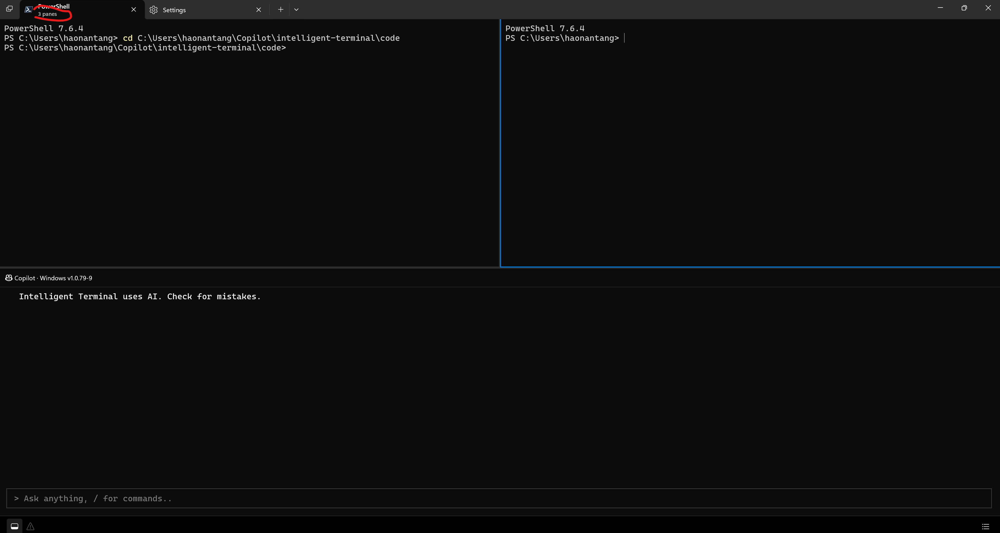
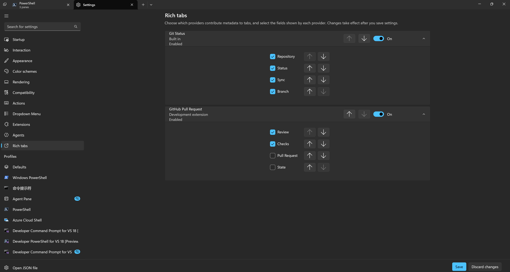

# Rich Tabs Provider Architecture Design V2

## 1. Purpose

This document focuses on two questions:

1. How Intelligent Terminal decouples the Rich Tab Infrastructure from Repository Awareness.
2. How first-party and third-party Providers are developed, integrated, and distributed.

## 2. Core Design

Rich Tab is a general-purpose contextual information platform, not a Git feature.

Repository Awareness is the first first-party Provider built on this platform. It is not part of the Rich Tab UI itself.

```text
Rich Tab Infrastructure
    = context + provider lifecycle + execution + validation + composition + presentation

Repository Awareness
    = a first-party provider that converts local Git state into Rich Tab fields
```

This boundary is the core of the design. TerminalApp and Tab do not need to understand the meaning of branch, dirty, ahead/behind, or pull request. They only process fields declared and returned by Providers.

## 3. Overall Architecture

```text
+------------------------------------------------------------------+
| Intelligent Terminal                                            |
|                                                                  |
|  Terminal session                                                |
|  - session ID                                                    |
|  - working directory                                             |
|  - shell context                                                 |
|  - lifecycle events                                              |
|         |                                                        |
|         v                                                        |
|  +----------------------+                                        |
|  |   ProviderBroker     |                                        |
|  |----------------------|                                        |
|  | Catalog              |                                        |
|  | Session state        |                                        |
|  | Scheduler            |                                        |
|  | Snapshot cache       |                                        |
|  | Field composition    |                                        |
|  +----------+-----------+                                        |
|             |                                                    |
|       +-----+----------------------+                             |
|       |                            |                             |
|       v                            v                             |
|  Built-in Catalog          Third-party Registry                  |
|       |                            |                             |
+-------+----------------------------+-----------------------------+
        |                            |
        v                            v
 First-party Provider        Managed / Development Provider
 - Git Status               - GitHub PR
 - future providers         - internal tools
        |                            |
        +-------------+--------------+
                      |
                      v
               Validated Snapshot
                      |
                      v
             Rich Tab Presentation
```

## 4. Rich Tab Infrastructure

### 4.1 Provider Contract

The Provider Contract defines the only supported communication mechanism between Terminal and a Provider.

It consists of three parts:

1. **Manifest**: Identifies the Provider, describes how it is launched and refreshed, and declares the fields it can return.
2. **Request**: Carries the current session context from Terminal to the Provider.
3. **Snapshot**: Contains the field values returned by the Provider for the current context.

The Infrastructure depends only on these general-purpose structures. It does not depend on the data model of Git, GitHub, or any other specific service.

### 4.2 Provider Catalog

The Catalog contains all Providers currently recognized by Intelligent Terminal.

It has two sources:

- **Built-in Catalog**: First-party Providers distributed with the Intelligent Terminal package.
- **Provider Registry**: Third-party Providers installed by users or registered for development.

### 4.3 ProviderBroker

`ProviderBroker` is the core of the Rich Tab Infrastructure.

It is a process-wide singleton responsible for:

- Combining the Built-in Catalog with the third-party Registry.
- Maintaining context for each terminal session.
- Converting pane, CWD, command completion, and tab activation events into Provider refreshes.
- Scheduling Provider execution.
- Validating and caching the latest Snapshot.
- Discarding stale results associated with an older session context.
- Producing the final Presentation according to Provider and field order.
- Publishing results to every Rich Tab attached to the session.

Multiple windows share the same Broker. The Settings UI must also access this Broker through TerminalApp.

### 4.4 Session Context

The Broker does not expose Tab or Pane objects to Providers. It supplies only a stable, minimal session context:

```text
sessionId
workingDirectory
workingDirectoryAuthoritative
shellType
activationReason
contextRevision
optional command result
```

### 4.5 Activation Events

A Provider declares the events it wants to receive in its manifest:

- `onPaneConnected`
- `onWorkingDirectoryChanged`
- `onCommandFinished`
- `onTabActivated`
- `onManualRefresh`

Terminal does not continuously poll Providers. The Broker requests a refresh only when an event declared by the Provider occurs.

This model allows each Provider to choose an appropriate execution cost:

- A local Git Provider can refresh when the CWD changes or a command finishes.
- A Pull Request Provider can refresh only when the CWD changes, a command finishes, or a tab is activated.
- A high-cost network Provider does not need to respond to every pane event.

### 4.6 Execution Model

A Provider is an external program launched on demand, rather than a plugin loaded into the Terminal process.

```text
Broker
    -> serialize request as JSON
    -> launch provider process
    -> write request to stdin
    -> read response from stdout
    -> validate response
    -> store Snapshot
```

This design was chosen because:

- Third-party code is not injected into the Terminal process as a DLL.
- A Provider crash does not directly corrupt Terminal memory.
- Providers can use PowerShell or other runtimes supported in the future.
- The Contract can be versioned independently.
- Terminal can enforce consistent timeouts and input/output limits.

At most one instance of the same Provider may run concurrently for a given session. If another refresh arrives while it is running, the Broker retains the latest request, preventing concurrent tasks from returning results out of order.

### 4.7 Snapshot

A Snapshot is the latest structured result produced by a Provider for a session context:

```json
{
  "protocolVersion": 1,
  "requestId": "<request-id>",
  "result": {
    "fields": {
      "branch": "main",
      "status": "dirty"
    },
    "tooltip": "Optional detailed information",
    "accessibilityText": "Repository on main branch with changes"
  }
}
```

Fields must be declared in the manifest in advance. Terminal verifies:

- Whether the field ID was declared.
- Whether the field type matches its declaration.
- Whether the request ID matches.
- Whether the protocol version is compatible.

An empty `fields` object means the Provider has no content for the current context. For example, the current directory may not be a repository, or the current branch may not have a pull request.

### 4.8 Presentation

Tab does not read Provider Snapshots directly. The Broker first combines fields from multiple Providers into a single Presentation:

```text
Provider order
    -> field order
    -> visible fields
    -> display text
    -> tooltip
    -> accessibility text
```

Tab consumes only the final result:

```cpp
struct Presentation
{
    std::wstring text;
    std::wstring tooltip;
    std::wstring accessibilityText;
};
```

As a result, adding a new Provider or field does not require changes to the Tab UI.

## 5. First-Party Provider Development and Distribution

### 5.1 Development Model

First-party Providers use the same manifest and protocol as third-party Providers.

This ensures that:

- First-party functionality does not depend on private UI interfaces.
- The public Contract is continuously exercised by the product itself.
- Third-party Providers do not become less capable, second-class extensions.
- Providers can be developed with the same `validate` and `test` tools before they are added to the package.

### 5.2 Package Distribution

First-party Providers are distributed with the Intelligent Terminal package:

```text
Intelligent Terminal package
└── RichTabProviders
    └── GitStatus
        ├── provider.json
        └── provider.ps1
```

### 5.3 First-Party Provider Identity

A built-in Provider is the authoritative implementation for its ID.

```text
built-in ID exists
    -> built-in wins
    -> third-party registration with same ID is shadowed
```

Even if the user disables the first-party Provider, a third-party Provider with the same ID cannot take over. This prevents a third party from impersonating a Microsoft Provider.

## 6. Third-Party Provider Development

### 6.1 Minimal Project

A third-party Provider requires at least:

```text
MyProvider
├── provider.json
└── provider.ps1
```

Developers do not need to:

- Modify the Intelligent Terminal source code.
- Link against a Terminal DLL.
- Use WinRT.
- Create UI.
- Maintain a persistent background service.

Developers only need to implement the manifest and the JSON stdin/stdout contract.

### 6.2 Manifest

Example:

```json
{
  "schemaVersion": 1,
  "id": "io.github.example.pr-status",
  "displayName": "GitHub Pull Request",
  "publisher": "example",
  "version": "1.0.0",
  "protocol": {
    "minVersion": 1,
    "maxVersion": 1
  },
  "runtime": {
    "type": "powerShellV1",
    "entrypoint": "provider.ps1",
    "arguments": []
  },
  "activationEvents": [
    "onWorkingDirectoryChanged",
    "onCommandFinished",
    "onTabActivated"
  ],
  "fields": [
    {
      "id": "pull-request",
      "displayName": "Pull Request",
      "type": "string",
      "defaultVisible": true
    },
    {
      "id": "checks",
      "displayName": "Checks",
      "type": "string",
      "defaultVisible": true
    }
  ]
}
```

The manifest is the static contract between a Provider and Terminal:

- `id` is a stable reverse-DNS Provider ID.
- `runtime` describes how to launch the Provider.
- `activationEvents` describes when to refresh it.
- `fields` describes the fields the Provider may return.
- `protocol` describes the compatible protocol range.

### 6.3 Request

The Provider reads a refresh request from stdin:

```json
{
  "protocolVersion": 1,
  "requestId": "42",
  "providerId": "io.github.example.pr-status",
  "method": "refresh",
  "params": {
    "processEpoch": 1,
    "sessionId": "session-id",
    "reason": "workingDirectoryChanged",
    "contextRevision": 5,
    "workingDirectory": {
      "value": "C:\\src\\project",
      "authoritative": true
    },
    "shellContext": {
      "type": "pwsh"
    }
  }
}
```

The Provider should treat each request as an independent computation and must not assume that any previous process or in-memory state still exists.

### 6.4 Response

The Provider writes exactly one protocol JSON object to stdout:

```json
{
  "protocolVersion": 1,
  "requestId": "42",
  "result": {
    "fields": {
      "pull-request": "PR #123",
      "checks": "CI passing"
    },
    "tooltip": "Add provider architecture",
    "accessibilityText": "Pull request 123, CI passing"
  }
}
```

Runtime logs must be written to stderr and must not be mixed into stdout.

### 6.5 Development Tools

The following workflow is provisionally supported:

```powershell
wtcli provider validate .\provider.json
wtcli provider test .\provider.json --cwd C:\src\project
wtcli provider register .\provider.json --dev
wtcli provider enable io.github.example.pr-status --accept-code-execution
wtcli provider list
```

Where:

- `validate` checks the manifest.
- `test` executes one refresh without launching the complete Terminal application.
- `register --dev` directly references the source directory, so developers do not need to copy the Provider again after modifying its script.
- `enable` explicitly authorizes Provider execution.
- `list` shows the current registration, source, and status.

`register --dev` is a development capability, not the formal installation flow for end users.

### 6.6 Developer Kit

To ensure third-party developers do not need to read the C++ source code, the Provider Contract should be released as a standalone Developer Kit:

```text
Rich Tab Provider Developer Kit
├── manifest-v1.schema.json
├── protocol-v1.md
├── provider-development.md
├── samples
│   ├── hello-world
│   └── github-pr
└── test-fixtures
    ├── requests
    └── expected-responses
```

The Developer Kit must explain:

- The meaning of every manifest field.
- When each activation event is raised.
- The request and response schemas.
- Field types and size limits.
- The meaning of an authoritative CWD.
- How to return an empty Snapshot.
- How to report errors.
- How to validate and test locally.
- How protocol versions evolve compatibly.

`wtcli provider validate/test` is the executable part of the Developer Kit.

## 7. Demo Screenshots

### 7.1 Rich Tabs Display
If we are in a git root folder


If we are not in a git root folder


### 7.2 How to customize content showing in tabs
