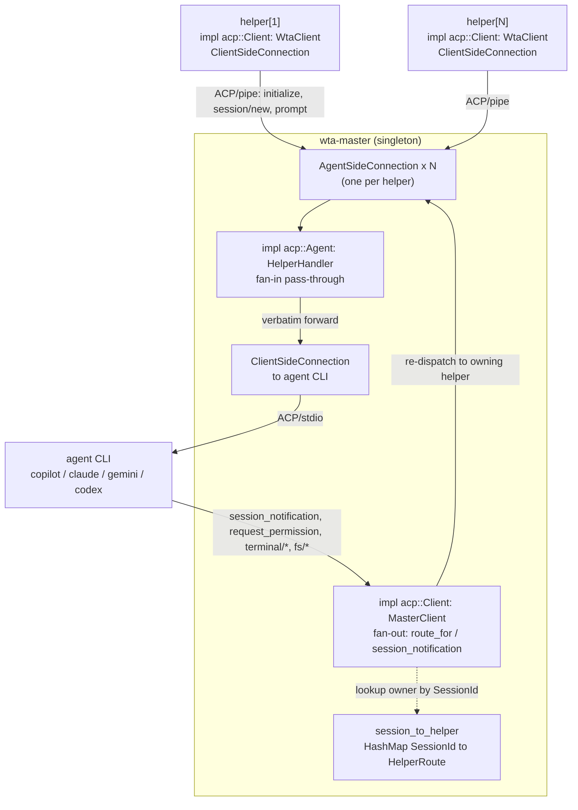
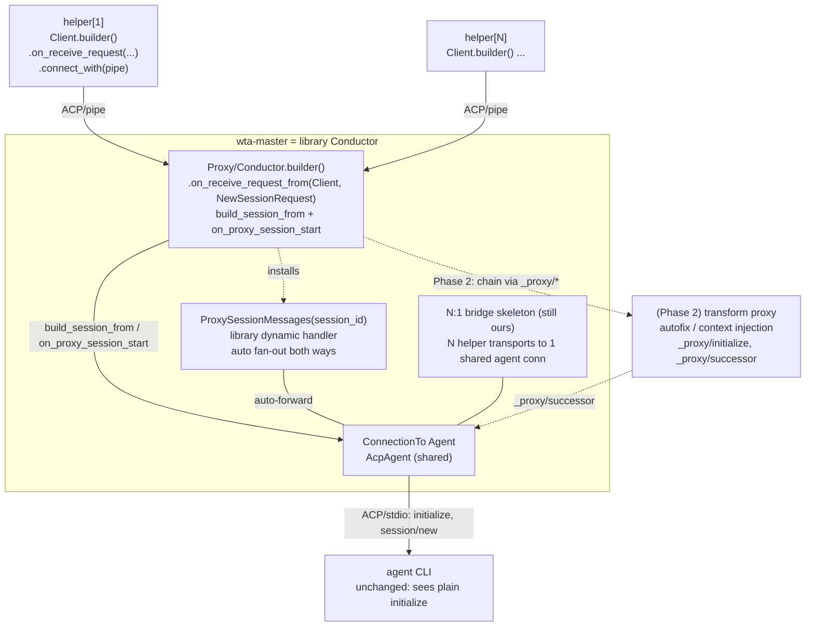
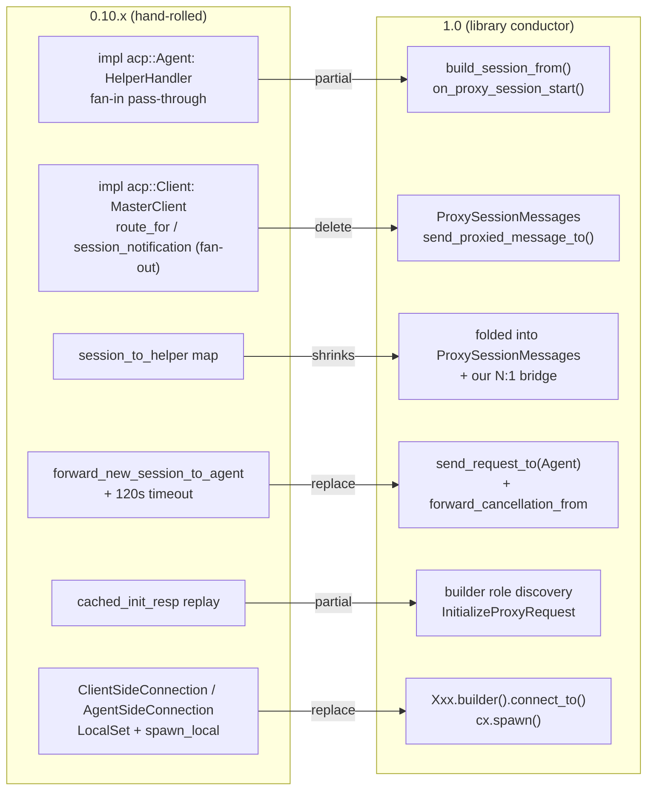
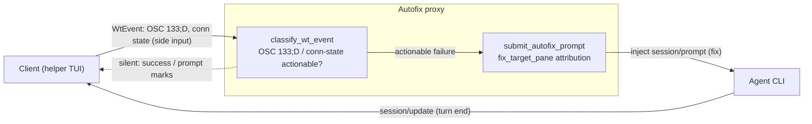
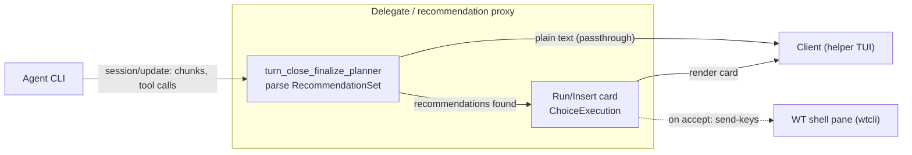

# ACP 1.0 conductor migration — abstracting the master/helper plane onto the standard proxy/conductor model

## Abstract

WTA's agent plane is a hand-rolled ACP multiplexer: `wta-master` owns one
`ACP/stdio` connection to the agent CLI and fans per-helper sessions onto it
(`session_to_helper` routing), while each `wta-helper` is an ACP client over a
named pipe. All of this is built on the **0.10.x** `agent-client-protocol`
programming model (`impl acp::Agent/Client`, `ClientSideConnection` /
`AgentSideConnection`, `LocalSet` + `spawn_local` + `handle_io`, trait-style
`conn.method().await` calls).

`agent-client-protocol` **1.0.0** (published 2026-06-24) does two things that
matter to us:

1. It **replaces that entire programming model** with a builder + dispatch model
   (`Client`/`Agent` are role markers, not traits; `cx.send_request(..).block_task().await`;
   `SessionBuilder`/`ActiveSession`; no `LocalSet`).
2. It **ships proxy/conductor natively** (`Proxy`/`Conductor` roles,
   `_proxy/initialize` / `_proxy/successor` wire methods, `start_session_proxy`,
   `on_proxy_session_start`, `send_proxied_message_to`, `ProxySessionMessages`,
   MCP-over-ACP). This is no longer just the `sacp` prototype or an RFD.

This spec assesses migrating the master/helper plane to 1.0 and, in the same
effort, re-expressing master's bespoke fan-in/fan-out as a library-managed
conductor. It is a **feasibility assessment + phased plan**, not a final design.

## Inspiration

- The `AHP` (Agent Host Protocol) vs `ACP` discussion: ACP is the **south-bound**
  host↔agent pipe (with proxy chains for extension); AHP is the **north-bound**
  multi-client state-sync surface. Master is the conductor on the south side;
  `IProtocolServer` (COM) is an AHP-lite on the north side. This spec only covers
  the **south-bound / ACP** half.
- `agent-client-protocol` reaching **1.0** (API declared stable) makes the
  0.10→1.0 jump unavoidable eventually, and 1.0 is exactly where proxy/conductor
  landed — so the upgrade and the abstraction win can be done together.
- Source of truth for the proxy API below: `agentclientprotocol/rust-sdk` at the
  1.0.0 release commit `12498fd22d75092e5709bd9d0e3a8a1a404e037b`
  (`src/agent-client-protocol/src/schema/proxy_protocol.rs`,
  `src/agent-client-protocol/src/session.rs`, `md/migration_v0.11.x.md`).

## Version timeline: 0.10.0 → 1.0.0

Our baseline is **0.10.0**. The significant changes up to **1.0.0** (source: the
crate's GitHub releases, `agentclientprotocol/rust-sdk`) — breaking changes
marked ⚠️, pivotal-for-us rows marked 🔑:

| Version | Date | Major changes |
|---|---|---|
| **0.10.0** | 2026-03-05 | ⚠️ Schema crate v0.11.0; more unstable feature flags. **(our current baseline)** |
| 0.10.1 | 2026-03-10 | Stabilized `session/list` + `session_info_update`. |
| 0.10.2 | 2026-03-11 | (unstable) `session/close`. |
| 0.10.3 | 2026-03-25 | (unstable) logout; schema 0.11.3. |
| 0.10.4 | 2026-03-31 | Schema 0.11.4; warning logs for silent RPC failures; clearer broken-connection error. |
| **0.11.0** 🔑 | 2026-04-20 | ⚠️ **"Migrate to new SDK design"** — the builder/dispatch rewrite (`Client`/`Agent` role markers, `connect_with` / `on_receive_*`, `SessionBuilder`, no `LocalSet`). **The break that forces our Phase 0**, and where the proxy/conductor primitives (`start_session_proxy`, `_proxy/*`) first ship. Guide: `migration_v0.11.x`. |
| 0.11.1 | 2026-04-21 | Drop `boxfnonce` dep. |
| **0.12.0** 🔑 | 2026-05-16 | ⚠️ **Extract MCP-over-ACP proxy**; stabilize `session/close` + `session/resume`; **remove direct `tokio` dep**. ⚠️ Removed `McpAcpTransport` (now advertised via `mcpCapabilities.acp`); renamed `McpConnectRequest.acp_url` → `acp_id`. |
| 0.12.1 | 2026-05-17 | Dependency bumps. |
| **0.13.0** | 2026-06-01 | Stabilize logout; **extract `rmcp` logic to `agent-client-protocol-rmcp`** (removes tokio/rmcp from core deps); (unstable, experimental) **protocol v2**. |
| 0.13.1 | 2026-06-01 | Schema 0.13.5. |
| **0.14.0** | 2026-06-05 | Stabilize `session/delete`, message ids, context usage; (unstable) **elicitation**; fix: serialize proxy metadata as `_meta`. |
| **0.15.0** 🔑 | 2026-06-19 | **HTTP/WebSocket transport**; (unstable) **request cancellation** (`forward_cancellation_from`); schema 0.14.0; replace `jsonrpcmsg` with shared schema types. |
| 0.15.1 | 2026-06-22 | Fix: **hide agent stdio windows on Windows** (relevant to our packaged helper). |
| **1.0.0** 🔑 | 2026-06-24 | API declared **stable**; schema 1.1.0; handle large future sizes in `run_until`. |

**Takeaways for this migration:**

- The unavoidable wall is **0.11.0** (full SDK redesign); 0.10.1–0.10.4 are
  additive/unstable and don't let us skip it.
- The proxy/conductor primitives we want arrived at **0.11.0** and matured
  (MCP-over-ACP extraction) at **0.12.0**.
- Dependency-graph wins land on the way: **tokio removed from core (0.12.0)** and
  **rmcp extracted (0.13.0)** → smaller transitive deps post-upgrade.
- `forward_cancellation_from` (our `session/new` timeout replacement) needs
  **≥ 0.15.0** (`unstable_cancel_request`).
- **0.15.1** carries a Windows stdio-window fix relevant to our packaged helper.

## Solution Design

### Today (0.10.x): hand-rolled multiplexer



> Everything inside `wta-master` is hand-rolled: `HelperHandler` (fan-in
> pass-through), `MasterClient` + `session_to_helper` + `route_for` (fan-out
> routing), and both `*SideConnection`s driven by a `LocalSet`.

- **fan-in** (helper → CLI): `HelperHandler` is a pass-through — it forwards
  helper requests verbatim to the shared `agent_conn` (`new_session`, `prompt`,
  …), adding only telemetry + a 120s `session/new` timeout.
- **fan-out** (CLI → helper): inbound `session_notification`s and reverse
  requests (`request_permission`, `terminal/*`, `fs/*`) are routed back to the
  owning helper via `session_to_helper` / `MasterClient::route_for(session_id)`.

### Target (1.0): master as a library Conductor



> Library-managed pieces are solid: `build_session_from` +
> `on_proxy_session_start` + `ProxySessionMessages` replace the hand-rolled
> fan-out. Only the **N:1 bridge skeleton** (dashed concern) and the Phase 2
> transform proxy stay ours. The agent CLI is untouched.

The 1.0 proxy/conductor model expresses per-session forwarding natively. The
canonical pattern (from `session.rs` docs) is:

```rust
Proxy.builder()
  .on_receive_request_from(Client, async |request: NewSessionRequest, responder, cx| {
      cx.build_session_from(request)            // intercept / transform session/new
          // .with_mcp_server(...)               // optionally inject tools (MCP-over-ACP)
          .on_proxy_session_start(responder, async |session_id| {
              // track/log only; forwarding is auto-installed
              Ok(())
          })
  }, on_receive_request!())
  .connect_to(transport)
  .await?;
```

Key primitives:

| API | Role |
|---|---|
| `on_proxy_session_start(responder, op)` | send `new_session` to the Agent, forward the response back to the Client, then install `ProxySessionMessages(session_id)` to auto-forward all later messages both ways (non-blocking) |
| `start_session_proxy(responder)` | blocking convenience = `start_session()` + respond + `proxy_remaining_messages()` |
| `ProxySessionMessages::new(session_id)` | dynamic handler that routes a session's messages — the **library equivalent of `session_to_helper`** |
| `send_proxied_message_to(Peer, dispatch)` | forward a raw dispatch to `Client`/`Agent` |
| `proxy_remaining_messages()` | drain queued messages, then hand off to the dynamic handler (race-free) |
| `_proxy/initialize` (`InitializeProxyRequest`), `_proxy/successor` (`SuccessorMessage`) | wire methods — **only needed when inserting additional proxies into a chain**; the basic helper↔master and master↔agent hops stay plain ACP |

### Fan-in / fan-out mapping (what the library subsumes)



| master today (hand-rolled) | 1.0 library equivalent | verdict |
|---|---|---|
| fan-out notif: `MasterClient::session_notification` → owner helper → channel | `ProxySessionMessages` auto-forwards agent session updates to the client | ✅ deletable |
| fan-out request: `route_for(sid)` → helper's `AgentSideConnection` | dynamic handler / `send_proxied_message_to(Client, ..)` | ✅ deletable |
| `forward_new_session_to_agent` + 120s timeout | `connection.send_request_to(Agent, req)` + `forward_cancellation_from` | ✅ replaceable (timeout/cancel via library cancellation) |
| `cached_init_resp` replay | builder role discovery + `InitializeProxyRequest` | 🟡 partial (see N:1 caveat) |
| `HelperHandler` pass-through → shared `agent_conn` | `cx.build_session_from(request)` → `on_proxy_session_start` | 🟡 partial |
| `session_to_helper: HashMap<SessionId, HelperRoute>` | library routes a single message by session_id; "which sessions belong to which helper, N helpers sharing 1 agent" still ours | 🟡 shrinks, doesn't vanish |

Estimated **~60–70% of the hand-rolled per-session routing can be deleted** and
delegated to the library.

### The topology caveat (the key honest finding)

ACP's proxy/conductor model is a **linear chain**: **1 Client → Conductor → 1
Agent**. One conductor builder `.connect_to(transport)` binds **one** transport
pair. WTA's master is **N helpers : 1 shared agent CLI** — a fan-in/fan-out
**multiplexer**, which the linear model does not express natively (M:N is
explicitly a *future* `peer` extension in the RFD).

- The library solves **in-session** forwarding cleanly.
- It does **not** give us, for free, "N independent client connections sharing
  one upstream agent connection." `ConnectionTo<Agent>` is cloneable and routing
  is by `session_id`, so one agent connection *can* host many sessions from many
  proxy front-ends — but **bridging N helper transports onto 1 shared agent
  connection remains our bespoke skeleton.**

**Net:** 1.0 solves the *per-session forwarding + insertable transform proxy*
half well; the *N:1 multiplexing* half stays ours.

**Why not the off-the-shelf conductor?** A ready-made conductor binary exists
(`agent-client-protocol-conductor`), but it solves a narrower problem: it
orchestrates a **linear chain for one editor ↔ one (spawned) agent over stdio**,
launching each proxy as a separate process. It has no concept of N clients
sharing one upstream agent ("Multiple parallel chains" is an unchecked Phase-4
item in its own design doc), and it runs as a standalone stdio binary — neither
fits WTA.

| | `agent-client-protocol-conductor` | WTA `master` |
|---|---|---|
| Clients | 1 editor (stdio) | N helpers (named-pipe server + accept loop) |
| Agent | spawns its own, 1 chain : 1 agent | **1 shared** agent CLI, reused by N helpers |
| Multiplexing | ✗ none (linear 1:1) | ✓ `session_to_helper` fans N onto 1 agent |
| Embedding | standalone stdio process | must live **inside the WT process** (COM package identity, `SharedWta` singleton, master-pipe rendezvous) |
| Maturity | MVP (crash-detection / tests still on its punch list) | production |

So `master` stays a **specialized conductor** (the N:1 multiplexer + WTA
lifecycle: agent-CLI spawn, pipe discovery, per-tab/window routing, alive-mirror,
restart) and **reuses the library's proxy/conductor *primitives*** —
`start_session_proxy`, `ProxySessionMessages`, `_proxy/successor` routing, and the
conductor's message-ordering guarantee (responses must not overtake
notifications) — *per session*. The library handles "how proxies are ordered
within one chain"; `master` handles "how N WT panes share one agent + WTA
lifecycle." The former is an inner part of the latter, not a replacement.

### Phased plan (de-risked)

- **Phase 0 — pure model migration (0.10 → 1.0), behavior unchanged.** Rewrite
  master + helper onto the builder/dispatch model. No proxy semantics yet. This
  is the largest, unavoidable step; isolate and verify it against the existing
  mock-ACP/render tests. (Checklist below.)
- **Phase 1 — master becomes a Conductor.** Replace the `session_to_helper`
  fan-out with `start_session_proxy` / `ProxySessionMessages`. Keep our N:1
  bridge skeleton.
- **Phase 2 — extract transform proxies.** Move the three strong transform cores
  out of `app.rs` — **autofix**, **context/prompt injection**, and
  **delegate/recommendation** — into standalone proxies wired via
  `_proxy/initialize` / `_proxy/successor`. This is where `_proxy/*` first becomes
  relevant, and it needs no further master change. See
  [Phase 2 detail: `app.rs` → proxies](#phase-2-detail-apprs--proxies).
- **Phase 3 (optional) — WT control via MCP-over-ACP.** Expose `wtcli` operations
  through `with_mcp_server` instead of shelling out. Larger rethink; separate
  spec.

### Phase 0 migration checklist (grounded in current code)

Blast radius by file (matches of the removed 0.10 symbols):
`master/mod.rs` 73, `mock_agent_tests.rs` 59, `client.rs` 29, `app.rs` 26,
`main.rs` 24, `probe.rs` 9, plus minor (`model_select.rs`, `cli_channel.rs`,
`wt_channel/mod.rs`, `session_registry.rs`).

**`tools/wta/src/master/mod.rs` (the conductor):**
- [ ] `impl acp::Client for MasterClient` (L338) → `Client`-peer handlers on the
      agent-side connection builder (or the proxy dynamic handler).
- [ ] `impl acp::Agent for HelperHandler` (L776) → `Proxy`/`Conductor` builder
      with `on_receive_request_from(Client, ..)` per helper.
- [ ] `ClientSideConnection::new(client, ..)` (L1758, → agent CLI) →
      `agent-client-protocol-tokio` `AcpAgent` / `Agent.builder()…connect_to`;
      master holds a `ConnectionTo<Agent>`.
- [ ] `AgentSideConnection::new(handler, ..)` (L1987, per helper in
      `serve_helper`) → `Proxy.builder()…connect_to(helper transport)`.
- [ ] `LocalSet` (L1347) + ~9 `spawn_local` sites → remove; use `cx.spawn(..)`.
- [ ] 10 trait-style outbound calls (`agent_conn.new_session().await`, …) →
      `cx.send_request(..).block_task().await` / `build_session_from`.
- [ ] Test doubles `NoopClient` (L3219), `PendingNewSessionAgent` (L3238) and the
      harness at L3289/L3301 → builder model.

**`tools/wta/src/protocol/acp/client.rs` (the helper, WtaClient):**
- [ ] `struct WtaClient` (L1437) + `impl acp::Client for WtaClient` (L1453) →
      `Client.builder().on_receive_request(..)` callbacks (permission UI,
      `ShellManager`, terminal/fs). ~28 method/call sites.
- [ ] `ClientSideConnection::new(client, ..)` (L2127, helper→master) →
      `Client.builder()…connect_with(transport, main_fn)`.
- [ ] ~12 `dispatch_*` free fns taking `conn: &Arc<acp::ClientSideConnection>` +
      `spawn_local` bodies (L2686/2868/3032/3073/3180/3230/3302/3361 …) →
      `ConnectionTo<Agent>` + `cx.spawn`.

**Supporting:**
- [ ] `tools/wta/src/protocol/acp/mock_agent_tests.rs` (59) — in-process
      mock harness; biggest test rewrite. Must move to the builder model to keep
      `connect_for_dispatch`/`DispatchHarness` compiling.
- [ ] `tools/wta/src/app.rs` (26) — helper TUI loop: `spawn_local` + `handle_io`
      references.
- [ ] `tools/wta/src/main.rs` (24) — helper `run_acp_app` entry + `LocalSet`
      bootstrap.
- [ ] `tools/wta/src/protocol/acp/probe.rs` (9) — `probe-models` ACP path.
- [ ] `tools/wta/src/protocol/acp/spawn.rs` — replace hand-rolled subprocess
      wiring with `agent-client-protocol-tokio` `AcpAgent`.
- [ ] `agent-client-protocol = "0.10"` → `"1.0"` and add
      `agent-client-protocol-tokio` in `tools/wta/Cargo.toml`; move message types
      to `acp::schema::…` imports; regenerate third-party notices
      (`Generate-WtaThirdPartyNotices.ps1`).

### Phase 2 detail: `app.rs` → proxies

`app.rs` is the central event-loop + state hub (`App` struct + the `AppEvent`
match), which is why every concern accreted there. Sizing (as of this spec):

- **16,137 lines total**; `mod tests` starts at L9787 → **~6.3K lines (~39%) are
  tests** (204 `#[test]`). Production logic ≈ **9.8K lines**.
- **422 fns** (~204 are tests → ~218 production); `struct App` ≈ **50 fields**;
  `impl App` split across 3 segments (L2244 / L8402 / L9347); `AppEvent` ≈ **50
  variants**.

A **proxy** here means a component that intercepts/transforms ACP traffic between
the helper (Client) and the agent CLI (Agent). Most of `app.rs` is **not** that —
it is TUI/state/connection/tab plumbing that stays in the helper.

| Responsibility cluster | Evidence (keyword hits / fns) | Nature |
|---|---|---|
| Auth / connection / lifecycle | `auth\|login\|preflight\|setup` 529; ConnectionState; AgentConnected/Error/Busy/SoftStop | ❌ not a proxy (conductor/helper plumbing) |
| TUI view / input / state | render, chip, scroll, help/debug overlay, Key/Resize/Focus, RevealTick (heavy render lives in `ui/`) | ❌ not a proxy (stays in helper UI) |
| Multi-tab routing | `tab_session\|tab_changed\|renamed` 161; owner_tab_id/window_id; session_to_tab | ❌ not a proxy (helper's N-tab fan-out) |
| **Autofix** | `classify_*` (10), `classify_wt_event`, `submit_autofix_prompt`, `fix_target_pane`, `AutofixTargetResolved`, WtEvent (303) | ✅ **proxy** |
| **Context / prompt injection** | `prompt\|persona\|planner` 355; PromptTemplateLoaded; `turn_submit_prompt`; `turn_close_finalize_planner` | ✅ **proxy** |
| **Delegate / recommendation** | `delegate\|recommend\|coordinator` 252; recommendation_tx; ChoiceExecution; DispatchedCommand; `turn_surface_recommendation` | ✅ **proxy** |
| Model pinning / override | `model` 282; `apply_global_acp_model`; `send_session_model`; SessionAttached re-apply; acp_model | 🟡 small proxy (`session/new` rewrite) |
| Permission policy | `permission` (11 fns, 113); PermissionState; auto-confirm settings | 🟡 half-proxy (policy extractable; card UI stays in helper) |
| Session registry / alive mirror | `agent_sessions\|alive\|session_to_tab` 270; AliveSnapshot/Added/Removed/JoinUpgrade | 🟡 observer; **overlaps master** → likely folds into the conductor, not a standalone proxy |

**Verdict: 3 strong proxies, ~5–6 upper bound.** Each strong proxy extracts the
*decision/transform core* only — the cards/pickers' rendering stays in the helper.

```mermaid
flowchart LR
    C["Client (helper TUI)"]
    subgraph CTX["Context / prompt-injection proxy"]
        BS["build_session_from<br/>persona / planner setup"]
        PR["rewrite session/prompt<br/>prepend template + context"]
    end
    A["Agent CLI"]

    C -->|"session/new"| BS
    BS -->|"session/new (+ context)"| A
    C -->|"session/prompt"| PR
    PR -->|"session/prompt (rewritten)"| A
    A -->|"session/update (passthrough)"| C
```







**Honest caveat — extracting proxies will not shrink `app.rs` much.** The bulk
(tests, auth/connection/setup, TUI, multi-tab routing) is not proxy material and
stays. Even within the extractable clusters, much is card/picker rendering that
stays in the helper; only the decision/transform core (optimistically ~30–40% of
production logic) moves out. Expected outcome: `app.rs` becomes a leaner
"TUI + connection + tab routing" hub with 3 transform cores lifted into
composable proxies — not 16K lines fragmented into N proxies.

### Proxy criterion & count (how many proxies, and why)

**Criterion.** A concern belongs in a proxy iff it can be expressed as *intercept
an ACP method, then transform the request or enrich the response* (the enrichment
typically rides in the `_meta` extension field). Anything that fails this test —
TUI rendering, the helper's event reactor / tab routing, connection/auth
lifecycle, and process-liveness / cross-window broadcast (multi-client state =
AHP, north-bound) — is **not** a proxy.

By that test, six concerns are proxy-able:

| Concern | ACP method intercepted | Transform |
|---|---|---|
| context / prompt injection | `session/prompt` (request) | prepend template / persona |
| model pinning | `session/new` (request) | rewrite the model field |
| delegate / recommendation | `session/update` (response) | parse `RecommendationSet`, surface cards |
| status-list | `session/list` (response) + `session/update` (activity) | discovery + enrich `_meta` with FS-read state |
| permission policy | `request_permission` (agent→client) | auto-decide per settings |
| autofix | off-wire `WtEvent` → inject `session/prompt` | inject a fix prompt |

**But "6 concerns" ≠ "6 components."** Filtered by whether each is worth a
standalone proxy:

| Concern | Standalone viability | Likely outcome |
|---|---|---|
| autofix | existing `app/autofix.rs` (566) + tests; clear boundary | ✅ standalone |
| context | existing `prompt.rs` (347); clear transform pipeline | ✅ standalone |
| delegate | existing `coordinator.rs` (1861); clear boundary | ✅ standalone |
| status-list | high value, but an ~8K-line session-mgmt **subsystem redesign**; may split into a live-activity observer + a list enricher | 🟡 one big (or two) |
| model | the whole job is "if an override is configured, rewrite one field" — a few lines, not a pipeline | 🔸 folds into context, or a conductor option |
| permission | the bulk is the card UI (`ui/permission.rs` + interaction), which stays in the helper; only the auto-confirm policy slice is proxy-able | 🔸 folds into the conductor/context |

**Net count: ~4 meaningful proxies** (autofix, context, delegate, status-list),
with model + permission as optional thin shims. The number is a **granularity
choice**, not a fixed value: consolidate aggressively → as few as **3** (model
into context, permission into the conductor, status-list as one); slice maximally
→ up to **6** (one per concern). Boundary clarity matters, not the count.

**The `status-list` proxy (the session-management collapse).** The cleanest
realization of "unified session status": a proxy intercepts the `session/list`
response and, for each `session_id`, reads state from the filesystem and injects
a custom field into `SessionInfo._meta`. This subsumes today's separate
`session_watcher` (discover + classify) and can collapse much of the parallel
registry + alive-mirror reconciliation (`agent_sessions.rs` 3060 +
`session_registry.rs` 2879). Two honest caveats:

1. **The list must first include Class B.** Today master answers `session/list`
   from its own Class-A registry (`master/mod.rs:1151`, "answering session/list
   from master registry") — it does **not** forward to the agent CLI or scan
   disk, so shell-launched (Class B) sessions are absent. The proxy must do the
   disk discovery itself (the `session_watcher/discover.rs` logic) to union them
   in before enriching.
2. **It is a snapshot, and liveness ≠ existence.** `session/list` + `_meta` gives
   point-in-time state (good for the `/sessions` picker), but live focused-session
   activity still needs the `session/update` tap, and "is the process alive right
   now" still needs a liveness probe. A thin reconciliation remains; the
   subsystem shrinks (optimistically 30–50%), it does not vanish.

**Suggested landing order:** (1) the 3 solid proxies (autofix / context /
delegate) — existing module backing, clear ACP-method boundaries, most test
migration; (2) `status-list` as a separate, larger workstream (subsystem redesign
with the two caveats above); (3) model / permission as fold-in decisions made
only after (1).

## Capabilities

### Accessibility

No user-facing UI change. The ratatui TUI, permission cards, and model picker
are unaffected; only the transport/dispatch plumbing under them changes.

### Security

Neutral-to-positive. The COM/`WT_COM_CLSID` trust boundary and package identity
are untouched. Phase 2 transform proxies can intercept/modify ACP traffic — a
trust consideration to document when they are introduced, not in Phase 0.

### Reliability

Phase 0 is the risk peak (large mechanical rewrite of two ACP planes + the mock
harness). Mitigated by: behavior-preserving scope, the existing mock-ACP and
render test suites, and landing it before any proxy semantics. Library-managed
forwarding (Phase 1) should *reduce* the surface for the race-prone hand-rolled
routing (cold-start joins, tombstones, etc.).

### Compatibility

- Agent CLIs (copilot `--acp`, claude/codex via npx adapters, gemini
  `--experimental-acp`) are **unaffected** — they receive a normal `initialize`;
  the proxy is transparent to them.
- 0.10→1.0 is a breaking API change for **our** code only. The helper↔master
  named-pipe wire stays private (plain ACP) through Phase 1.
- `agent-client-protocol` 1.0 was published the day before this spec; the proxy
  types note they are "intended to become part of the ACP spec" — treat the
  proxy wire format as still-settling for Phase 2 timing.

### Performance, Power, and Efficiency

Expected neutral. The new model removes `LocalSet`/`spawn_local` bookkeeping; the
extra proxy hop (Phase 2) adds small message-passing overhead dwarfed by LLM
latency (per the ACP RFD's own performance note).

### Modularity & testability

Estimates grounded in current code metrics (not measured outcomes).

**Modularity** — net positive, but bounded by what a proxy actually is (an ACP
transform on the helper↔agent wire), which is a *different axis* from `app.rs`
(the helper's UI/state reactor):

| Metric | Today | After |
|---|---|---|
| Reasoned units | 2 monoliths (`app.rs` 16K + hand-rolled `master`) | ~5–6 units (lean App + library conductor + 3 proxies, ± marginal model/permission) |
| master per-session routing | hand-rolled `session_to_helper` fan-in/fan-out | library `ProxySessionMessages` → **~60–70% deletable** (3 of 6 mapping rows) |
| `app.rs` decoupling | 3 transform cores share App's ~50 fields + the `AppEvent` match | autofix / context / delegate move out as standalone proxies, own state |
| `app.rs` size | 16,137 lines | ≈ **−20–25%** (~3–4K transform-glue lines move out) → still ~12–13K |

Why `app.rs` does **not** collapse: rendering already lives in `ui/` (15 files),
and the autofix/coordinator/prompt cores already live in `app/autofix.rs` (566),
`coordinator.rs` (1861), `protocol/acp/prompt.rs` (347) — yet `app.rs` is still
16K. What remains is the **central event reactor**: ~50 `AppEvent` variants + the
dispatch match, per-tab `TabSession` wiring, the ~50 `App` fields, and ~6.3K test
lines. Proxies trim the transform glue; the reactor stays. Truly shrinking
`app.rs` needs *separate* refactors (split the event dispatcher, the
connection/auth state machine, the tab registry) outside this spec's scope.

**Testability** — concentrated, real gains:

- Of ~204 `app.rs` tests, **~55 (~27%) target extractable-proxy concerns**
  (autofix 21, permission 15, prompt 13, delegate 6, model 6) and can become
  **standalone proxy unit tests** — feed ACP messages in, assert transformed ACP
  out, with no TUI/App/`ShellManager` harness. Reuses the library's dispatch
  model + the existing `connect_for_dispatch` / `DispatchHarness` pattern.
- Exemplar: autofix's `classify_*` fns (`classify_osc133_*`, `classify_connection_*`)
  are already near-pure; extraction makes them genuinely unit-scoped.
- The other **~73%** are not "blocked from being unit tests" — they simply
  **aren't proxy tests by category**: render/UI tests (47) exercise `ui/` modules
  (presentation, not ACP transforms); session/alive/tab tests (51) exercise the
  helper/conductor's stateful multi-tab routing and alive-mirror (much of it
  belongs to the conductor/registry, which `agent_sessions.rs` /
  `session_registry.rs` already test). They stay as helper-UI / conductor-state
  tests.
- **Caveat:** Phase 0 first *worsens* testability — `mock_agent_tests.rs` (59
  hits) + `DispatchHarness` must be rewritten to the 1.0 builder model before any
  per-proxy gain lands.

## Potential Issues

- **N:1 topology mismatch (see caveat):** the bespoke multiplexer skeleton
  survives; do not assume the library erases it.
- **Mock harness churn:** `mock_agent_tests.rs` (59 matches) and
  `DispatchHarness` underpin most regression coverage — they must be migrated in
  lockstep or the safety net disappears mid-rewrite.
- **Phase 0 is all-or-nothing per crate:** the old and new connection models do
  not coexist cleanly in one binary, so Phase 0 cannot be landed file-by-file
  behind a flag without significant scaffolding.

## Future considerations

- Phase 2 turns autofix/context-injection into composable proxies — reorderable
  and insertable by config rather than code.
- MCP-over-ACP (`with_mcp_server`) could replace `wtcli` shell-outs for WT
  control (Phase 3).
- The north-bound `IProtocolServer` could later be re-expressed against AHP's
  channel/state/action model to retire the hand-written session-management
  reconciliation — out of scope here, tracked separately.

## Resources

- AHP — "What is the Agent Host Protocol?":
  https://microsoft.github.io/agent-host-protocol/guide/what-is-ahp.html
- ACP proxy chains RFD — "Agent Extensions via ACP Proxies":
  https://agentclientprotocol.com/rfds/proxy-chains
- `agent-client-protocol` 1.0.0 source (release commit `12498fd`):
  `schema/proxy_protocol.rs`, `session.rs`, `md/migration_v0.11.x.md`
  (`agentclientprotocol/rust-sdk`).
- `sacp` / `sacp-proxy` / `sacp-conductor` (Symposium prototype the upstream work
  came from): `symposium-dev/symposium-acp`.
- Existing internal design: `doc/specs/Multi-window-agent-pane.md`,
  `tools/wta/AGENTS.md`.
