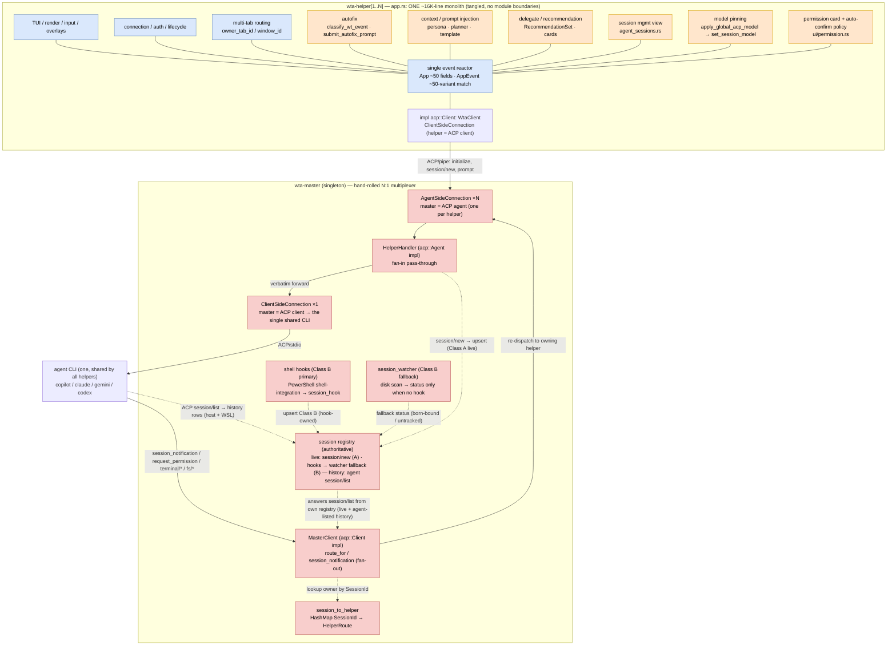
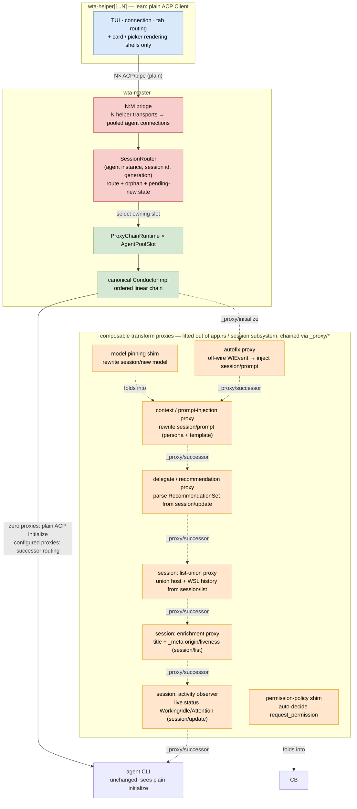
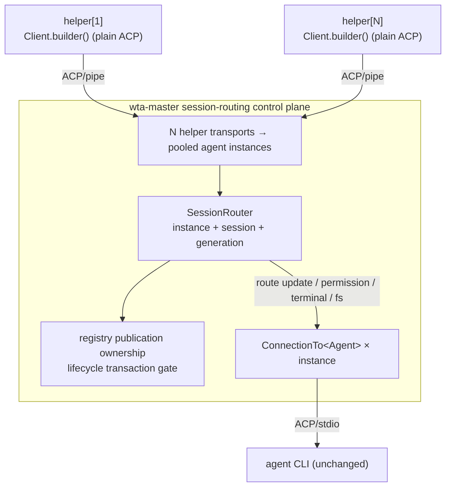
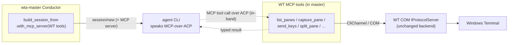

# ACP 1.x proxy-chain migration — separating session routing from the standard conductor

## Abstract

WTA's agent plane is a hand-rolled ACP multiplexer: `wta-master` owns a pool of
`ACP/stdio` agent CLI connections and uses `SessionRouter` to fan per-helper sessions onto them
by `(agent instance, SessionId)`, while each `wta-helper` is an ACP client over a
named pipe. All of this was built on the **0.10.x** `agent-client-protocol`
programming model (`impl acp::Agent/Client`, `ClientSideConnection` /
`AgentSideConnection`, `LocalSet` + `spawn_local` + `handle_io`, trait-style
`conn.method().await` calls).

`agent-client-protocol` reached its first **stable 1.0.0** release (2026-06-24),
so the 0.10 → 1.0 upgrade is now both unavoidable and worth doing deliberately.
1.0 changes two things that matter to us:

1. It **replaces the entire programming model** with a builder + dispatch model
   (`Client`/`Agent` are role markers, not traits; `cx.send_request(..).block_task().await`;
   `SessionBuilder`/`ActiveSession`; no `LocalSet`; the connection is `Send`).
2. It **ships proxy/conductor natively** — the [ACP proxy-chains
   direction](https://agentclientprotocol.com/rfds/proxy-chains): `Proxy`/`Conductor`
   roles, `_proxy/initialize` / `_proxy/successor` wire methods, `start_session_proxy`,
   `on_proxy_session_start`, `send_proxied_message_to`, the private
   `ProxySessionMessages` implementation type, and
   MCP-over-ACP. This is no longer just the `sacp` prototype or an RFD.

This spec migrates the master/helper ACP plane to stable ACP and separates two
different responsibilities:

- WTA's outer N:M **session-routing control plane**, which remains WTA-owned;
- one canonical linear **Proxy Conductor** inside each pooled agent slot.

Composable library proxies then become linear inner transform chains:

- **Modularity** — each cross-cutting concern (autofix, prompt/context injection,
  delegate/recommendation) becomes a self-contained proxy with a clear
  ACP-method boundary, instead of accreting in `app.rs`.
- **Free orchestration** — proxies are **reorderable, insertable, and removable by
  config**, not by editing the event loop; a new behavior is a new proxy in the
  chain.
- **Testability** — a proxy is a pure 1:1 transform with typed ACP in/out, so it
  is unit-testable in isolation; it does not replace WTA's N:M multiplexer.

It is a **feasibility assessment + phased plan**, not a final design.

## Inspiration

- The direction is the [ACP proxy-chains RFD — "Agent Extensions via ACP
  Proxies"](https://agentclientprotocol.com/rfds/proxy-chains): extend an agent by
  chaining standard ACP proxies rather than forking the host. This migration only
  covers the master/helper **ACP** plane (the host↔agent pipe); the COM
  `IProtocolServer` surface is out of scope.
- `agent-client-protocol` reaching **1.0** (API declared stable) makes the
  0.10→1.0 jump unavoidable eventually, and 1.0 is exactly where proxy/conductor
  landed — so the upgrade and the abstraction win can be done together.
- Source of truth for the proxy API below: `agentclientprotocol/rust-sdk` at the
  1.0.0 release commit `12498fd22d75092e5709bd9d0e3a8a1a404e037b`
  (`src/agent-client-protocol/src/schema/proxy_protocol.rs`,
  `src/agent-client-protocol/src/session.rs`, `md/migration_v0.11.x.md`).

## Version timeline: 0.10.0 → 1.0.0

Our baseline is **0.10.0**. The significant changes up to **1.0.0** (source: the
crate's GitHub releases, `agentclientprotocol/rust-sdk`) — breaking changes
marked ⚠️, pivotal-for-us rows marked 🔑:

| Version | Date | Major changes |
|---|---|---|
| **0.10.0** | 2026-03-05 | ⚠️ Schema crate v0.11.0; more unstable feature flags. **(our current baseline)** |
| 0.10.1 | 2026-03-10 | Stabilized `session/list` + `session_info_update`. |
| 0.10.2 | 2026-03-11 | (unstable) `session/close`. |
| 0.10.3 | 2026-03-25 | (unstable) logout; schema 0.11.3. |
| 0.10.4 | 2026-03-31 | Schema 0.11.4; warning logs for silent RPC failures; clearer broken-connection error. |
| **0.11.0** 🔑 | 2026-04-20 | ⚠️ **"Migrate to new SDK design"** — the builder/dispatch rewrite (`Client`/`Agent` role markers, `connect_with` / `on_receive_*`, `SessionBuilder`, no `LocalSet`). **The break that forces our Phase 0**, and where the proxy/conductor primitives (`start_session_proxy`, `_proxy/*`) first ship. Guide: `migration_v0.11.x`. |
| 0.11.1 | 2026-04-21 | Drop `boxfnonce` dep. |
| **0.12.0** 🔑 | 2026-05-16 | ⚠️ **Extract MCP-over-ACP proxy**; stabilize `session/close` + `session/resume`; **remove direct `tokio` dep**. ⚠️ Removed `McpAcpTransport` (now advertised via `mcpCapabilities.acp`); renamed `McpConnectRequest.acp_url` → `acp_id`. |
| 0.12.1 | 2026-05-17 | Dependency bumps. |
| **0.13.0** | 2026-06-01 | Stabilize logout; **extract `rmcp` logic to `agent-client-protocol-rmcp`** (removes tokio/rmcp from core deps); (unstable, experimental) **protocol v2**. |
| 0.13.1 | 2026-06-01 | Schema 0.13.5. |
| **0.14.0** | 2026-06-05 | Stabilize `session/delete`, message ids, context usage; (unstable) **elicitation**; fix: serialize proxy metadata as `_meta`. |
| **0.15.0** 🔑 | 2026-06-19 | **HTTP/WebSocket transport**; (unstable) **request cancellation** (`forward_cancellation_from`); schema 0.14.0; replace `jsonrpcmsg` with shared schema types. |
| 0.15.1 | 2026-06-22 | Fix: **hide agent stdio windows on Windows** (relevant to our packaged helper). |
| **1.0.0** 🔑 | 2026-06-24 | API declared **stable**; schema 1.1.0; handle large future sizes in `run_until`. |

**Takeaways for this migration:**

- The unavoidable wall is **0.11.0** (full SDK redesign); 0.10.1–0.10.4 are
  additive/unstable and don't let us skip it.
- The proxy/conductor primitives we want arrived at **0.11.0** and matured
  (MCP-over-ACP extraction) at **0.12.0**.
- Dependency-graph wins land on the way: **tokio removed from core (0.12.0)** and
  **rmcp extracted (0.13.0)** → smaller transitive deps post-upgrade.
- `forward_cancellation_from` (our `session/new` timeout replacement) needs
  **≥ 0.15.0** (`unstable_cancel_request`).
- **0.15.1** carries a Windows stdio-window fix relevant to our packaged helper.

## Solution Design

### Today (0.10.x): two hand-rolled monoliths (app.rs reactor + N:1 multiplexer)

Two hand-rolled monoliths, nothing modularized. The helper's `app.rs` fuses every
cross-cutting concern into one reactor, and the master is a bespoke N:1
multiplexer — there is **no ACP-method boundary** anywhere, so nothing is a proxy.



> **Legend:** orange = a concern that *could* be a standalone proxy but today is
> fused in; blue = helper plumbing that genuinely stays in the helper; red =
> hand-rolled master routing / registry.
>
> **Helper:** `app.rs` is a single ~16K-line reactor where every proxy-able concern
> (orange) shares the same `App` state + `AppEvent` match, interleaved with the TUI /
> connection / tab-routing plumbing (blue).
>
> **Master:** the N:1 multiplexer is bespoke (red) — `HelperHandler` fan-in,
> `session_to_helper` + `MasterClient::route_for` fan-out, both `*SideConnection`s on
> a `LocalSet`.
>
> **Class A vs Class B.** *Class A* (`SessionOrigin::AgentPane`) = a session WTA
> created for an Intelligent Terminal **agent pane** . *Class B*
> (`SessionOrigin::Unknown`) = the user ran a CLI (`copilot`/`claude`/`codex`)
> **directly in a normal shell pane**.

- **fan-in** (helper → CLI): `HelperHandler` is a pass-through — it forwards
  helper requests verbatim to the shared `agent_conn` (`new_session`, `prompt`,
  …), adding only telemetry + a 120s `session/new` timeout.
- **fan-out** (CLI → helper): inbound `session_notification` and reverse
  requests (`request_permission`, `terminal/*`, `fs/*`) are routed back to the
  owning helper via `session_to_helper` / `MasterClient::route_for(session_id)`.

### Target: outer session router + per-agent canonical proxy conductor



> **Legend:** orange = a standalone, reorderable **proxy** (the same concerns fused
> in app.rs above, plus the session subsystem); green = usable library connection
> pieces; red = the WTA-owned N:M router/bridge; blue = helper
> plumbing that stays.
>
> The transform cores lift out into composable proxies: the three solid ones
> (autofix / context / delegate) plus the session family. **"Folds into"** on the
> model / permission shims means each is thin enough to be **absorbed into a
> neighbor** (model-pinning → the context proxy; permission-policy → the conductor)
> instead of being its own proxy — but either *could* be a standalone proxy; it is a
> granularity choice, not a hard boundary. Each proxy is a pure 1:1 ACP transform
> inserted via `_proxy/initialize` / `_proxy/successor`, reorderable by config.
> The session router and bridge (red) own WTA's N-helper → pooled-agent
> topology, per-agent-instance session identity, orphan/rebind lifetime, and
> bounded delivery. They are a prerequisite control plane, not an ACP
> Conductor. Each pool slot then owns a canonical linear `ConductorImpl`, which
> performs proxy initialization, ordered successor routing, and final-agent
> initialization. The
> helper (blue) keeps only
> TUI / connection / tab routing + card/picker shells; the agent CLI is untouched.

The 1.0 proxy/conductor model expresses per-session forwarding natively. The
canonical pattern (from `session.rs` docs) is:

```rust
Proxy.builder()
  .on_receive_request_from(Client, async |request: NewSessionRequest, responder, cx| {
      cx.build_session_from(request)            // intercept / transform session/new
          // .with_mcp_server(...)               // optionally inject tools (MCP-over-ACP)
          .on_proxy_session_start(responder, async |session_id| {
              // track/log only; forwarding is auto-installed
              Ok(())
          })
  }, on_receive_request!())
  .connect_to(transport)
  .await?;
```

Key primitives:

| API | Role |
|---|---|
| `on_proxy_session_start(responder, op)` | send `new_session` to the Agent, forward the response back to the Client, then install `ProxySessionMessages(session_id)` to auto-forward all later messages both ways (non-blocking) |
| `start_session_proxy(responder)` | blocking convenience = `start_session()` + respond + `proxy_remaining_messages()` |
| `ProxySessionMessages::new(session_id)` | Internal dynamic handler used by the SDK's linear proxy path; it remains `pub(crate)` and is not constructed by WTA |
| `send_proxied_message_to(Peer, dispatch)` | forward a raw dispatch to `Client`/`Agent` |
| `proxy_remaining_messages()` | drain queued messages, then hand off to the dynamic handler (race-free) |
| `_proxy/initialize` (`InitializeProxyRequest`), `_proxy/successor` (`SuccessorMessage`) | wire methods — **only needed when inserting additional proxies into a chain**; the basic helper↔master and master↔agent hops stay plain ACP |

### Fan-in / fan-out mapping (what WTA must own)

| master today (hand-rolled) | 1.0 library equivalent | verdict |
|---|---|---|
| fan-out notification → bounded helper channel | `SessionRouter` route keyed by `(AgentInstanceId, SessionId)` | WTA-owned |
| reverse request → helper `AgentSideConnection` | same instance-scoped route | WTA-owned |
| `session/new` response/notification race | per-agent pending-new buffer, bounded and drained before response | WTA-owned |
| helper disconnect + orphan/rebind | generation-token state transition | WTA-owned |
| `cached_init_resp` replay | per-agent process cache | WTA-owned |
| later 1:1 transforms | public `Proxy`/`Conductor` builder and `_proxy/*` primitives | library candidate |

The old loose maps and lifecycle code can be consolidated, but routing itself is
not delegated to the library.

### The topology caveat (the key honest finding)

ACP's proxy/conductor model is a **linear chain**: **1 Client → Conductor → 1
Agent**. One conductor builder `.connect_to(transport)` binds **one** transport
pair. WTA's master is **N helpers : 1 shared agent CLI** — a fan-in/fan-out
**multiplexer**, which the linear model does not express natively (M:N is
explicitly a *future* `peer` extension in the RFD).

- The library solves **in-session** forwarding cleanly.
- It does **not** give us, for free, "N independent client connections sharing
  one upstream agent connection." `ConnectionTo<Agent>` is cloneable and routing
  is by `session_id`, so one agent connection *can* host many sessions from many
  proxy front-ends — but **bridging N helper transports onto 1 shared agent
  connection remains our bespoke skeleton.**

There is a concrete public-API boundary in the core crate:
`ProxySessionMessages` is `pub(crate)`. The public `Conductor`/session-proxy
entry points create it only while owning a linear Client → Conductor → Agent
transport chain. WTA cannot supply N independently accepted helper transports,
select one of several pooled agent-process transports, or retain an orphan after
the client transport disappears through those APIs.

**Net:** the outer session routing, multiplexing, and lifetime state machine
stays WTA-owned. The inner, linear transform chain uses the public
`agent-client-protocol-conductor::ConductorImpl` rather than reimplementing the
RFD routing algorithm.

**How the canonical conductor fits.** `agent-client-protocol-conductor` is both
a binary and an embeddable library. Its `ConductorImpl` deliberately solves one
linear chain; WTA embeds one instance per pooled agent slot and keeps N:M
routing outside it.

| | `agent-client-protocol-conductor` | WTA `master` |
|---|---|---|
| Clients | 1 editor (stdio) | N helpers (named-pipe server + accept loop) |
| Agent | spawns its own, 1 chain : 1 agent | **1 shared** agent CLI, reused by N helpers |
| Multiplexing | ✗ none (linear 1:1) | ✓ `SessionRouter` fans N helpers onto pooled chains |
| Embedding | binary or library component | embedded `ConductorImpl` inside each `ProxyChainRuntime` |
| Maturity | MVP (crash-detection / tests still on its punch list) | production |

So `master` contains two layers: `SessionRouter` owns N:M selection and WTA
lifetime; `ConductorImpl` owns each slot's ordered linear chain. WTA explicitly
closes its outer `session/new` ordering gap with a bounded pending-new buffer.
The canonical conductor owns `_proxy/initialize`, `_proxy/successor`, and
request/response/notification/reverse-request forwarding inside the slot.

## Phased plan (de-risked)

- **Phase 0 — pure model migration (0.10 → 1.0), behavior unchanged.** Rewrite
  master + helper onto the builder/dispatch model. No proxy semantics yet. This
  is the largest, unavoidable step; isolate and verify it against the existing
  mock-ACP/render tests. (Checklist below.)
- **Phase 1 — extract WTA's session-routing control plane.** Replace loose route
  and orphan maps with one instance-scoped, generation-token state machine.
  Keep bounded helper delivery and explicitly buffer early `session/new`
  notifications. No private SDK API use.
- **Phase 2 — embed the canonical conductor.** Replace each pool slot's direct
  agent connection with a `ProxyChainRuntime` containing a zero-proxy
  `ConductorImpl` and the final agent transport. Observable behavior must remain
  identical.
- **Phase 3 — prove the proxy wire.** Add one no-op tracing proxy that receives
  `_proxy/initialize` and forwards every request, response, notification, and
  reverse request through `_proxy/successor`.
- **Phase 4 — extract transform proxies.** Move the three strong transform cores
  out of `app.rs` — **autofix**, **context/prompt injection**, and
  **delegate/recommendation** — into standalone proxies wired via
  `_proxy/initialize` / `_proxy/successor`. This is where `_proxy/*` first becomes
  relevant, and it needs no further master change. See
  [Phase 2 detail: extracting the transform proxies](#phase-2-detail-extracting-the-transform-proxies).
- **Phase 3 (optional) — WT control via MCP-over-ACP.** Expose `wtcli` operations
  through `with_mcp_server` instead of shelling out. Larger rethink; separate
  spec.

### Phase 0 detail: the 0.10 → 1.0 model swap

Phase 0 is the behavior-preserving 0.10 → 1.0 model migration (no proxy semantics
yet). Below: the major SDK changes it absorbs, the file-by-file migration
checklist, and the structure that actually landed.

#### 0.10 → 1.0: the major changes (what Phase 0 absorbs)

Phase 0 is a behavior-preserving swap, but the surface area is large because 1.0
rewrote the SDK. The main blocks:

1. **Programming model: traits → builder/dispatch.** In 0.10 you `impl acp::Client`
   / `impl acp::Agent` — one typed `async fn` per ACP method, with the compiler
   guaranteeing you covered them all and the library owning the routing. 1.0 has no
   trait: you attach a single `on_receive_request` (plus one `on_receive_notification`)
   closure to `Client.builder()` / `Agent.builder()`, and it is handed the **whole
   `AgentRequest` / `ClientRequest` enum** together with a `responder`. *You* now write
   the `match` that routes each variant to a handler and replies via
   `responder.respond(..)` / `respond_with_error(..)` (results cross a
   `serde_json::Value` boundary instead of a statically-typed return), with a trailing
   `on_receive_request!()` macro wiring the dispatch table. Exhaustiveness is no longer
   the compiler's job — it is your `_ => method_not_found()` arm. That dynamic dispatch
   is precisely what Phase 1/2 need: a **proxy** can match the few messages it
   transforms and forward the rest verbatim, which a trait you must fully implement
   cannot express — so the rewrite is the enabling change, not gratuitous churn. WTA
   keeps the old typed ergonomics *behind* the `conn.rs` shim — `WtaClient` /
   `HelperHandler` / `MasterClient` keep their per-method fns (now invoked from the
   dispatch `match`) and `ClientLink` / `AgentLink` still expose `conn.method(req).await`
   for the ~10K call sites (outbound `.await` mechanics in #7).
2. **Connection objects removed.** `ClientSideConnection` / `AgentSideConnection`
   (object + separate `handle_io`) are gone; `connect_with(transport, main_fn)`
   hands you a `ConnectionTo<…>` plus the I/O future. We confine this to a compat
   shim (`protocol/acp/conn.rs`: `ClientLink` / `AgentLink` / `spawn_client` /
   `spawn_agent`) so the ~10K call sites keep `conn.method().await`.
3. **Connection is `Send`, but WTA keeps `LocalSet` deliberately.** 0.10's `!Send`
   connection *forced* a `LocalSet`; 1.0's `ConnectionTo<…>` **handle** is `Send`,
   so that hard constraint is gone. WTA still drives ACP I/O on a `LocalSet` +
   `spawn_local` (at `spawn_client` / `spawn_agent`) because the **dispatch handlers
   registered on the builder capture `!Send` state** — the helper's TUI / `App`
   state, `ShellManager`, `Rc` / channel handles — so `connect_with`'s driving future
   is `!Send` even though the connection handle isn't (`spawn_client` / `spawn_agent`
   take no `Send` bound). Making it fully `Send` (to run on the multi-thread runtime)
   would mean threading `Send` through the whole helper app for no real gain on a
   single-threaded TUI process — a possible *future* master-only change, not a Phase
   0 gap.
4. **Schema moved.** All message types moved to `acp::schema::v1::*` (~538 path
   moves); `ProtocolVersion` to `acp::schema::ProtocolVersion`.
5. **Proxy/conductor primitives shipped.** Public `Proxy` / `Conductor`,
   `_proxy/*`, `build_session_from`, and `on_proxy_session_start` are candidates
   for later linear chains. `ProxySessionMessages` also exists but is
   `pub(crate)` and is not a WTA integration surface.
6. **Dropped / changed APIs.** `session/set_model` + `SetSessionModelRequest`
   were removed (re-declared locally; the model list now comes from
   `config_options`); `unstable_session_list` / `unstable_session_model`
   stabilized; ext methods (`ext_method` / `ext_notification`) only
   enum-fall-through for `_`-prefixed names, so `intellterm.wta/*` became
   `_intellterm.wta/*`.
7. **Async / concurrency model.** Outbound calls can no longer be `.await`ed
   directly: `cx.send_request(req)` returns a handle resolved with
   `.block_task().await` (only safe in a spawned task) or
   `.on_receiving_result(cb)` (inside a handler) — awaiting it inline would
   deadlock the dispatch loop, and the type system enforces the distinction.
   Handlers run *inside* the dispatch loop and block further message processing
   until they return, so background work uses `cx.spawn(..)` /
   `cx.spawn_connection(..)` instead of `spawn_local`. The transport itself is now
   actor-split (separate read / parse / write tasks joined by channels),
   pipelining the large/bursty messages 0.10's single `select!` loop processed
   serially.

Concretely, the inbound half of the trait→builder shift (client side; the agent
side is the mirror image):

```rust
// 0.10 — implement the trait; the library routes each RPC to a typed method and
// the compiler makes you cover every one.
impl acp::Client for WtaClient {
    async fn request_permission(&self, a: RequestPermissionRequest)
        -> acp::Result<RequestPermissionResponse> { /* … */ }
    async fn create_terminal(&self, a: CreateTerminalRequest)
        -> acp::Result<CreateTerminalResponse> { /* … */ }
    // … one method per request + notification …
}

// 1.0 — register one dispatch closure on the builder; you match the whole enum
// and reply through `responder`. The `_` arm is now your responsibility.
let builder = acp::Client.builder()
    .on_receive_request(move |req: AgentRequest, responder, _cx| async move {
        use AgentRequest as Q; use ClientResponse as R;
        match req {
            Q::RequestPermissionRequest(a) =>
                respond_enum(responder, c.request_permission(a).await.map(R::RequestPermissionResponse)),
            Q::CreateTerminalRequest(a) =>
                respond_enum(responder, c.create_terminal(a).await.map(R::CreateTerminalResponse)),
            // … terminal_output / wait_for_terminal_exit / release / kill …
            _ => responder.respond_with_error(acp::Error::method_not_found()),
        }
    }, acp::on_receive_request!())
    .on_receive_notification(/* match AgentNotification { SessionNotification(n) => …, _ => {} } */,
                             acp::on_receive_notification!());

// outbound stays behind the conn.rs shim, so the ~10K call sites don't change:
//   0.10:  conn.new_session(req).await
//   1.0:   cx.send_request(req).block_task().await     // block_task/on_receiving_result: see #7
```

#### Phase 0 migration checklist (grounded in current code)

**Status: landed.** Phase 0 is done — `tools/wta/Cargo.toml` is on
`agent-client-protocol = "1.2.0"`, master + helper run on the
builder/dispatch model, and outbound calls resolve via
`cx.send_request(..).block_task().await` behind the `protocol/acp/conn.rs` shim (see
*Structure after Phase 0*). The items below are what landed; the single
plan-vs-reality delta is the `LocalSet`, **kept** rather than removed.

Blast radius by file (matches of the removed 0.10 symbols):
`master/mod.rs` 73, `mock_agent_tests.rs` 59, `client.rs` 29, `app.rs` 26,
`main.rs` 24, `probe.rs` 9, plus minor (`model_select.rs`, `cli_channel.rs`,
`wt_channel/mod.rs`, `session_registry.rs`).

**`tools/wta/src/master/mod.rs` (the conductor):**
- `impl acp::Client for MasterClient` → `Client`-peer handlers on the
      agent-side connection builder (or the proxy dynamic handler).
- `impl acp::Agent for HelperHandler` → `Proxy`/`Conductor` builder with
      `on_receive_request_from(Client, ..)` per helper.
- `ClientSideConnection::new(.. → agent CLI)` → a `ConnectionTo<Agent>` via the
      `conn.rs` shim (`ClientLink` / `spawn_client`).
- `AgentSideConnection::new(.. per helper)` → a `ConnectionTo<Client>` via the
      shim (`AgentLink` / `spawn_agent`).
- **`LocalSet` + `spawn_local` — *retained*, not removed** (the one plan
      change): the 1.0 connection is `Send`, but WTA still drives ACP I/O on a
      `LocalSet` at its entry points (`spawn_client`/`spawn_agent`). See *major
      changes* #3.
- **Async call model** — trait-style outbound calls
      (`agent_conn.new_session().await`, …) → `cx.send_request(..).block_task().await`,
      hidden inside the `conn.rs` shim so the ~10K call sites keep the
      `conn.method().await` shape. The full concurrency change
      (dispatch-loop-blocking handlers, `cx.spawn`, actor-split transport) is in
      *major changes* #7.
- Test doubles (`NoopClient`, `PendingNewSessionAgent`, harness) → builder model.

**`tools/wta/src/protocol/acp/client.rs` (the helper, WtaClient):**
- `struct WtaClient` + `impl acp::Client for WtaClient` →
      `Client.builder().on_receive_request(..)` callbacks (permission UI,
      `ShellManager`, terminal/fs).
- `ClientSideConnection::new(.. helper→master)` →
      `Client.builder()…connect_with(transport, main_fn)`.
- ~12 `dispatch_*` free fns taking `conn: &Arc<ClientSideConnection>` →
      `ConnectionTo<Agent>` via the shim (I/O still driven on `spawn_local`).

**Supporting:**
- `tools/wta/src/protocol/acp/mock_agent_tests.rs` — in-process mock harness
      moved to the builder model (`connect_for_dispatch` / `DispatchHarness`).
- `tools/wta/src/app.rs` — helper TUI loop off `handle_io` (`LocalSet` retained).
- `tools/wta/src/main.rs` — helper `run_acp_app` entry / `LocalSet` bootstrap.
- `tools/wta/src/protocol/acp/probe.rs` — `probe-models` ACP path.
- `tools/wta/src/protocol/acp/spawn.rs` — subprocess wiring on the 1.0 model.
- `agent-client-protocol = "0.10"` → stable 1.x in `tools/wta/Cargo.toml`;
      message types moved to `acp::schema::v1::*`; third-party
      notices regenerated (`Generate-WtaThirdPartyNotices.ps1`).

#### Structure after Phase 0 (what actually landed)

Behavior-preserving model swap. The hand-rolled multiplexer **topology is
unchanged** from *Today* — same N helpers → N:1 fan-in/fan-out → 1 shared agent CLI;
only the connection primitives moved to 1.0, confined to one compat shim
(`protocol/acp/conn.rs`) so the ~10K call-site lines keep the old
`conn.method().await` shape. Because the shape is exactly the *Today* diagram with
each 0.10 node swapped for its 1.0 equivalent — `impl acp::Client/Agent` →
`Client/Agent.builder()` + dispatch closures; `ClientSideConnection` /
`AgentSideConnection` → `ConnectionTo<…>` via the `ClientLink` / `AgentLink` shim;
`HelperHandler` / `MasterClient` from trait impls to inherent-fn dispatch — it is
**not re-drawn here**. The node-level delta is the *0.10 → 1.0 major changes* list
above and the *fan-in / fan-out mapping* table.

> Key landed specifics: `impl Client/Agent` traits → builder
> `on_receive_request/notification` closures matching the **whole** `AgentRequest`/
> `ClientRequest` enum (responses serialize to `serde_json::Value`); `cx` is
> delivered async via a `Ready` cell (`spawn_client`/`spawn_agent`); the removed
> `session/set_model` is re-declared locally and model lists read from
> `config_options`; ext methods only enum-fall-through for `_`-prefixed names so
> `intellterm.wta/*` became `_intellterm.wta/*`. Phase 1 consolidates route,
> orphan, and ordering state behind WTA's session router; it does not
> remove the N:M bridge or manual forwarding.

### Phase 1 detail: extract the session-routing control plane

Master is the correct owner because it alone sees helper connection lifetime,
agent-process lifetime, the pooled transport selected for each helper, registry
publication, and ext-notification ordering. Phase 1 extracts those concerns from
`master/mod.rs` into `master/session_router.rs`. `SessionRouter` is a prerequisite
for the SDK conductor, not a specialized implementation of it.

The state machine is keyed by `(AgentInstanceId, SessionId)`, not `SessionId`
alone. Every bind returns a generation token. Load failure, closed-channel
cleanup, helper disconnect, registry removal, and agent reap mutate state only
when that exact token or agent instance is still current.

An active helper binding is exclusive: a competing `session/load` is rejected
rather than stealing the route. Only a detached orphan can be claimed without
an upstream load round-trip. Agent reap removes all routes and publications for
that exact process instance under the lifecycle transaction gate and leaves an
instance tombstone so an in-flight RPC cannot publish after process death.

It owns:

- helper route and reverse-request forwarder;
- orphan detach/claim/rollback for the exact live agent process;
- pending `session/new` counts and bounded early-notification buffers;
- registry-publication ownership, so stale cleanup cannot remove a replacement
  row or emit `session_removed` after its replacement `session_added`.

Pending-new ownership is request- and helper-scoped, so helper disconnect
cancels late completion. Raw-SessionId publication collisions retain candidate
metadata; when the published owner exits, the oldest still-live candidate is
promoted atomically into the management registry.

The lifecycle transaction gate serializes router/registry/ext-notification
commits, but is released during upstream `session/new` and `session/load`.
Generation tokens validate the commit after the await. Notification delivery
remains bounded and uses `try_send`; full queues drop with rate-limited logging.
A closed queue triggers exact-token cleanup and cannot tear down a rebound route.

**Wire & compatibility.** Both hops remain plain ACP in Phase 1. No
`_proxy/*` envelope is introduced. Multi-agent pooling, orphan fast rebind,
already-loaded fallback, Cancelled orphan permissions, helper restart, and
reentrant prompt requests remain unchanged.



> Phase 1 changes ownership and correctness, not the wire: helper pipes and
> agent stdio connections are unchanged. The old loose routing/orphan maps move
> behind one tested state machine; manual ACP forwarding remains because WTA's
> topology requires it.

### Phase 2 detail: canonical zero-proxy conductor

Each `AgentPoolSlot` holds a `ProxyChainRuntime` rather than a direct
`AgentCli`. The runtime's client link terminates at
`agent-client-protocol-conductor::ConductorImpl<Agent>`, configured with
`AgentOnly(final_agent_transport)`. The final agent process is still spawned,
logged, initialized, and reaped by WTA, preserving package PATH/environment,
stderr diagnostics, exact instance IDs, tombstones, and pool retry semantics.

With zero configured transform proxies, the canonical conductor is transparent:

- the final component receives ordinary `initialize`, never
  `_proxy/initialize`;
- every request, response, notification, and reverse request crosses the
  conductor unchanged;
- helper ownership remains entirely in `SessionRouter`;
- conductor termination and final-agent termination both feed the existing
  exact-instance reap path.

This phase deliberately uses the upstream implementation rather than copying
its dispatch algorithm. Phase 3 adds an explicit no-op tracing proxy to prove
the successor wire before any feature changes message contents.

### Phase 4 detail: extracting the transform proxies

`app.rs` is the central event-loop + state hub (`App` struct + the `AppEvent`
match), which is why every concern accreted there. Sizing (as of this spec):

- **16,137 lines total**; `mod tests` starts at L9787 → **~6.3K lines (~39%) are
  tests** (204 `#[test]`). Production logic ≈ **9.8K lines**.
- **422 fns** (~204 are tests → ~218 production); `struct App` ≈ **50 fields**;
  `impl App` split across 3 segments (L2244 / L8402 / L9347); `AppEvent` ≈ **50
  variants**.

A **proxy** here means a component that intercepts/transforms ACP traffic between
the helper (Client) and the agent CLI (Agent). Most of `app.rs` is **not** that —
it is TUI/state/connection/tab plumbing that stays in the helper.

| Responsibility cluster | Evidence (keyword hits / fns) | Proxy? | ACP seam & what extracts | Lifted from |
|---|---|---|---|---|
| Auth / connection / lifecycle | `auth\|login\|preflight\|setup` 529; ConnectionState; AgentConnected/Error/Busy/SoftStop | ❌ conductor/helper plumbing | — | — |
| TUI view / input / state | render, chip, scroll, help/debug overlay, Key/Resize/Focus, RevealTick (heavy render lives in `ui/`) | ❌ stays in helper UI | — | — |
| Multi-tab routing | `tab_session\|tab_changed\|renamed` 161; owner_tab_id/window_id; session_to_tab | ❌ helper's N-tab fan-out | — | — |
| **Autofix** | `classify_*` (10), `classify_wt_event`, `submit_autofix_prompt`, `fix_target_pane`, `AutofixTargetResolved`, WtEvent (303) | ✅ proxy | off-wire `WtEvent` → inject `session/prompt`: classify an actionable failure (OSC 133;D exit / connection state) and inject a fix prompt | `app/autofix.rs` |
| **Context / prompt injection** | `prompt\|persona\|planner` 355; PromptTemplateLoaded; `turn_submit_prompt`; `turn_close_finalize_planner` | ✅ proxy | `session/new` (build) + `session/prompt` (rewrite): prepend persona / template / context | `protocol/acp/prompt.rs` |
| **Delegate / recommendation** | `delegate\|recommend\|coordinator` 252; recommendation_tx; ChoiceExecution; DispatchedCommand; `turn_surface_recommendation` | ✅ proxy | `session/update` (response): parse a `RecommendationSet`, surface Run/Insert cards | `coordinator.rs` |
| Model pinning / override | `model` 282; `apply_global_acp_model`; `send_session_model`; SessionAttached re-apply; acp_model | 🟡 shim | `session/new` (request): rewrite the model field — folds into **context** | `apply_global_acp_model` |
| Permission policy | `permission` (11 fns, 113); PermissionState; auto-confirm settings | 🟡 shim | `request_permission` (agent→client): auto-decide per settings; card UI stays in helper — folds into the **conductor** | `ui/permission.rs` (policy slice) |
| Session registry / alive mirror | `agent_sessions\|alive\|session_to_tab` 270; AliveSnapshot/Added/Removed/JoinUpgrade | 🟡→✅ splits into the session-proxy family (list-union / enrichment / activity — see the criterion table below); only process-liveness + cross-window sync stay in the conductor | 3× `session/list` + `session/update` (see below) | `session_registry` / `agent_sessions` / `wsl_acp` |

**Verdict: 3 strong proxies out of `app.rs` (autofix / context / delegate); ~5–6
upper bound for the app.rs extraction.** The `Session registry / alive mirror` row
is *not* an app.rs core — it splits into the separate session-proxy family out of
the session subsystem (counted under *Proxy criterion & count* below). The last two
columns double as the **extraction manifest**: each proxy row is a pure 1:1 ACP
transform lifted out of a monolith — only the decision/transform core moves out; the
cards / pickers / TUI stay in the helper. Feature-proxy extraction is **Phase
4**; Phases 1–3 establish routing, the canonical conductor, and wire proof.

#### Structure after Phase 4 (conductor + chained transform proxies)

The conductor from Phase 2 is unchanged; the three `app.rs` transform cores
(autofix / context / delegate) become standalone proxies chained between it and
the agent via `_proxy/initialize` / `_proxy/successor` — and the session-proxy family
+ the model / permission shims chain in the same way. The full chain below carries
the **same proxy set as the *Target* diagram** (this is just the LR chain view). Each
proxy is reorderable/insertable by config rather than by editing `app.rs`. The helper
TUI and the agent CLI are both untouched — they still speak plain ACP at the ends of
the chain.

```mermaid
flowchart LR
    H["helper (Client, plain ACP)"]
    subgraph master["wta-master"]
        CB["SessionRouter<br/>N:M control plane"]
        C["ConductorImpl<br/>per-slot linear chain"]
    end
    AFX["autofix proxy<br/>WtEvent → inject session/prompt"]
    CTX["context/prompt proxy<br/>rewrite session/prompt"]
    REC["delegate/recommendation proxy<br/>parse RecommendationSet"]
    SLU["session: list-union proxy<br/>host + WSL history (session/list)"]
    SLE["session: enrichment proxy<br/>title + _meta origin/liveness"]
    SLA["session: activity observer<br/>Working/Idle/Attention (session/update)"]
    MOD["model-pinning shim<br/>rewrite session/new model"]
    PERM["permission-policy shim<br/>auto-decide request_permission"]
    CLI["agent CLI (plain initialize)"]

    H -->|"ACP/pipe"| CB
    CB --> C
    C -.->|"_proxy/initialize"| AFX
    AFX -.->|"_proxy/successor"| CTX
    CTX -.->|"_proxy/successor"| REC
    REC -.->|"_proxy/successor"| SLU
    SLU -.->|"_proxy/successor"| SLE
    SLE -.->|"_proxy/successor"| SLA
    SLA -.->|"_proxy/successor"| CLI
    SLA -->|"session/update passthrough"| CB
    MOD -.->|"folds into"| CTX
    PERM -.->|"folds into"| CB
```



> Only the dashed `_proxy/*` chain is new vs Phase 1. The WTA conductor still owns
> the N:M bridge and session lifecycle; proxies are optional pure 1:1 transforms in the
> chain. `app.rs` keeps the cards/pickers + TUI/tab/connection plumbing; only each
> proxy's decision/transform core moved out. Landing order within Phase 2: the three
> `app.rs` cores (autofix / context / delegate) first, then the `session:` family
> (from the session subsystem), with model / permission as optional fold-in shims.

### Proxy criterion & count (how many proxies, and why)

**Criterion.** A concern belongs in a proxy iff it can be expressed as *intercept
an ACP method, then transform the request or enrich the response* (the enrichment
typically rides in the `_meta` extension field). Anything that fails this test —
TUI rendering, the helper's event reactor / tab routing, connection/auth
lifecycle, and process-liveness / cross-window broadcast (multi-client state
sync) — is **not** a proxy.

By that test, eight concerns are proxy-able — and session management, far from
being one monolith, supplies **three** of them (it splits cleanly along its ACP
methods). But *proxy-able* ≠ *worth its own component*: the last two columns filter
each concern by whether it deserves a standalone proxy (the ❌ `session: residual
core` row is the counter-example — no ACP seam, so it stays in the conductor/helper):

| Concern | ACP method intercepted | Transform | Standalone viability | Likely outcome |
|---|---|---|---|---|
| autofix | off-wire `WtEvent` → inject `session/prompt` | inject a fix prompt | existing `app/autofix.rs` (566) + tests; clear boundary | ✅ standalone |
| context / prompt injection | `session/prompt` (request) | prepend template / persona | existing `prompt.rs` (347); clear transform pipeline | ✅ standalone |
| delegate / recommendation | `session/update` (response) | parse `RecommendationSet`, surface cards | existing `coordinator.rs` (1861); clear boundary | ✅ standalone |
| session: list-union (discovery) | `session/list` (response) | union host + WSL history from the agent's `session/list` (already master-fetched), subtract Class-A index | host+WSL history **already** routes through `session/list`, so the seam exists | ✅ standalone (1 of 1–2) |
| session: enrichment | `session/list` (response `_meta`) | pass the title through (upgrading a synthetic live-row title in place) and stamp origin (Class-A/B) + liveness (Live/Ended/Historical) into `_meta` — the raw `session/list` has neither; live *activity* is **not** stamped here (it would be stale — that's the observer's job) | same `agent_sessions` / `session_registry` (~8K-line subsystem) | ✅ standalone (2 of 1–2) |
| session: activity (observer) | `session/update` (notification) | derive & own the live activity status (Working / Idle / Attention) for Class A (Class B activity comes from hooks / watcher, not this tap) | a 2nd live `session/update` tap (alongside delegate) | ✅ standalone |
| session: residual core | — (no ACP seam) | process-liveness probe + cross-window mirror sync (`intellterm.wta/session_added\|removed`) + local `PaneClosed` tombstones / cold-start join + Enter dispatch | multi-client state sync / UI dispatch | ❌ **not a proxy** — stays in conductor/helper |
| model pinning | `session/new` (request) | rewrite the model field | the whole job is "rewrite one field if an override is set" — a few lines, not a pipeline | 🔸 folds into context, or a conductor option |
| permission policy | `request_permission` (agent→client) | auto-decide per settings | the bulk is the card UI (`ui/permission.rs`), which stays in the helper; only the policy slice is proxy-able | 🔸 folds into the conductor/context |

**Net count: ~6 meaningful proxies** — autofix, context, delegate, plus the
**session family** (list-union, `_meta` enrichment, activity observer) — with
model + permission as optional thin shims **and a residual non-proxy session core**
(process-liveness + cross-window state sync) that stays in the conductor. The
number is a **granularity choice**, not a fixed value: consolidate aggressively →
as few as **3–4** (model into context, permission into the conductor, the session
list-union + enrichment as one, activity folded into the delegate `session/update`
tap); slice maximally → up to **8** (one per concern). **Don't over-slice the
session family:** the per-CLI `classify_{claude,codex,copilot,gemini}` strategies
each share one ACP method (`session/list` enrich / `session/update` activity), so
they are trait-object strategies *inside* those proxies, not four more proxies.
Boundary clarity matters, not the count.

**The session-status proxy *family* (the session-management collapse).** Session
management is **not** one monolithic proxy — it decomposes into **~2–3** along its
ACP methods: a `session/list` **discovery** stage (union host + WSL history from the
agent's own `session/list`, then subtract Class-A via the `agent_pane_origin`
index), a `session/list` **enrichment** stage (pass the **title** through — upgrading
synthetic live-row titles in place — and stamp **origin** + **liveness** into
`SessionInfo._meta`, which the raw `session/list` lacks; the live *activity* status
is deliberately **not** stamped into the snapshot), and a `session/update`
**activity observer** that derives & owns that live Working/Idle/Attention status.
The first two share the `session/list` response — one proxy in two stages, or two
chained proxies; the third is a separate `session/update` tap. This is a *natural* proxy seam because master
**already** intercepts here: `host_session_list_raw` calls `session/list` on the
running `agent_conn` to source history. Together they subsume the live-status
`session_watcher` and collapse much of the parallel registry + alive-mirror
reconciliation (`agent_sessions.rs` 3060 + `session_registry.rs` 2879). Two honest
caveats bound what *stays*:

1. **The list already unions history via ACP `session/list`.** The premise that
   master answers only from a Class-A registry is **outdated**: master seeds and
   reconciles its registry from the running agent's own `session/list` (host
   round-trip on `agent_conn` + per-distro WSL scan) and no longer disk-parses
   history, so host + WSL history rows are already present. The proxy's job is
   therefore to intercept the `session/list` response master already fetches (union
   WSL, subtract the Class-A `agent_pane_origin` index), **not** to scan disk. Bound:
   it is gated on `sessionCapabilities.list`, so a Gemini / non-ACP `custom:` agent
   returns empty history with no fallback.
2. **It is a snapshot, and liveness ≠ existence.** `session/list` + `_meta` gives
   point-in-time state (good for the `/sessions` picker); live focused-session
   activity is the **`session/update` activity-observer proxy** above. But "is the
   process alive right now" + the cross-window mirror sync
   (`intellterm.wta/session_added|removed`) + local tombstone / cold-start join are
   the **residual non-proxy core** — they fail the criterion (multi-client state
   sync), so they stay in the conductor. The subsystem shrinks (optimistically
   30–50%), it does not vanish.

**Suggested landing order:** (1) the 3 solid proxies (autofix / context /
delegate) — existing module backing, clear ACP-method boundaries, most test
migration; (2) the **session family** as a separate, larger workstream — slice it
into the `session/list` list-union + enrichment proxies and the `session/update`
activity observer, leaving the residual non-proxy core (liveness + cross-window
sync) in the conductor (the two caveats above); (3) model / permission as fold-in
decisions made only after (1).

### Phase 3 detail: WT control via MCP-over-ACP

Today the agent reaches Windows Terminal by **shelling out**: it spawns `wta` /
`wtcli`, which call WT's COM `IProtocolServer` (`CliChannel`). Every WT operation
(`list-panes`, `capture-pane`, `send-keys`, `split-pane`, …) is a fresh
subprocess. Phase 3 replaces that subprocess transport with **MCP-over-ACP**: the
conductor injects an MCP server into each `session/new` via
`SessionBuilder::with_mcp_server(...)`, exposing the WT operations as typed MCP
tools the agent calls **in-band** over the ACP connection.

**What changes:**
- `session/new` would carry a conductor-published MCP server through the
  ACP-native `with_mcp_server` path.
- Each `wtcli` verb becomes an MCP tool with a JSON schema; the agent discovers
  them via the MCP tool list instead of being told to shell out.
- No per-call process spawn; the agent issues a tool call and gets a typed result
  over the existing ACP pipe.

**Kept (the COM path stays the implementation):**
- WT's COM `IProtocolServer` + `TerminalProtocolComServer` are unchanged — they
  remain the *backend* each tool handler calls. Only the **agent→WT transport**
  changes (subprocess shell-out → in-band MCP tool call). `WT_COM_CLSID` discovery
  and package identity are untouched.
- `wta`/`wtcli` stay for humans and for agents that can only shell out; the MCP
  surface is additive.

**Caveats (why it is a separate, optional workstream):**
- **Security/trust.** MCP tools can mutate WT (split panes, send keystrokes) — the
  same authority `wtcli` has today, but now reachable in-band by the model. This
  needs an explicit trust/confirmation policy (it dovetails with the existing
  `aiIntegration.confirmation.*` settings) and is the security item flagged for
  "when proxies/tools are introduced."
- **Agent support.** The agent CLI must speak MCP-over-ACP. Copilot/Claude/Gemini
  expose MCP, but capability negotiation + per-agent quirks are real work.
- **Scope.** This is a larger rethink (tool schema design, error mapping,
  streaming `capture-pane`) and gets its own spec; it needs no further
  conductor/proxy change.



> Versus Phase 2: the only delta is the agent no longer spawns `wtcli`
> subprocesses — WT control moves in-band as MCP tools. The COM server + WT are the
> same boxes; the dashed subprocess arrow from earlier phases is replaced by an
> in-band MCP tool call.

## Capabilities

### Accessibility

No user-facing UI change. The ratatui TUI, permission cards, and model picker
are unaffected; only the transport/dispatch plumbing under them changes.

### Security

Neutral-to-positive. The COM/`WT_COM_CLSID` trust boundary and package identity
are untouched. Phase 2 transform proxies can intercept/modify ACP traffic — a
trust consideration to document when they are introduced, not in Phase 0.

### Reliability

Phase 0 is the API-migration risk peak. Phase 1 is a concurrency/lifecycle
change and therefore relies on focused state-machine tests: instance isolation,
generation-safe rollback, orphan restoration/reap, pending-new buffering,
closed/full channels, and registry/broadcast ordering. The SDK does not supply
ordering for WTA's topology; WTA's lifecycle gate and binding tokens do.

### Compatibility

- Agent CLIs (copilot `--acp`, claude/codex via npx adapters, gemini
  `--experimental-acp`) are **unaffected** — they receive a normal `initialize`;
  the proxy is transparent to them.
- 0.10→1.0 is a breaking API change for **our** code only. The helper↔master
  named-pipe wire stays private (plain ACP) through Phase 1.
- WTA uses `agent-client-protocol` and
  `agent-client-protocol-conductor` **1.2.0**. The latter is the canonical
  implementation of the RFD's linear chain.

### Performance, Power, and Efficiency

Expected neutral. The new model removes `LocalSet`/`spawn_local` bookkeeping; the
extra proxy hop (Phase 2) adds small message-passing overhead dwarfed by LLM
latency (per the ACP RFD's own performance note).

### Modularity & testability

Estimates grounded in current code metrics (not measured outcomes).

**Modularity** — net positive, but bounded by what a proxy actually is (an ACP
transform on the helper↔agent wire), which is a *different axis* from `app.rs`
(the helper's UI/state reactor):

| Metric | Today | After |
|---|---|---|
| Reasoned units | 2 monoliths (`app.rs` 16K + hand-rolled `master`) | `SessionRouter` control plane + per-slot canonical `ConductorImpl` + later transform proxies |
| master per-session routing | loose route/orphan maps in `master/mod.rs` | cohesive instance-scoped state machine; forwarding remains WTA-owned |
| `app.rs` decoupling | 3 transform cores share App's ~50 fields + the `AppEvent` match | autofix / context / delegate move out as standalone proxies, own state |
| `app.rs` size | 16,137 lines | ≈ **−20–25%** (~3–4K transform-glue lines move out) → still ~12–13K |

Why `app.rs` does **not** collapse: rendering already lives in `ui/` (15 files),
and the autofix/coordinator/prompt cores already live in `app/autofix.rs` (566),
`coordinator.rs` (1861), `protocol/acp/prompt.rs` (347) — yet `app.rs` is still
16K. What remains is the **central event reactor**: ~50 `AppEvent` variants + the
dispatch match, per-tab `TabSession` wiring, the ~50 `App` fields, and ~6.3K test
lines. Proxies trim the transform glue; the reactor stays. Truly shrinking
`app.rs` needs *separate* refactors (split the event dispatcher, the
connection/auth state machine, the tab registry) outside this spec's scope.

**Testability** — concentrated, real gains:

- Of ~204 `app.rs` tests, **~55 (~27%) target extractable-proxy concerns**
  (autofix 21, permission 15, prompt 13, delegate 6, model 6) and can become
  **standalone proxy unit tests** — feed ACP messages in, assert transformed ACP
  out, with no TUI/App/`ShellManager` harness. Reuses the library's dispatch
  model + the existing `connect_for_dispatch` / `DispatchHarness` pattern.
- Exemplar: autofix's `classify_*` fns (`classify_osc133_*`, `classify_connection_*`)
  are already near-pure; extraction makes them genuinely unit-scoped.
- The other **~73%** are not "blocked from being unit tests" — they simply
  **aren't proxy tests by category**: render/UI tests (47) exercise `ui/` modules
  (presentation, not ACP transforms); session/alive/tab tests (51) exercise the
  helper/conductor's stateful multi-tab routing and alive-mirror (much of it
  belongs to the conductor/registry, which `agent_sessions.rs` /
  `session_registry.rs` already test). They stay as helper-UI / conductor-state
  tests.
- **Caveat:** Phase 0 first *worsens* testability — `mock_agent_tests.rs` (59
  hits) + `DispatchHarness` must be rewritten to the 1.0 builder model before any
  per-proxy gain lands.

## Potential Issues

- **N:1 topology mismatch (see caveat):** the bespoke multiplexer skeleton
  survives (and is N:M with the agent pool); do not assume the library erases it.
- **Public API mismatch:** `ProxySessionMessages` is `pub(crate)`, while public
  conductor/session-proxy APIs own one linear transport chain. Do not copy the
  private type or imply it backs WTA routing.
- **Session-id collisions:** agent processes may return equal SessionIds.
  Every route, orphan, pending buffer, and reap operation must include the
  stable agent-process instance id. The existing session-management registry is
  still keyed by raw SessionId, so only the first instance can publish a
  colliding id at a time; later instances remain correctly routable and are
  promoted when the current published owner exits.
- **Await races:** never hold the lifecycle gate over an upstream RPC. Bind
  first, await, then commit/rollback by generation token.
- **Buffer pressure:** pre-response notification buffering is bounded; overflow
  and final-pending-failure discards are logged.
- **Mock harness churn:** `mock_agent_tests.rs` (59 matches) and
  `DispatchHarness` underpin most regression coverage — they must be migrated in
  lockstep or the safety net disappears mid-rewrite.
- **Phase 0 is all-or-nothing per crate:** the old and new connection models do
  not coexist cleanly in one binary, so Phase 0 cannot be landed file-by-file
  behind a flag without significant scaffolding.

## Future considerations

- Phase 2 turns autofix/context-injection into composable proxies — reorderable
  and insertable by config rather than code.
- MCP-over-ACP (`with_mcp_server`) could replace `wtcli` shell-outs for WT
  control (Phase 3).
- The COM `IProtocolServer` surface could later retire the hand-written
  session-management reconciliation — out of scope here, tracked separately.

## Resources

- ACP proxy chains RFD — "Agent Extensions via ACP Proxies":
  https://agentclientprotocol.com/rfds/proxy-chains
- `agent-client-protocol` and `agent-client-protocol-conductor` 1.2.0 source:
  `role/acp.rs`, `session.rs`, and the conductor crate's `conductor.rs`
  (`agentclientprotocol/rust-sdk`).
- `sacp` / `sacp-proxy` / `sacp-conductor` (Symposium prototype the upstream work
  came from): `symposium-dev/symposium-acp`.
- Existing internal design: `doc/specs/Multi-window-agent-pane.md`,
  `tools/wta/AGENTS.md`.

## Implementation status

Branch `dev/<alias>/acp-1.0-phase0`. Build/test from the **worktree root** (not
`tools/wta/src` — that dir's `rust-toolchain.toml` pins an uninstalled channel):
`cargo build --manifest-path tools/wta/Cargo.toml`. Baseline = 1017 tests.

**Done — chunk 1 (committed):** Cargo bump 0.10→1.0; dropped stabilized features
`unstable_session_list`/`unstable_session_model`; ~538 schema-path moves
(`acp::<T>`/`agent_client_protocol::<T>` → `acp::schema::v1::<T>`). 311→**47**
errors, all structural. **No `agent-client-protocol-tokio`** (stuck at 0.11.1,
needs core ^0.11): use core `acp::AcpAgent`/`Stdio`/`ByteStreams`.

**Done — chunk 2/4 = chunks 2-4 bucket (build + 1017 tests green):** All 47 errors cleared. Connection
model confined to a compat shim `protocol/acp/conn.rs` (`ClientLink`/`AgentLink`
wrap `ConnectionTo`, `spawn_client`/`spawn_agent` return link + handle_io; cell
filled by `connect_with` so call sites keep `conn.method().await`). `impl
Client/Agent` (WtaClient/MasterClient/HelperHandler/MockAgent/PendingAgent) →
`on_receive_request/on_receive_notification` enum dispatch (`ClientRequest`/
`AgentRequest`, response enums serialize to `Value`). N:1 multiplexer stays
bespoke. **set_session_model** removed in schema 1.1 → re-declared locally; model
list is config-option only. **ext** (`ext_method`/`ext_notification`) only enum-
falls-through for `_`-prefixed methods in 1.0, so all `intellterm.wta/*` were
prefixed `_intellterm.wta/*`. `ProtocolVersion` → `acp::schema::ProtocolVersion`.

**Done — Phase 1:** `SessionRouter` owns generation-safe bindings,
pending-new buffering, orphan/rebind, exact agent reap, and registry collision
promotion. It is explicitly the outer control plane, not the proxy conductor.

**Done — Phase 2:** each pool slot is a `ProxyChainRuntime` backed by
`agent-client-protocol-conductor` 1.2.0 with zero configured transform proxies.
The final agent still receives plain `initialize`; WTA retains process launch,
diagnostics, timeout, and exact-instance reap.

**Next — Phase 3:** add a no-op tracing proxy and assert
`_proxy/initialize`/`_proxy/successor` routing before migrating any feature.
