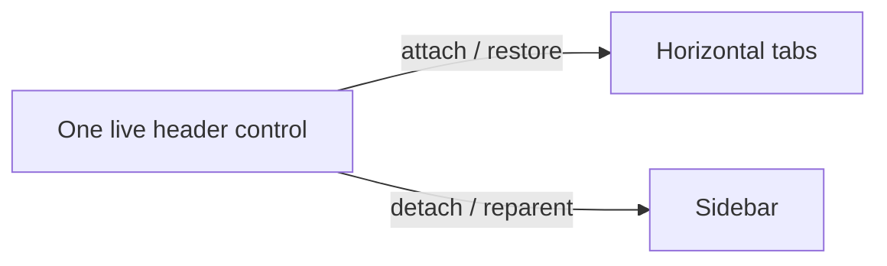
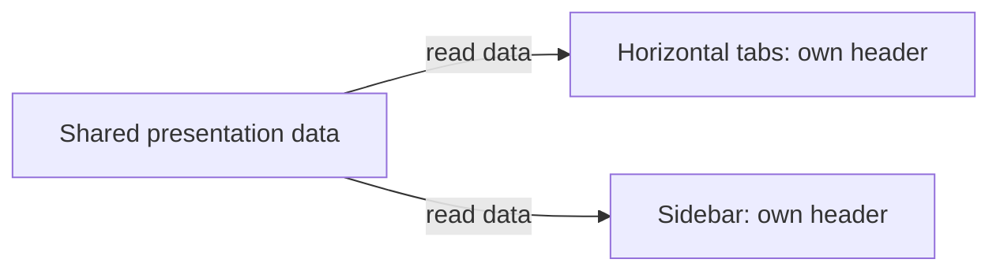

# Agent History and Sidebar Keyboard Navigation

## Status and scope

This specification defines the agreed target behavior, including the October 9,
2026 PM/UX revision. A static Tabs heading and independent display filters replace
the earlier Tabs/Agents switch. The single-scroll layout and one-time Sidebar
introduction remain unchanged.
This is not an acceptance report: build-specific results and remaining validation
belong in the release checklist and validation evidence.

The scenarios below cover the left sidebar in the **vertical** tab layout. The
sidebar and the independent **Agent Pane** are different surfaces. The sidebar
is always **Tabs**. Its **Agents only** and **Recent agent sessions** options are
independent: recent sessions can appear below ordinary shell tabs as well as
agent tabs. **History** below refers to the existing session rows and their
loading/activation lifecycle, not a separate navigation mode. The one-time upgrade
changes the initial `tabLayout`; subsequent user choices, horizontal agent-session
behavior, and other agent/delegation shortcuts remain supported.

Custom native CLI launch identities remain `custom:<name>` when their underlying
CLI reports activity as a built-in provider. Activity/session bindings still
update, and built-in native CLI panes retain provider rebinding.

For reports attributed to the same pane and session, a built-in provider takes
precedence over a custom-provider representation. Different sessions using that
pane are selected by their newest activity timestamp, including when providers
differ. This preserves the existing provider precedence without freezing the
pane to an older session. Live updates with equal or missing timestamps use the
latest received report. Tab/pane icons follow the selected reported provider
rather than remaining fixed to the agent originally launched. No nested-agent
stack is inferred.
Snapshots first select the canonical report for each pane/session, then select
the newest session for each pane. A newer session can replace an ended one,
including a custom session, and a delayed older ended report cannot reclaim the
pane. Custom reports about the same completed session still cannot override its
built-in report.
Snapshot rows without a provider ID are aggregated separately, then applied as
state updates to the resolved session provider. They must not inherit whichever
provider happened to occur immediately before them in an unordered snapshot.
An older live report may identify a previously unnamed provider without rolling
back that session's newer status or activity timestamp.
Live reports with equal or missing timestamps use receive order. Snapshot rows
have no receive order, so a tied refresh preserves the known pane winner. With
no known winner, timestamp/provider/session ordering provides a stable fallback
instead of letting unordered snapshot rows repeatedly change the icon.

## One-time Sidebar upgrade and introduction

- Sidebar becomes the default tab layout for new users. On the first eligible
  upgrade, existing non-Sidebar users also move to Sidebar once.
- Persist a hidden migration-completed state separately from the hidden
  introduction-shown state. Neither appears as an editable Settings UI option.
  Migration completion is recorded only after its required layout change has
  succeeded through the existing settings persistence path.
- Later choosing horizontal tabs must not reset either state. Restarting,
  reloading settings, opening another window, or another ordinary upgrade must
  not force Sidebar again or repeat an already-shown introduction.
- Present a succinct, dismissible Windows TeachingTip anchored to the visible
  Sidebar only when its UI is ready. Explain the new tab organization, where to
  adjust the view, and how to return to horizontal tabs.
- Record introduction-shown state when the tip is actually presented, not
  merely when migration starts. If no usable anchor is available, defer the
  introduction without repeating the completed layout migration.
- Multiple windows must not independently repeat the same migration or bubble.
  Preserve existing onboarding, focus, and modal behavior.

| Default shortcut | Responsibility |
|---|---|
| `Ctrl+Shift+G` | Toggle **Agents only** without changing **Recent agent sessions** or the search query. |
| `Ctrl+Shift+R` | Toggle **Recent agent sessions** without changing **Agents only** or the search query. |
| `Ctrl+Shift+/` | Retained alias for the recent-session preference in vertical layout; horizontal Agent Pane sessions behavior is unchanged. |
| `Ctrl+Shift+S` | Enter the sidebar through global search, or collapse it and return to the previous input when focus is already inside. |
| `Ctrl+Shift+.` | Show/hide the independent Agent Pane; its behavior is unchanged. |

In horizontal layout, `Ctrl+Shift+S` remains a consumed no-op: no layout/chrome
change and no input leakage into the terminal. User bindings can override or
unbind the defaults.

## Filter and search matrix

| State before the action | Action | Resulting surface/state | Focus policy |
|---|---|---|---|
| Sidebar collapsed | `Ctrl+Shift+S` | Expand the sidebar and open global search. | Remember the current terminal or Agent input, then focus the shared search box. |
| Sidebar expanded, focus outside the sidebar | `Ctrl+Shift+S` | Keep the sidebar expanded and open global search. | Remember the current input, then focus the shared search box. |
| Sidebar expanded, focus inside the sidebar | `Ctrl+Shift+S` | Collapse the sidebar and close search; keep both filter preferences. | Best-effort return to the input used before entering the sidebar. |
| Query empty | Both filters off | All open shell/agent tabs; no recent section. | Keep standard menu/input focus. |
| Query empty | Agents only on, recent off | Open agent tabs; no recent section. | Keep standard menu/input focus. |
| Query empty | Agents only off, recent on | All open shell/agent tabs plus recent sessions. | Keep standard menu/input focus. |
| Query empty | Both filters on | Open agent tabs plus recent sessions. | Keep standard menu/input focus. |
| Either filter combination | Enter a nonempty query | Matching open shell/agent tabs and matching recent sessions, regardless of filters. | Keep focus in shared search. |
| Nonempty query | Toggle either filter | Results remain global; record the new checked preference. | Preserve query and search/menu focus. |
| Nonempty query | Clear/close search | Restore results from the exact current filter combination. | Normal search focus policy. |

Opening search with an empty query does not override the filters. The static
Tabs heading has no activation action or keyboard focus stop. Recent-session
loading is triggered when the section is needed by its preference or a query,
using the existing backend and matching rules.

The default **+** action always opens a normal terminal tab using the configured
default profile. Filters, search, and tab layout do not change its action,
accessible name, help text, or tooltip. Creating an agent requires an explicit
agent action, not an override of the normal new-tab control.

## Sidebar presentation

- The toolbar heading is static **Tabs**, with no switch button, border, or swap
  icon. The display-options flyout has a **Show** section containing standard
  checkable **Agents only** and **Recent agent sessions** controls.
- The display-options button uses **Sidebar display options** for its tooltip
  and accessible name regardless of filters. Its menu configures visible tab details and
  any available tab filters; opening it does not itself filter tabs.
- History rows have three text lines aligned to the right of a leading 16px
  provider icon: title, working directory, then status or time. The icon is
  vertically centered across all three lines. The third line shows only **In use**
  for live sessions without an IT registration, the detailed
  Idle/Active/Waiting for input/Error status for live IT registrations, or the
  relative timestamp for ended/historical sessions. Live rows do not display a
  timestamp, and historical rows do not display the redundant Historical status.
  An outlined window with an upward restore arrow beside the third line
  identifies a confirmed background tab; clicking restores the whole original
  tab. Two overlapping windows identify a session attached to another visible
  window; clicking focuses its original tab and pane. Its detailed status also
  ends with **In another window**, separated by a middle dot (for example,
  `Idle · In another window`). This requires confirmed different-window
  ownership; current-window, external **In use**, historical, and unknown-owner
  rows do not receive the annotation. Kept-tab membership takes precedence
  over an old window ID and does not show the other-window annotation.
  Unknown ownership leaves the activity status visible without either indicator.
  Enter uses the same activation: focus or restore an existing bound pane, or
  attempt supported resume in the current window for an explicitly activated
  known-provider shell session with no bound pane. A failed bound-pane focus
  never falls back to creating a new resumed session.
  Bare Enter activates the focused History row even with selection disabled;
  modified Enter is ignored. A focused ownership button retains its native
  activation, rather than also activating its containing row.
  Provider identity remains available through the icon tooltip, the focused
  history row's accessible name (alongside its title), and shared search.
  The working directory supports search highlighting and a full-path tooltip.
  For **In use** sessions, hovering the row, working directory, or provider icon
  instead explains: **This session is open in another application.**
  The focused history row exposes the same explanation as accessible help text.
  Both follow status changes without replacing the row, and the help text clears
  when the session returns to IT or becomes historical.
  Text may truncate with an ellipsis at the minimum sidebar width; the ownership
  action retains reserved space.
- History ages match the original session-management view: localized,
  unabbreviated numeric relative time below seven days, such as `2 minutes ago`,
  `2 hours ago`, and `2 days ago`. Below a minute, the existing localized
  “just now” text remains. Whole elapsed minutes, hours, and days are floored.
  At exactly seven days and beyond, display the session's UTC calendar date
  using a localized year/month/day date without a weekday, rather than weeks,
  months, or years ago (for example, `September 21, 2026` in English).
  Relative-time translations, plural grammar, date ordering, and month names
  come from Windows ICU's long CLDR formats, using the UI resource language.
  Missing or unsupported timestamps, or timestamps that cannot be formatted, retain localized “unknown.”
- The sidebar has exactly one vertical scrolling viewport containing the
  eligible open tabs followed by **Recent agent sessions** when requested.
  The live section grows or shrinks with its tab, group, and pane rows; this does
  not mean stretching individual row heights. Recent agent sessions follows the last
  live row rather than being pinned to the bottom edge of the window.
- There is no draggable divider, section-height setting, keyboard section
  resizing, fixed split ratio, or independent section scrollbar. Window resizing
  changes the shared viewport while both sections remain reachable.
  A theme-aware, noninteractive separator remains above the Recent agent sessions
  heading in both expanded and collapsed states.
- Recent agent sessions has a keyboard-accessible expand/collapse heading exposing its
  expanded state to UI Automation. It is initially expanded, preserving the
  existing visible-session behavior. Expanded session rows have no additional
  indentation beyond their existing provider-icon and metadata alignment.
  Collapsing this section does not clear shared search, delete sessions, or close
  tabs. Its action tooltip says **Expand recent agent sessions** or
  **Collapse recent agent sessions**, matching the current expanded state.
  A nonempty global query expands the results and disables manual section
  collapse without changing the remembered non-search expansion preference.
  Expansion is not selection: the heading retains neutral theme styling rather
  than an accent-colored checked fill, with ordinary hover and pressed feedback.
  Its custom automation peer derives from `ToggleButtonAutomationPeer`, matching
  the heading's `ToggleButton` base. XAML requires that peer interface when
  `IsChecked` changes with UI Automation property listeners active, including
  during template realization.
- Preserve virtualized row realization, keyboard navigation, focused-row
  visibility, and existing live-tab/group/pane interactions with the shared
  scroll surface; do not obtain one scrollbar by introducing unbounded nested
  lists.
- **Global Search**: There is no separate history search box. The single
  `SearchTextBox` searches all open tabs and recent agent sessions regardless
  of the two display preferences. It never rewrites their checked values.
  Clearing or closing search restores those values immediately.
- The search placeholder, automation names, and button tooltip read
  **Search tabs and recent agent sessions**, independent of filters.
- Recent agent sessions retains its loading, error, and empty-state messages without
  replacing usable retained rows or introducing another scrolling viewport.
  Runtime Narrator/UIA and RTL behavior remain separate validation steps.
- Exclude only the represented history identity: provider, session ID, source
  location (host or WSL distro), and session universe. The open-pane binding
  supplies session ID, provider (when known), and pane ID; the matching history
  row supplies location and universe. Pane ID disambiguates colliding history
  identities, but an unambiguous session/provider remains represented after
  rebinding to a new pane even if its history row still names the old pane.
  A graceful connection close refreshes this projection even when the pane is
  retained by `closeOnExit: never`; a failed connection retains its binding until
  the pane closes.
  If colliding rows cannot be disambiguated, retain them rather than hiding
  an unrelated session. Status alone is not identity: an idle or working
  session without a representing open pane remains in the lower section.

## Recent-session preference and focus

There is no separate History entry/exit navigation context. Changing its display
preference does not collapse the rail, clear a query, change the Agents only
preference, or start a session. New-tab and resume actions retain the chosen
display preferences. Standard flyout keyboard navigation and checked-state
automation remain available; the removed heading action is not a tab stop.

## Sidebar hotkey: enter search and return to input

`Ctrl+Shift+S` navigates between the current input and the sidebar's global search.

- When the sidebar is collapsed, expand it, open **Search tabs and recent agent sessions**, and
  focus its search box. When expanded with focus outside, open/focus the same
  box without collapsing the sidebar.
- Remember the terminal or Agent chat input used just before this hotkey entry.
  A later entry from another input replaces that best-effort return target.
  Closing search with Escape or its button expires the target; opening
  search without the hotkey (including its pointer or keyboard button)
  starts without a saved hotkey source. A new hotkey entry captures its input
  only after search has opened successfully.
- When focus is inside the expanded sidebar, collapse it. If the remembered
  input remains visible and focusable, return there without changing its
  unsent draft. Otherwise, try the currently active visible terminal or Agent
  input, then a visible terminal pane in the current tab, best effort; never
  reopen a hidden Agent Pane or create a pane to recover focus.
- If no target exists, leave any remaining valid focus unchanged; do not
  display an error, block, or retry indefinitely.

The titlebar's Expand/Collapse button retains its existing visibility behavior;
it does not itself open search. The search hotkey preserves both filter
preferences, including when recent-session results are visible; there is no
separate History source-restoration path.
The public `toggleSidebar` command remains a visibility toggle when invoked
from the command palette or another non-key source. The titlebar rail toggle
counts as inside the sidebar for the keybinding's focus policy.

## Data and lifecycle invariants

- These actions change visibility and focus only. They do not delete, clear, or
  modify underlying session records or conversation contents.
- They do not terminate agent processes/tasks, restart agents, or resume
  conversations for focus recovery.
- Preserve unsent chat and terminal input.
- History list refreshing and transient loading/error UI may follow the existing
  view-close lifecycle. Stopping a list refresh must not stop an agent task.
- Closing History does not mean closing the independent Agent Pane.
- Expected unavailable-focus cases are normal best-effort fallbacks, not reasons
  to display an error or leave keyboard interaction blocked.

## Sidebar toggle hint

- Use the localized labels **Expand sidebar** and **Collapse sidebar** for the
  tooltip and automation name, retaining the existing resource identifiers.

## Tab-header ownership and rename focus

### Presentation design principles

The problem with transferring a live header between layouts is that data,
visual ownership, edit state, and rendering lifetime become coupled. The
principle-led change is to share the information while each view keeps its
own controls:

1. **Share data, not controls.** Titles, status, rich metadata, and accessibility
   text have one shared source; Horizontal and Sidebar realizations own their
   own headers and icons.
2. **Change presentation, not meaning.** Layout-specific visibility does not
   change progress or pin state. Selection and commands follow stable tab/pane
   identity, not a temporary display index.
3. **Let the view own rendering lifetime.** The visible control owns its clock
   and reconciles actual attachment/visibility. Do not put clocks in shared
   models or add per-move animation repair callbacks.

**Before:** one live header is sequentially attached/restored or reparented.

**After:** the same information is read by independently owned views.

The benefit is stable visual ownership through moves/layout changes, correct
command/selection ownership, and locally managed animation lifetime. This is
a focused presentation boundary, not a full application architecture rewrite or a
reason to add speculative framework layers. The contracts below remain the
implementation reference.

The tab owns a data-only `TabHeaderPresentation` and the existing aggregate
`TerminalTabStatus`. The canonical horizontal `TabViewItem` permanently retains
its native `TabHeaderControl`. Each sidebar row template creates a separate
`TabHeaderControl` bound to the same presentation; no header control is extracted,
detached, or transferred during reorder or layout changes. Sidebar icon elements
are also template-owned, with retained `IconSource` data rather than shared live
elements. Pane rows and terminal/taskbar progress remain independent of this
presentation contract.

The localized tab accessibility name is computed once alongside pin and rich
metadata state, stored in the shared presentation, and projected to the native
tab and selectable sidebar row. The existing container-realization handler
installs a one-way binding to observable presentation data and clears it on
recycle. UWP does not evaluate bindings in style setters; the row does not bind
through a nested attached-property path on the hidden horizontal control.
The C++ presentation is marked `bindable` so runtime binding can resolve its
properties through generated XAML metadata; compiled `x:Bind` alone does not
provide that runtime lookup contract.

Selection is restored by canonical tab identity mapped to the current sidebar
descriptor, not by treating a canonical index as a display index. Existing
focus fallback first retains the current visible terminal or Agent input, then
uses the existing source-shell fallback; this adds no saved focus field,
selection cache, timer, repair callback or view-model clock.

Pin state remains shared model data. `TabHeaderControl.ShowPinnedIcon` is an
appended, view-local property, defaulting to true: the canonical horizontal
header sets it to false, while newly created sidebar headers retain the default.
Only the horizontal visual pin glyph is hidden. Sidebar badges, accessibility
labels, Pin/Unpin menus, ordering, first-ordinary unpin placement and cross-pin
movement boundaries retain #1052 semantics. This does not clear `IsPinned`,
restore original positions, introduce grouping UI or permit unrestricted
movement across pinned/unpinned boundaries. The primary layout round trip
verifies canonical owner and the sidebar selection pattern before secondary
visual checks. Matched same-profile title-leading offsets measure reserved pin
space; FontIcon peer counts are diagnostic only because UWP may not expose
those peers. Small compositor crops include the full header and leading glyphs.
Actual Sidebar pin presence and Horizontal pin absence require independent
visual review; neither geometry nor peer absence proves rendered pixels.

Indeterminate header, pane-row, and tab-switcher progress use the shared
`IndeterminateProgressRing` control and its style in
`IndeterminateProgressResources.xaml`. The control owns one compositor
rotation animation on its current template visual and starts it only while loaded, active, and visible through its
attached visual ancestry. Activity and ancestor-visibility callbacks stop or
start the clock; unload stops it and releases weak ancestry observers, and load
observes the new ancestry. Template replacement stops the old clock before
attaching to the replacement visual. This is view-local rendering lifetime, not progress
model state or per-move/layout repair; there is no XAML `Loaded` trigger or
native `ActiveStates` group or XAML storyboard target competing with it.

The rotation targets a renderer-owned child ShapeVisual, not the
framework-owned XAML element visual that recycling/layout can reset.
The control's `IsActive` property remains bound to status; the existing outer
active gate and inner indeterminate gate control presentation. It is neither a
keyboard tab stop nor a hit-test target, and its automation peer exposes
`ProgressBar` without a numeric `RangeValue` pattern. The arc uses
the resolved Foreground brush, including brush color and theme changes; MUX determinate/error/paused progress and the
shared data/identity policy are unchanged. Product-host reload/animation
acceptance still requires runtime integration validation.

Identity and progress are separate: a profile or known live agent icon remains
visible beside active progress in horizontal tabs, individual sidebar tabs,
and pane rows. In the expanded sidebar, a collapsible group's chevron occupies
the same leading slot as an individual tab's identity icon, without an
additional profile icon; their top-level title positions remain aligned whether
the group is expanded or collapsed. The compact rail hides the chevron and
retains identity. Explicit hidden-icon styling remains hidden, including while busy.
The sidebar uses the native tab's configured source, including monochrome
styling; the existing agent-session projection still selects the provider icon.
Selected-color contrast applies to monochrome identity, not colored bitmaps or
extracted images.

Metadata visibility and the aggregate-progress visibility gate belong to the
individual view. Title, search text, rename width, metadata text/accessibility
text, and aggregate status are shared data. A recycled view cancels an outstanding
rename before rebinding without committing it or requesting focus for its new
owner.

Context-menu and palette rename commands resolve the realized row header, as
does the color-picker anchor. Rename commits route through that row's current
canonical tab to `SetTabText`; rename completion uses the existing focus-request
path. Closing a context menu checks the real row's `InRename` before restoring
terminal focus.
Interactive requests reveal the actual row by expanding a collapsed rail through
the existing view commands, without hiding recent sessions. Filter-hidden rows remain
unavailable; no invisible native-header fallback is used.

Existing WinRT methods retain their ordering and signatures. New members are
appended. `TabStripDisplayItem.Header` retains its `Object` getter/setter slots,
but now returns `TabHeaderPresentation`, never a visual; its setter accepts
presentation data, a legacy header (extracting only its data), a boxed title,
or null (creating an empty presentation). `Icon` retains its `IconElement`
getter/setter slots on both tab and pane descriptors as a data-only compatibility
adapter, not a promise of full legacy visual semantics: the getter creates a fresh,
unparented native icon element, and the setter extracts source data from standard
icon types. Unsupported inputs fail with `E_INVALIDARG`. Templates use the
`Presentation` and validated, data-only `IconSource` properties instead. The
`Object` icon-source slot contains a MUX `IconSource`; this avoids the XAML
function-binding compiler default-constructing the abstract source base class.
The icon-source
factory creates a fresh element per template and retains EXE/DLL image sources,
agent SVG geometry, bitmap and symbol sources, and font/RTL properties.
Pane descriptors retain source data, content identity, and status, never live
icon elements. Tab and pane adapters share the same conversion and element
factory; simultaneous containers share geometry/image data but own distinct
elements.
- Show the label and dimmed effective shortcut on the same line with 8 units
  of spacing for both the collapsed **Expand sidebar** and expanded
  **Collapse sidebar** buttons. Keep Segoe UI Variable, `FontSize=12`, normal
  weight, `LineHeight=16`, and shortcut opacity `0.7`.
- Display normal shortcut casing, such as `Ctrl+Shift+S`, rather than serialized
  lowercase text.
- Resolve the effective sidebar binding and refresh the hint when settings
  change. Rebinding changes the displayed chord; unbinding or overriding the
  action hides the obsolete shortcut without leaving an empty gap.

Opening global search with `Ctrl+Shift+S` does not change either checked filter
preference or the ordinary Tab traversal of sidebar items.

## Acceptance scenarios

These are required checks for this contract, not claims of completed validation:

- Exercise all four filter combinations, with pointer and remapped keyboard
  actions. Verify a static Tabs heading and standard checked menu automation.
- Check that open tabs and recent sessions remain reachable in the shared
  scrolling viewport through window shrinking/growing, section collapse, group
  expansion, and keyboard navigation.
- Check that only identity-matched represented sessions are absent from history,
  and unattached idle sessions remain available.
- Check that a nonempty shared search includes matching shell tabs, agent tabs,
  and recent sessions regardless of filters. Opening empty search must not
  override filters.
- Change filters during search, then clear and close the query separately.
  Verify restoration of the exact checked preferences, not default values.
- Verify existing recent-row resume/ownership actions and live tab/group/pane
  actions remain available when their rows are visible.
- For sidebar-hotkey entry from collapsed and expanded rails, verify restoration
  to Agent Pane chat and the exact originating terminal split when available.
- Repeat with an unavailable source and verify the visible-terminal fallback,
  unchanged session data/drafts, and nonblocking behavior.
- Verify that `Ctrl+Shift+S` from either collapsed or expanded/outside focus
  activates tab search and focuses its box; a second press from inside
  collapses and best-effort restores the originating shell or Agent input.
- Inspect both Expand/Collapse hints against the single-line designer
  reference, including the sidebar wording, accurate shortcut presence,
  casing, remapping, and unbinding.

The related release-checklist IDs remain `C110` (History), `C112` (action
dispatch), `C365` (sidebar toggle), and `C366` (hint presentation). Earlier
results for a different behavior contract are not acceptance of this revision.
