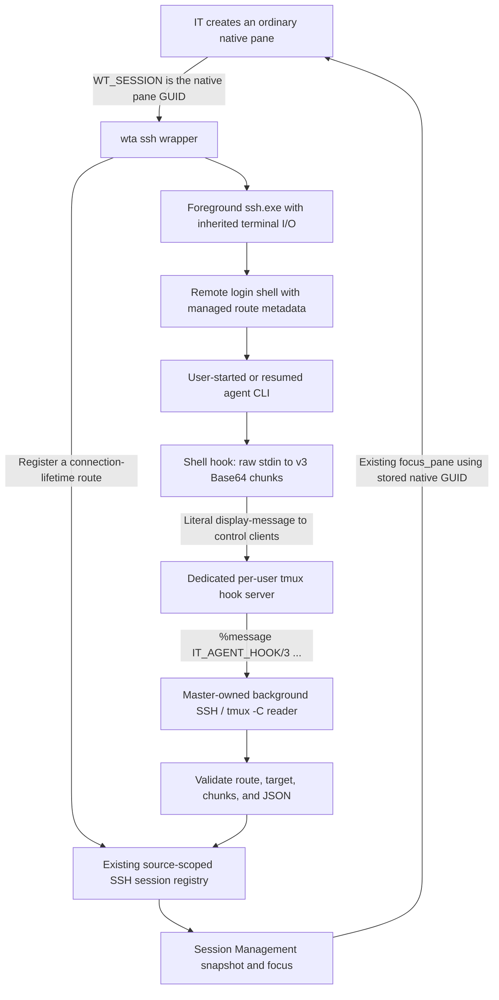

# Agent Hooks in Ordinary Managed SSH Panes

## Scope

This extends remote hook tracking to agent CLIs running in an ordinary SSH
shell. The agent does not need to run inside a tmux pane. A separate tmux
control connection carries hook notifications back to the local WTA master.

The supported entry points are SSH profiles and SSH commandlines that IT can
normalize, plus SSH sessions resumed through Session Management. This does
not intercept arbitrary `ssh` commands typed inside an unrelated shell.
Existing native tmux windows continue to use the
[v2 pane-scoped hook protocol](tmux-remote-agent-hooks.md).

The implementation reuses the existing SSH source registry, session reducer,
snapshot notifications, and native focus operation. It does not introduce a
second session list or infer pane ownership from cwd, process names, or focus.

## Architecture



Foreground SSH carries the user's interactive terminal traffic. The background
connection is only a hook transport: it does not create a visible tmux window
or use a dummy tmux pane as the session's focus target.

### Why v3 Does Not Pass Through `wtcli listen`

The two modes have different local owners of the control stream:

| Mode | Control-stream owner | Local event and state path |
|---|---|---|
| Native tmux panes, v2 | C++ `TmuxController` | C++ validation/redaction -> COM `agent_event` -> local `wtcli listen` -> master |
| Ordinary managed SSH, v3 | `wta-master` background reader | Master validation/redaction -> existing SSH source registry |

`wtcli listen` subscribes to IT's COM event service. It does not automatically
observe all internal WTA events or read arbitrary SSH/tmux stdout.

Master already owns the v3 connection routes, SSH source identity, remote
session IDs, and native pane bindings. Processing there avoids sending data
through C++/COM only to deliver it back to master, and keeps updates in the
correct source-scoped registry. Republishing v3 as the existing `agent_event`
without changing its routing would risk duplicate processing or attribution
to the wrong registry.

This is an implementation choice, not a limitation of tmux control mode.
It trades a shared COM diagnostic stream for direct source-aware processing.
There is currently no unified post-validation hook event stream for both
modes. A future observer stream would need separate semantics so observation
does not apply the same state transition again; it is not implemented here.

## Native SSH Launch Integration

`AgentSourceUtils.h` recognizes the same destination/user/port subset used by
SSH Session Management. Supported bare or Windows system OpenSSH commandlines
are wrapped in a managed launch:

```text
wta.exe ssh --destination user@host [--port 2222] [--no-pty]
```

Explicit custom SSH executables and unsupported inline options are not
silently replaced. The original profile remains unchanged. An internal
ConPTY `originalCommandline` setting preserves the logical SSH command for
querying, duplication, restart, and layout persistence rather than storing
the current package's WTA executable path.

Session source discovery uses the source pane's logical connection command,
not just the inherited profile. It also recognizes managed WTA SSH commands,
including resume commands that carry `--remote-command`. This keeps a
commandline override or resumed SSH tab from incorrectly showing Host history.

The wrapper obtains the local pane GUID from `WT_SESSION`. It registers an
active connection route with master before relying on hook messages, and
revokes that route when foreground SSH exits. Native pane closure remains an
independent cleanup signal.

The remote shell receives:

| Variable | Purpose |
|---|---|
| `IT_SSH_HOOK_ROUTE` | Connection-lifetime route UUID |
| `IT_SSH_HOOK_SOCKET` | Explicit path of the managed tmux socket |
| `IT_SSH_HOOK_SESSION` | Dedicated hook transport session |

These values are supplied by the managed SSH launch, not manually fabricated
by a user or inferred from a Copilot session ID. The foreground shell's
metadata does not depend on the CLI retaining the login shell's `HOME`.

## Remote Setup

The package includes both `it-agent-hook.sh` and `install-remote-hooks.sh`.
Master stages these assets through the background SSH connection using
bounded, known-size input. Stdin remains open when the remote process
transitions into tmux control mode.

The installer manages its own files under the remote user's
`.intelligent-terminal` directory. It installs self-contained CLI hook
plugins through their supported plugin/extension interfaces rather than
rewriting arbitrary user settings. The generated hook command uses a stable
absolute script path.

Setup is policy-scoped and ownership-aware:

- Only allowed, supported, detected CLIs are candidates.
- Agent executables, authentication, and system packages are not installed
  or changed.
- Foreign files and explicitly disabled integrations are not overwritten or
  re-enabled merely because their names match.
- A recognized IT-owned v2 Copilot installation can be migrated after its
  ownership, manifest, script, and registration are verified.
- Installation is locked and repairable; partial failures do not become a
  false claim that every provider is available.
- A CLI runtime must be able to execute tmux and access the socket. A plugin
  being installed is not proof of that capability; confined Snap runtimes
  are not made to work by bypassing their restrictions.

The dedicated server publishes finite readiness metadata:

```text
@it-ssh-hooks-protocol = 3
@it-ssh-hooks-installed-clis = canonical CLI IDs, or -
@it-ssh-hooks-unavailable-clis = canonical CLI IDs, or -
```

The reader checks a nonce-bearing response rather than treating arbitrary
stdout as readiness:

```text
IT_HOOK_READY/3 <nonce> 3 <installed> <unavailable>
```

Provider-level failures must remain visible without declaring all working
providers unavailable. Setup readiness describes transport and registration,
not proof that a running agent has already loaded or fired its hooks.

## V3 Wire Protocol and State Routing

The sender prefers managed SSH routing when route metadata is present.
Without it, the existing native tmux v2 path remains available.

```text
%message IT_AGENT_HOOK/3 <route> <cli-source> <event> <transfer> <index> <count> <base64>
```

The raw-body contract is unchanged: up to 1 MiB of stdin, at most 6,000
Base64 characters per chunk, and no partial JSON rewriting on Linux.
Master validates the reader's SSH target against the active route, reassembles
bounded transfers, validates UTF-8/JSON and session identity, and projects
only consumed metadata.

For a resumed session, its remote ID and native pane binding are already
known. A hook updates that existing source-scoped row instead of creating
a parallel Host or tmux-pane record.

For a newly started agent in a managed SSH shell, the route supplies the
native pane GUID needed to associate the new remote session ID. The event
then follows the shared hook plan and registry reducer. Source-specific
`_intellterm.wta/ssh_sessions/changed` notifications refresh the existing
Session Management view.

Native tmux v2 hooks also update this registry when the controller resolved an
SSH target from its local backend launch command. The COM envelope includes
that target separately from the projected remote payload. Master preserves the
raw agent session ID, so an existing Historical row becomes the live tmux row
instead of creating a second Host entry. Destination/alias, user, explicit
port, and provider remain source boundaries; aliases are not guessed to be the
same machine. Native pane UUID ownership is distinct from v3 connection-route
ownership, including stale-event protection after an SSH resume.

These rows share the same title refresh, source notifications, and native
focus/resume behavior as ordinary SSH sessions. Closing the native pane ends
its binding; resuming an ended conversation launches the agent over ordinary
SSH rather than recreating the tmux layout. Native v2 still travels through
C++/COM and remains visible to `wtcli listen`. Backends without a supported SSH
identity keep the original isolated tmux behavior.

Hooks provide activity and lifetime, not the agent's generated conversation
title. New rows initially use the working directory's basename as a placeholder.
While an SSH Session Management view is open, its five-second poll returns the
cached snapshot immediately and asks master to refresh remote ACP `session/list`
metadata in the background. One shared refresh gate per destination, port, and
agent coalesces viewers and enforces a minimum five-second interval after each
completed query, including failures. A title change publishes the same
source-specific notification; history merging preserves hook status and native
pane bindings. Background query failures are logged and leave cached state
intact. Hook notifications and diagnostic `Snapshot` requests do not trigger
these remote queries or wait for them.

Focus continues to use the registry's stored native pane GUID. The transport
server's tmux session and panes are never used as focus targets.

## Diagnostics: Event Streams Versus State Snapshots

| Observation point | What it shows | What it does not show |
|---|---|---|
| tmux control client's stdout | Raw `%message` frames, including encoded original payloads | Whether master accepted an event or applied a status transition |
| `wtcli --json listen --event "agent.*"` | COM-published local hooks and native tmux v2 events | Ordinary SSH v3 hook events |
| `wta sessions list --master --ssh <destination> --cli copilot --json` | One current snapshot of the master's SSH source registry, including status and pane bindings | A live event subscription or every intermediate transition |
| `wta sessions list --ssh <destination> --cli copilot --json` | A remote history query | The master's live pane bindings and hook-driven status |

For example, run this in a local IT shell to inspect an existing source:

```powershell
wta sessions list --master --ssh user@host --cli copilot --json
```

The command returns and exits. Re-running it polls state; it does not turn
into `listen`, replay missed hooks, or guarantee that brief intermediate
statuses will be observed. Use the same destination and explicit port, if
any, as the managed connection so the source identities match.

The master's `wta-main_master.<UTC-date>.log` contains `ssh_hooks` setup,
connection, and rejection diagnostics. It is not a complete payload/event
dump. The `_intellterm.wta/ssh_sessions/changed` notification invalidates the
UI's source snapshot; it is not a forwarded copy of the original hook.
Inspecting raw tmux traffic can expose unredacted prompts and tool data, so
do not treat a raw capture as equivalent to the redacted COM stream.

## Lifecycle and Policy

The connection wrapper remains present while global Session Management is
temporarily disabled. Automatic native profile wrapping does not add a
durable `--no-hooks` option for that temporary setting.

Changes to Session Management or the selected agent publish the local
`ssh_hooks_configuration` event. Master reconciles currently registered
targets when enabled and stops background setup/readers when disabled,
without terminating the user's foreground SSH connection or uninstalling
remote files. Existing hook installation entry points also request remote
reconciliation.

The explicit `wta ssh --no-hooks` option is a durable opt-out for that
connection. It is distinct from temporarily disabling Session Management.

Background transport failure does not prove that foreground SSH or the
remote agent has ended. Reconnection, route revocation, native pane closure,
and agent lifecycle events must remain separate operations. Late events may
not rebind a closed connection to a new pane.

## Limitations and Security

Background setup uses existing trusted SSH configuration and noninteractive
authentication. It does not weaken host-key verification, forward credentials,
or prompt for passwords in a hidden process. If background setup is
unavailable, ordinary foreground SSH remains usable with a diagnostic.

Configured remote commands or session modes that cannot be reproduced safely
fall back to the original untracked SSH behavior rather than being silently
replaced. Before inserting a POSIX bootstrap into an ordinary login, the
wrapper requires a successful bounded, nonce-correlated Linux probe using
trusted noninteractive SSH. Unconfirmed or non-Linux targets retain their
original command-less login; they are not forced to execute a POSIX command.

New or changed hook registrations may require an agent restart. The system
does not retrofit hooks into an already-running CLI or replay missed events.
Arbitrary external SSH processes without a registered route are not implicitly
bound to whichever IT pane happens to be active.

The tmux side channel carries unredacted Base64 data until local processing.
Base64 is not encryption, and socket access permits status spoofing. Route
validation provides session attribution, not authorization to inject shell
input or grant agent permissions.

## Implementation Map

| Area | Location |
|---|---|
| Native launch/source recognition | `src\cascadia\inc\AgentSourceUtils.h` |
| Profile wrapping and configuration events | `src\cascadia\TerminalApp\TerminalPage.cpp` |
| Logical commandline preservation | `src\cascadia\TerminalConnection\ConptyConnection.cpp` |
| Foreground managed SSH command | `tools\wta\src\cli` |
| Background routes, setup, and control transport | `tools\wta\src\master\ssh_hooks.rs` |
| Existing source registry, resume, and focus | `tools\wta\src\master\ssh_sessions.rs` |
| Source-scoped helper/master protocol | `tools\wta\src\ssh_session_registry.rs` |
| Remote runtime and installer | `tools\wta\wt-agent-hooks\tmux` |

Verification covers native commandline/source handling, v2 compatibility, v3
framing and limits, installer ownership and policy, connection lifecycle,
source isolation, status transitions, and reuse of native focus. The native
XAML test host still has an environment-specific local RPC authentication
limitation; runtime integration checks are recorded separately from that host.

A real deployed verification connected an ordinary native SSH pane to Ubuntu
using Windows OpenSSH. The remote worker confirmed that `TMUX` and `TMUX_PANE`
were absent while the managed route was present. An authenticated Copilot
conversation produced Working, Idle, and Ended in the master's source snapshot.
Activating its Working row through the same SSH registry operation used by
Session Management focused the exact original native pane GUID. The test
closed only its own pane and scratch files.

The runtime checks also exercised Windows OpenSSH's omission of an unset
`RemoteCommand` in `ssh -G`, user-local CLI discovery through the background
login environment, and migration from a verified v2 Copilot installation whose
CLI listed its source only as `installed`.
