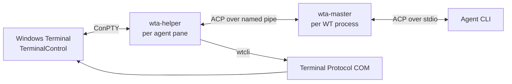
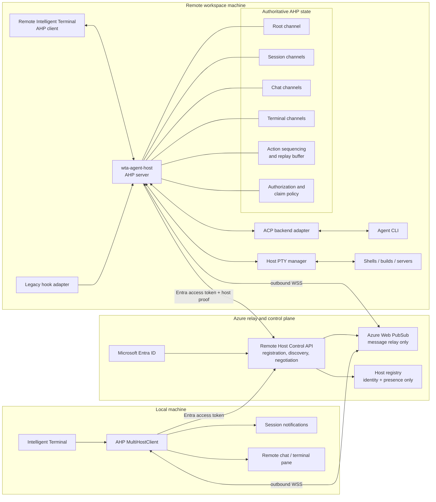
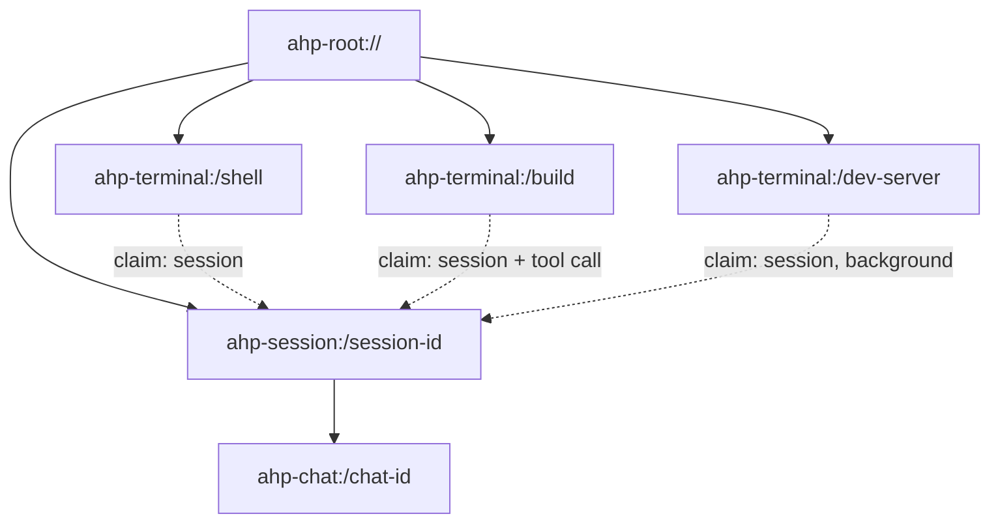
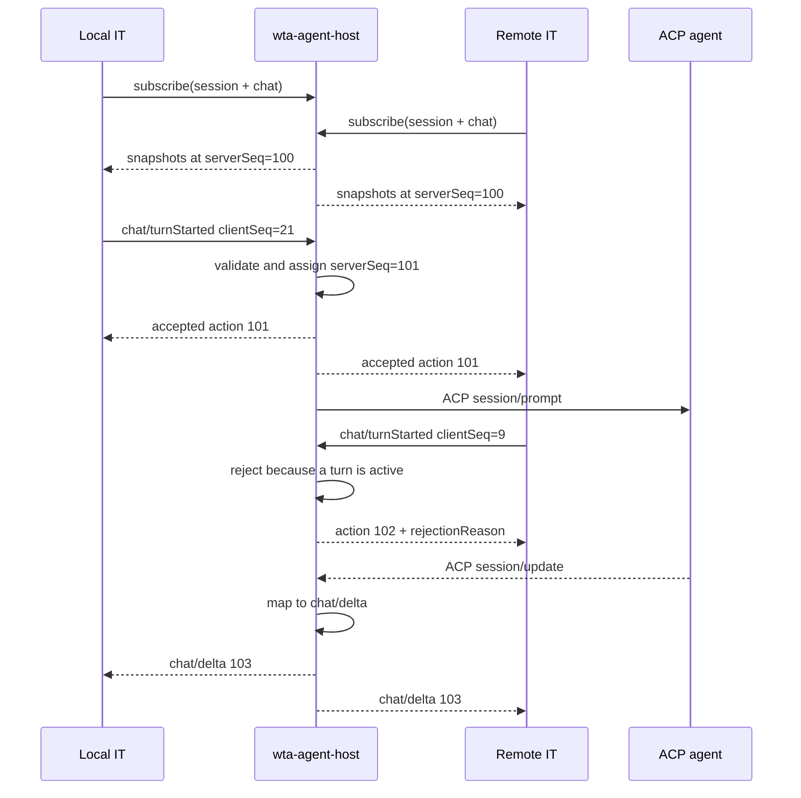
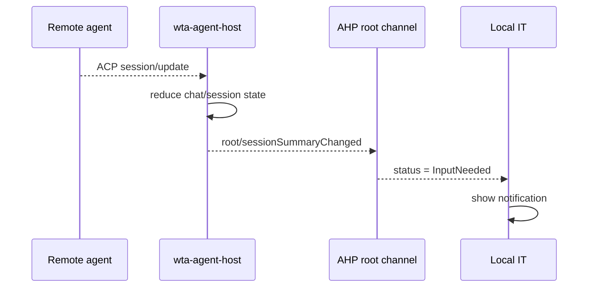
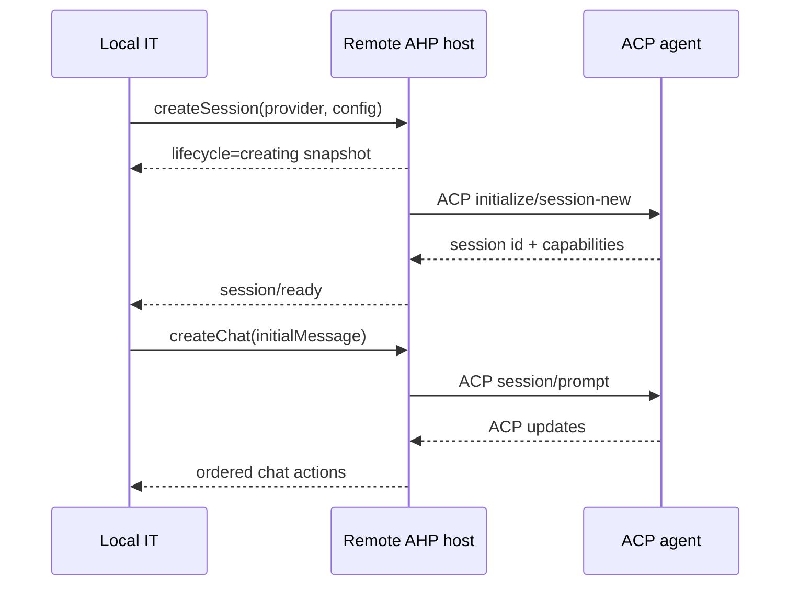
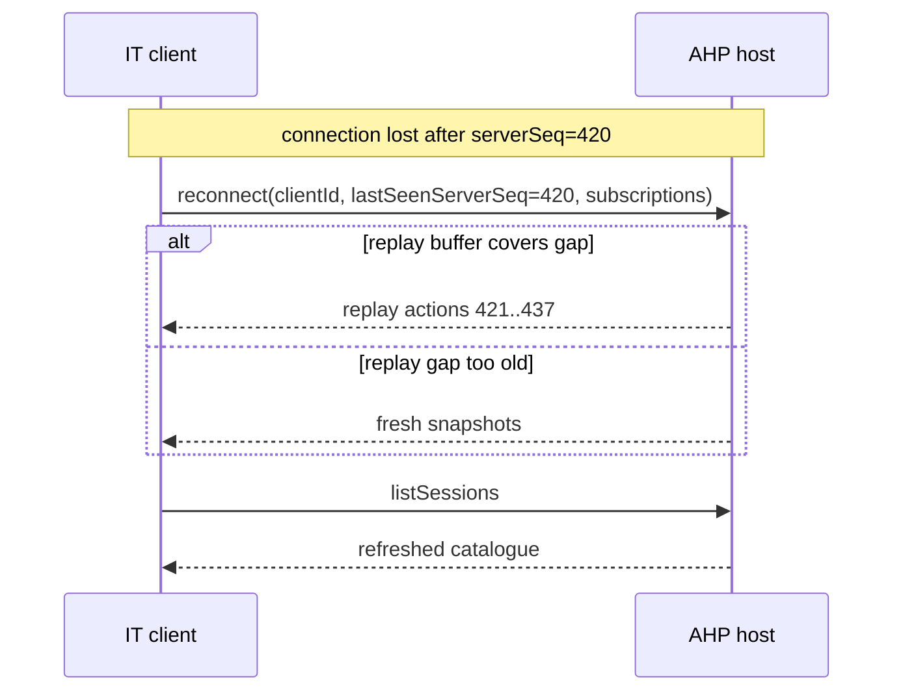
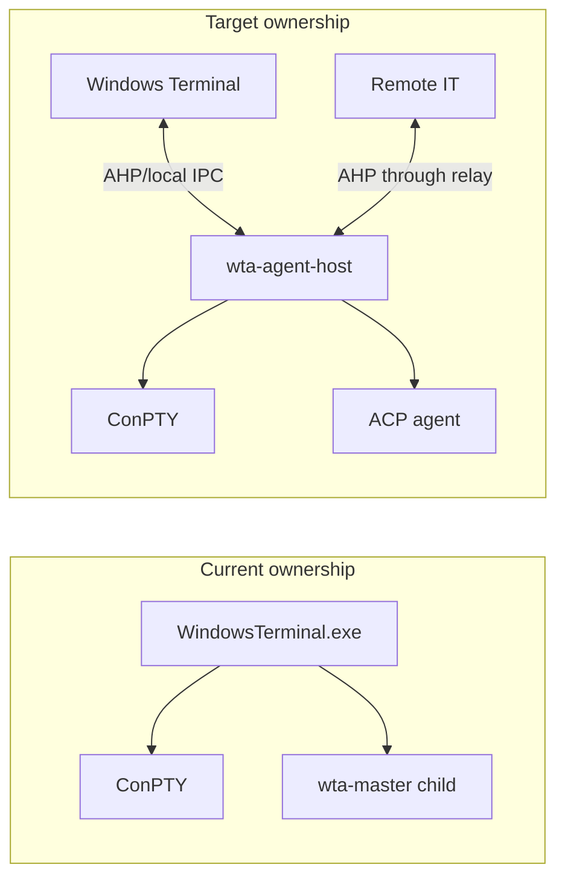

# Remote Intelligent Terminal Sessions via Agent Host Protocol

- Author: kaitao@microsoft.com
- Date: 2026-07-23
- Status: MVP foundation implemented; end-to-end product integration in progress

## Implementation status

The repository now contains the first executable vertical slice:

- a standalone Rust AHP 0.7 host core with authoritative sequencing, bounded
  replay, snapshot fallback, catalogue ingestion, atomic local persistence,
  authenticated loopback diagnostics, and slow-client limits;
- an Entra-protected .NET control API for host registration, discovery,
  heartbeat, RSA host proof, nonce replay protection, and scoped Web PubSub
  negotiation;
- Bicep/azd infrastructure for Container Apps, serverless Cosmos DB, Web
  PubSub, ACR, managed identity, Application Insights, and least-privilege
  role assignments.

This is not yet the end-user remote-session MVP. The Azure Web PubSub transport,
native Entra client, existing hook/ACP integration, host-owned PTY channels, and
TerminalApp remote session UI remain to be connected through the contracts
defined here.

## Abstract

Intelligent Terminal currently manages AI-agent sessions inside one Windows
Terminal process. A `wta-master` owns the agent CLI connection, per-pane
`wta-helper` processes render the agent UI, and the Terminal Protocol COM server
provides pane discovery and control. Session state is therefore local to one
machine and, for important parts of the lifecycle, local to one running Windows
Terminal process.

This document proposes evolving that architecture around the
[Agent Host Protocol (AHP)][ahp]. A standalone `wta-agent-host` on the machine
where the workspace and processes live becomes the authoritative owner of agent
sessions, chats, terminals, sequencing, replay, and client coordination.
Intelligent Terminal instances become AHP clients. A local client and a client
running on a Dev Box can observe and control the same session without copying
the workspace or moving execution away from the Dev Box.

The resulting protocol stack is:

```text
Intelligent Terminal clients
        │
        │ AHP through an Entra-authenticated cloud relay
        ▼
wta-agent-host
        │
        ├── AHP authoritative state + client arbitration
        ├── ACP adapter ──► agent CLI
        └── PTY manager ──► shells, builds, and long-running processes
```

AHP owns multi-client state and coordination. ACP remains the point-to-point
protocol between the host and an agent implementation. Terminal I/O uses AHP's
terminal channels. Machine discovery, wake/start operations, and transport
authentication remain outside AHP.

The proposal is deliberately workspace-provider-neutral. Microsoft Dev Box,
Windows 365, and ordinary remote Windows machines register with the same control
plane and expose the same AHP host. This is important because Microsoft
documents Dev Box as being in [maintenance mode][devbox-roadmap] and directs new
investment toward Windows 365.

## Goals

1. Surface live session updates from a remote machine in the local Intelligent
   Terminal, including Working, Idle, Input Needed, Error, completion, and
   lifecycle changes.
2. List local and remote sessions through one `/sessions` experience.
3. Attach to a remote session without opening the remote desktop.
4. Send chat actions and terminal input while all execution remains on the
   remote machine.
5. Create, resume, cancel, and dispose sessions remotely.
6. Allow multiple authorized clients to observe the same session and converge
   on one authoritative state.
7. Resolve simultaneous actions deterministically rather than relying on
   best-effort UI conventions.
8. Allow a session to continue when a client disconnects.
9. Preserve the current ACP integrations for Copilot, Claude, Gemini, Codex,
   and custom ACP-compatible agents.
10. Require only outbound HTTPS/WebSocket connectivity from both clients and
    remote hosts.

## Non-goals

- Reusing or reverse engineering the private VS Code Server protocol.
- Making AHP responsible for machine discovery, Dev Box lifecycle management,
  Entra authentication, or relay provisioning.
- Replacing ACP as the host-to-agent protocol.
- Treating an agent session ID, a chat ID, a terminal ID, and a Windows
  Terminal pane GUID as the same identity.
- Making legacy user-typed CLI sessions as semantically rich as host-native
  sessions when their only data source is hooks and terminal output.
- Depending on the current draft AHP wire shape as a persistent on-disk format.
- Requiring Azure infrastructure for the first implementation.

## Terminology

| Term | Meaning |
|---|---|
| **Host machine** | The machine where the workspace, agent CLI, PTYs, tools, and commands run. It may be the local computer, a Dev Box, Windows 365 Cloud PC, or another remote machine. |
| **AHP host** | `wta-agent-host`, the authoritative server for sessions, chats, terminals, action ordering, replay, and policy. |
| **Client** | An Intelligent Terminal UI, CLI, mobile/web client, or other authorized controller connected to an AHP host. |
| **Agent session** | AHP `ahp-session:/<id>` resource containing lifecycle, metadata, chat catalogue, aggregated status, and input-needed state. |
| **Chat** | AHP `ahp-chat:/<id>` resource containing turns, streaming responses, tool calls, pending messages, and input requests. |
| **Terminal** | An AHP terminal resource containing PTY state, retained output, dimensions, process exit state, and ownership claim. |
| **Agent session key** | The backing CLI's stable session identifier, such as a Copilot or Claude session UUID. This is backend metadata, not the AHP resource URI. |
| **Pane session ID** | The Windows Terminal pane/connection GUID, currently exposed as `WT_SESSION`. It is local to one Windows Terminal lifetime. |
| **Claim** | AHP terminal ownership identifying the client or session currently responsible for a terminal. |

## Current architecture

The shipped helper/master architecture is:



Important existing properties:

- One `wta-master` exists per Windows Terminal process.
- The master owns one agent CLI subprocess and multiplexes ACP sessions for
  helpers.
- Each agent pane owns a `wta-helper` conpty child that renders the ratatui UI.
- The helper owns `ShellManager`; agent terminal and permission requests are
  routed back to the helper that owns the ACP session.
- The Terminal Protocol COM server provides `ListPanes`, `ReadPaneOutput`,
  `CreateTab`, `SplitPane`, `SendInput`, `FocusPane`, events, and related
  operations.
- `wta-master` has an in-memory session registry and a helper-facing
  `_intellterm.wta/sessions/list` extension method.
- Hooks for shell-pane agent CLIs publish lifecycle and activity events through
  `wtcli send-event` and the Terminal Protocol COM event bus.

This architecture works well inside one Terminal process but has three limits
for remote use:

1. **State ownership is split.** The master owns the agent connection, while
   helpers own baseline tool/terminal behavior and UI-dependent permission
   handling.
2. **The master lifetime follows Windows Terminal.** Closing the Terminal
   process ends the shared master and its live ACP sessions.
3. **The COM protocol does not expose a continuous pane output stream.**
   `ReadPaneOutput` returns a buffer snapshot. It is sufficient for capture and
   initial display, but not a complete remote PTY transport.

## Why AHP

ACP assumes one client communicating with one agent. It intentionally does not
define coordination among multiple clients, shared optimistic state,
reconnection replay, or terminal ownership.

AHP addresses those exact concerns:

- The host owns the authoritative state tree.
- Clients subscribe to URI-addressed channels.
- A subscription begins with a snapshot and continues with ordered actions.
- Every accepted or rejected action receives a host-assigned `serverSeq`.
- Client actions carry `clientId` and `clientSeq` origin information.
- Clients can reconnect with `lastSeenServerSeq`.
- The host replays missed actions when possible and otherwise sends fresh
  snapshots.
- Sessions, chats, and terminals are independent first-class resources.
- Multiple clients can observe the same resources.
- Terminals have explicit client or session claims.

A useful mental model from the AHP documentation is:

> AHP is a mutex over ACP.

The AHP host serializes and validates actions above an ACP agent that still sees
one point-to-point client.

### Protocol ownership

| Concern | AHP | ACP | Transport/provider |
|---|---:|---:|---:|
| Multi-client synchronization | Yes | No | No |
| Authoritative UI/session state | Yes | Agent-specific only | No |
| Action ordering and rejection | Yes | No | Ordered delivery only |
| Reconnection replay/snapshot | Yes | No | Reconnects the byte/message stream |
| Prompt and streaming agent updates | Maps them to common state | Yes | No |
| Tool calls and agent permissions | Represents their shared state | Yes | No |
| PTY output/input/resize | Terminal channel | Agent terminal requests only | No |
| Machine discovery and wake | No | No | Yes |
| Endpoint authentication | No; transport concern | No | Yes |
| Per-agent OAuth/resource auth | Yes, via `authenticate` | Agent-specific | Obtains tokens |

## Target architecture



The AHP host runs next to the workspace. File edits, commands, agent tool calls,
and PTYs therefore remain on the remote machine. Clients render and control the
host's state but do not move execution locally.

The relay is deliberately not an AHP state owner. It authenticates connections,
enforces route permissions, and forwards complete messages. Session snapshots,
`serverSeq`, validation, replay, terminal claims, and ACP mapping remain solely
inside `wta-agent-host`.

## Resource and identity model

### Host identity

AHP resource URIs are unique within one host, not globally across all machines.
The local client therefore uses a composite reference:

```text
RemoteResourceRef = HostId + AHP resource URI
```

Examples:

```text
(devbox-a, ahp-session:/92b...)
(devbox-a, ahp-chat:/cf1...)
(devbox-a, ahp-terminal:/build-7)
(local,    ahp-session:/3a0...)
```

`HostId` is assigned by the connection provider and remains stable across
connections. It must not be inferred from a mutable display name.

The Rust AHP SDK already provides a `MultiHostClient`, which is the preferred
client abstraction for merging local and remote hosts.

### Session, chat, terminal, and pane identity



Rules:

- A session can contain one or more chats.
- A terminal exists independently of any chat.
- A session may own zero or more terminals through terminal claims.
- A Windows Terminal pane GUID may be recorded as legacy compatibility metadata,
  but it is not exposed as the AHP resource identity.
- The backing agent CLI session key is recorded in host metadata so the ACP
  adapter can load or resume it.

### Intelligent Terminal metadata

AHP supports session metadata without requiring custom resource URI schemes.
Intelligent Terminal-specific data should be isolated under one namespace:

```json
{
  "_meta": {
    "intelligentTerminal": {
      "backendSessionKey": "agent-cli-session-id",
      "source": "host-native",
      "location": {
        "kind": "windows"
      },
      "capabilities": {
        "structuredChat": true,
        "terminalAttach": true,
        "resume": true
      }
    }
  }
}
```

The exact metadata shape is versioned independently from AHP. Clients must
feature-detect standard AHP capabilities first and treat this metadata as an
optional enhancement.

## Session catalogue and `/sessions`

Each AHP client subscribes to `ahp-root://`, then calls `listSessions`.
The initial list is patched using:

- `root/sessionAdded`
- `root/sessionRemoved`
- `root/sessionSummaryChanged`

The root notifications are ephemeral and are not replayed. After reconnecting,
the client must call `listSessions` again even if action replay succeeds.

The local `/sessions` view merges the catalogues from every connected host:

```text
HOST          STATUS         PROVIDER     TITLE
Local         In progress    Copilot      Fix terminal resize
DevBox-A      Input needed   Claude       Refactor parser
DevBox-A      Idle           Copilot      Add integration tests
CloudPC-B     Offline        -            Host unavailable
```

The view keeps the host dimension throughout selection and dispatch. Selecting
a row resolves to `(HostId, ahp-session URI)`, never a bare session ID.

### Status mapping during migration

Existing `SessionInfo` fields map approximately as follows:

| Existing WTA | AHP projection |
|---|---|
| `session_id` | Backend session key in IT metadata |
| `title` | Session summary title |
| `cwd` | Session working directory |
| `Idle` | Idle activity |
| `Working` | In-progress activity |
| `Attention` | Input-needed activity |
| `Error` | Error activity |
| `Ended` / `Historical` | Non-live persisted session summary; exact archived/read policy is host-defined |
| `cli_source` | Session provider |
| `current_tool` | Session/chat activity and tool-call state |
| `attention_reason` | Aggregated input-needed entry |
| `pane_session_id` | Host-internal terminal/pane binding |
| `location` | IT metadata and host identity |

AHP status flags and existing `AgentStatus` are not identical enums. The legacy
session adapter must use explicit conversion functions rather than serializing
one enum as the other.

## Chat flow and simultaneous actions

Both the local and remote Intelligent Terminal subscribe to the same session and
chat channels:



Host validation, not client timing, decides the result. Clients may apply
ordinary state actions optimistically, then reconcile with the echoed
`ActionEnvelope`.

### Turn ownership

AHP does not model a permanent exclusive owner for an entire chat. Instead, the
host validates its state machine:

- Only one active turn runs in one chat.
- A second `chat/turnStarted` is rejected or represented as a queued message,
  according to explicit client intent.
- Any authorized client may cancel a running turn if host policy allows it.
- Steering and queued messages use the standard pending-message actions.

This is preferable to a coarse session lock because observation, cancellation,
queueing, and responding to input requests remain available without transferring
the whole session.

### Tool confirmations and user input

When the agent requests permission or structured input:

```text
ACP request_permission / input request
    → host agent-event mapper
    → chat tool/input actions
    → SessionState.inputNeeded aggregate
    → root/sessionSummaryChanged
    → local notification
```

Any authorized client can display the request. The host accepts only a response
valid for the current tool/input state. The first valid response wins;
subsequent responses are rejected and reconciled.

This replaces client-specific hook parsing for host-native sessions and gives
the local machine enough structured state to answer a remote request directly.

## Terminal channels

AHP terminals are first-class root resources. A terminal subscription returns a
snapshot containing:

- title
- working directory
- rows and columns
- retained terminal content
- exit code
- current claim
- command-detection capability

Subsequent updates use terminal actions:

| Action | Direction | Behavior |
|---|---|---|
| `terminal/data` | Host → clients | Appends host-authoritative PTY output |
| `terminal/input` | Client → host | Side effect only; forwards input to the PTY |
| `terminal/resized` | Client → host | Changes PTY dimensions |
| `terminal/claimed` | Client/session → host | Requests ownership transfer |
| `terminal/cwdChanged` | Host → clients | Updates current directory |
| `terminal/exited` | Host → clients | Records process completion |
| `terminal/cleared` | Client → host | Clears retained terminal content |
| `terminal/commandExecuted` | Host → clients | Starts a structured command part |
| `terminal/commandFinished` | Host → clients | Completes a command part |

Terminal input is intentionally not applied optimistically. A PTY is stateful;
clients cannot predict whether input is echoed, transformed, ignored, or handled
by a full-screen application. Output is always host-authoritative.

### Claims and ownership

An AHP terminal always has one claim:

```typescript
{ kind: "client", clientId: "local-it" }
```

or:

```typescript
{
  kind: "session",
  session: "ahp-session:/abc",
  turnId: "turn-1",
  toolCallId: "tool-7"
}
```

Claims solve the dual-control problem without preventing multi-client
observation:

- Any number of clients may subscribe and render output.
- Only the accepted claimant may send terminal input under IT host policy.
- If two clients claim concurrently, the host accepts one ordered action and
  rejects the other with `rejectionReason`.
- A session claim with `turnId` and `toolCallId` means an active agent tool is
  using the terminal.
- A session-only claim means the terminal is backgrounded but remains associated
  with the session.

### Intelligent Terminal claim policy

AHP supplies the claim mechanism; it does not define all product authorization
and takeover policy. The initial IT policy is:

1. Multiple clients may observe one terminal.
2. Only the current client claimant may dispatch `terminal/input` and
   `terminal/resized`.
3. A terminal actively claimed by a session tool call cannot be taken by a
   client without an explicit "take over from agent" operation.
4. A background session claim may be transferred to a client.
5. A connected client cannot silently steal another connected client's claim.
6. A takeover request is either confirmed by the current client or allowed
   after that client is disconnected for a configured grace period.
7. Claim changes are audited with host, resource, prior claimant, new claimant,
   authenticated principal, and timestamp.
8. Disconnecting a viewing client does not affect the terminal.
9. Disconnecting the claiming client starts a grace timer; it does not
   immediately kill or dispose the terminal.

The grace timer and explicit takeover confirmation are host policy layered over
standard AHP claim actions. They must not introduce a second, contradictory
client-side ownership state.

### Why existing WT panes do not satisfy the MVP terminal contract

The current Terminal Protocol provides:

- `ReadPaneOutput`: a snapshot of scrollback or the most recent marked prompt.
- `SendInput`: terminal input.
- pane lifecycle events.

It does not currently provide a continuous raw output subscription suitable for
producing every `terminal/data` action. Consequently:

- Snapshot polling can validate remote discovery and read-only attachment.
- Snapshot polling must not be presented as a fully faithful interactive
  terminal protocol.
- Adapting existing panes would require a new WT-side output stream.
- The MVP instead makes `wta-agent-host` own agent-created PTYs and emits AHP
  terminal actions directly from the PTY manager.

## Native and legacy sessions

### Host-native sessions

A host-native session is created and driven through AHP:

```text
AHP createSession/createChat
    → wta-agent-host
    → ACP session/new or session/load
    → ACP updates
    → AHP chat/session actions
```

Properties:

- Full structured chat state.
- Reliable tool and input-needed state.
- Host-controlled lifecycle.
- AHP reconnection and replay.
- Associated host-owned terminals.
- No agent hook required for activity.

### Legacy shell-pane sessions

A legacy session is created when a user manually launches an agent CLI in an
ordinary shell pane. That CLI owns its TUI and may not expose its live
conversation through the host's ACP connection.

Compatibility flow:

```text
Agent CLI hook
    → local named-pipe hook ingress
    → wta-agent-host legacy adapter
    → AHP session summary/activity projection
```

The hook includes `WT_SESSION` where available, allowing the adapter to associate
the projected session with a terminal/pane adapter.

Legacy capabilities are intentionally narrower:

| Capability | Host-native | Legacy hook session |
|---|---:|---:|
| Session list and status | Yes | Yes |
| Structured chat replay | Yes | Usually no |
| Tool/input request details | Yes | Hook-dependent |
| Terminal observe | Yes | Yes when pane binding exists |
| Terminal input | Yes | Yes when claim policy permits |
| ACP cancel/load | Yes | No, unless separately supported |
| CLI resume | Backend-dependent | Backend-dependent |
| Client-independent execution | Yes in final architecture | Depends on the shell pane |

Clients must use advertised capabilities and must not render a legacy projection
as though it were a complete AHP chat.

### Hook ingress

Hooks should ultimately publish directly to a per-user local host endpoint,
rather than requiring this path:

```text
hook → wtcli → COM → TerminalPage event → wta-master
```

The preferred path is:

```text
hook → authenticated same-user named pipe → wta-agent-host
```

Reasons:

- The Agent Host, not the UI, is the state authority.
- Hooks continue to update the host when no Terminal UI client is attached,
  provided the hooked CLI process remains alive.
- Hook events do not need to traverse an unrelated UI event bus.
- The host can deduplicate native ACP events, born-bound events, and legacy
  hooks in one reducer boundary.

The named pipe is a local transport and not by itself the authorization model.
The server must restrict it to the intended user SID and validate every event.

## Remote session flows

### Receive a remote session update



### Attach to a remote session

1. Resolve `(HostId, session URI)` from `/sessions`.
2. Subscribe to the session channel.
3. Subscribe to its default chat.
4. Discover associated terminals from the root terminal catalogue and their
   claims.
5. Subscribe to the selected terminal if the user opens terminal view.
6. Render snapshots immediately.
7. Continue applying ordered actions.
8. Request a client claim before enabling terminal input.

Attaching does not focus or open the remote Windows desktop. It creates a local
view/controller for resources owned by the remote host.

### Create a remote session



The client supplies structured fields such as provider, model, working
directory, profile/configuration ID, and optional initial message. It must not
supply an arbitrary privileged command line for the host to execute.

### Reconnect



The final `listSessions` is required because root session catalogue
notifications are not replayed.

## Transport and discovery

AHP requires a reliable, ordered, bidirectional, complete-message transport.
It does not negotiate the transport.

### MVP relay topology

The MVP uses Azure Web PubSub as a message relay. Both sides make outbound
connections:

```text
Intelligent Terminal ──outbound HTTPS/WSS──┐
                                          ├── Azure control plane + Web PubSub
wta-agent-host      ──outbound HTTPS/WSS──┘
```

No inbound port, SSH daemon, VPN, or remote-desktop session is required on the
workspace machine.

The Azure control plane contains:

| Component | Responsibility |
|---|---|
| Microsoft Entra ID | User authentication and tenant identity |
| Remote Host Control API | Host registration, discovery, authorization, and short-lived relay negotiation |
| Host registry | Stable `HostId`, owner/tenant, public host key, display metadata, version, capabilities, and expiring presence |
| Azure Web PubSub | TLS WebSocket termination, group membership, and message forwarding |

The host registry never stores authoritative AHP sessions, chats, terminal
contents, prompts, or replay logs.

### MVP Azure deployment baseline

The recommended first deployment is:

| Azure resource | MVP use |
|---|---|
| Azure Web PubSub Standard | Reliable WebSocket relay and route permissions |
| Azure Container Apps | Entra-protected Remote Host Control API |
| Azure Cosmos DB serverless | Host registration, presence expiry, and proof-nonce TTL records |
| Azure Container Registry | Control API image |
| Application Insights | Negotiation, authorization, presence, and relay diagnostics |
| Managed identity | Control API access to Web PubSub and Cosmos DB |

The control API is stateless and can scale horizontally. Cosmos DB contains only
control-plane records. No storage account key, Web PubSub access key, or Cosmos
DB key is shipped to clients; the API uses managed identity and least-privilege
Azure RBAC.

Two Entra applications are sufficient for MVP:

1. A public-client registration used by Intelligent Terminal and
   `wta-agent-host` for interactive user sign-in.
2. A protected control-plane API exposing host registration, discovery, and
   a delegated `RemoteAgentControl.Access` scope for registration, discovery,
   and connection negotiation.

The host key pair is separate from Entra authentication. Entra proves who is
requesting access; the key proves that a process reconnecting as a registered
`HostId` possesses that host's local credential.

### Relay routes

Each host has one inbound route, one shared event route, and one targeted route
per connected client:

```text
host.{HostId}.requests                 client → host
host.{HostId}.broadcast                host → all authorized clients
host.{HostId}.client.{ClientInstanceId} host → one client
```

The negotiated Web PubSub token grants asymmetric, least-privilege roles:

| Connection | Join | Send |
|---|---|---|
| Host | exact `requests` | exact `broadcast` and `host.{HostId}.client.*` |
| Client | exact `broadcast` and its own `client.{ClientInstanceId}` | exact `requests` |

A client cannot publish host events or join another client's targeted route,
and a host cannot join another host's request route. Route names and wildcard
role patterns are derived by the control plane, not accepted from an untrusted
caller. Shared accepted actions use `broadcast`; snapshots, rejections, and
connection-specific responses use the targeted client route.

### Control-plane API

The minimum control-plane surface is:

```text
POST   /v1/hosts/register
POST   /v1/hosts/{hostId}/heartbeat
GET    /v1/hosts
GET    /v1/hosts/{hostId}
POST   /v1/hosts/{hostId}/connections/host
POST   /v1/hosts/{hostId}/connections/client
DELETE /v1/hosts/{hostId}
```

Connection negotiation returns a short-lived Web PubSub client access URI,
assigned user ID, route permissions, token expiry, and relay protocol version.
The API authenticates with Entra ID and uses a managed identity to call the Web
PubSub token-generation API. Azure resource keys are not distributed to desktop
clients or remote hosts.

The API accepts only delegated user tokens from the configured tenant and
requires `iss`, `aud`, `tid`, `oid`, lifetime, and the
`RemoteAgentControl.Access` value in `scp`. App-only tokens and user tokens
without that explicit delegated scope are rejected.

### Relay envelope

AHP messages remain unchanged inside a small versioned relay envelope carried
by Azure Web PubSub's `json.reliable.webpubsub.azure.v1` subprotocol:

```json
{
  "relayVersion": 1,
  "messageId": "01J...",
  "connectionEpoch": "host-start-uuid",
  "sentAt": "2026-08-09T15:00:00Z",
  "kind": "ahp",
  "payload": {}
}
```

Rules:

- One relay message contains exactly one complete AHP message.
- `payload` is interpreted only after route, assigned relay user ID, and
  authenticated connection checks.
- The receiver deduplicates `messageId` within a bounded window.
- `connectionEpoch` prevents delayed messages from an old host connection from
  being accepted after a host restart.
- Relay delivery is not treated as state acknowledgement.
- Web PubSub reliable reconnect reduces transient transport loss, but AHP replay
  remains required for application-state recovery.
- AHP `clientSeq` and host-assigned `serverSeq` remain the semantic ordering and
  reconciliation mechanism.
- Payload size, rate, and retained terminal content are bounded independently.

### Connection establishment

```mermaid
sequenceDiagram
    participant Host as wta-agent-host
    participant API as Control API
    participant Relay as Azure Web PubSub
    participant Client as Intelligent Terminal

    Host->>API: Entra token + HostId + host proof
    API-->>Host: short-lived host relay URI
    Host->>Relay: reliable WSS; join requests route
    Host->>API: heartbeat(online, capabilities, version)

    Client->>API: Entra token
    API-->>Client: authorized host catalogue
    Client->>API: negotiate client connection for HostId
    API-->>Client: short-lived client relay URI
    Client->>Relay: reliable WSS; join broadcast + own targeted route
    Client->>Host: AHP initialize through requests route
    Host-->>Client: AHP capabilities and snapshots through events route
```

The relay connection and AHP connection are separate state machines. A relay
reconnect does not imply a new AHP session if the host can replay from the last
acknowledged `serverSeq`.

### Presence and offline state

`wta-agent-host` refreshes a short-TTL presence record. The client reports:

- **Online** when presence is fresh and AHP initialization succeeds.
- **Connecting** while relay or AHP negotiation is in progress.
- **Offline** when presence expires or relay negotiation reports no host.
- **Incompatible** when relay or AHP version negotiation fails.

Presence is advisory. It is not evidence that an individual agent session is
running or ended.

### State ownership and persistence

| Layer | State it owns | Persistence |
|---|---|---|
| Azure control plane | Host identity, owner/tenant, public key, metadata, presence, protocol compatibility | Cosmos DB |
| Azure Web PubSub | Connections and group membership | Service-managed and transient |
| `wta-agent-host` | AHP resources, `serverSeq`, reducer state, replay buffer, terminal claims, ACP mappings | Local host store plus bounded memory |
| Intelligent Terminal client | Rendered projections, subscriptions, `lastSeenServerSeq` | Disposable cache/checkpoints |

The host local store persists resource metadata and reducer checkpoints, not raw
wire objects as the canonical schema. The action log is bounded. After host
restart, recoverable ACP sessions are loaded and clients receive fresh
snapshots. MVP PTYs survive client disconnects but are not promised to survive
an operating-system reboot or `wta-agent-host` process crash.

### Dev Box and Windows 365

The Dev Box/Windows 365 provider may add:

- resource enumeration
- machine status
- start/resume operations
- organization policy
- Conditional Access
- user-friendly connection setup

After relay establishment, every machine uses the same AHP implementation.

## MVP implementation placement

The AHP implementation should live in Rust inside `tools/wta`, where the ACP
client, master multiplexer, shell abstractions, and session registry already
exist.

### Remote host role

Add a new long-running role:

```text
wta agent-host --remote
```

Its internal boundaries are:

```text
RelayTransport
    → AhpConnectionRouter
    → AhpHostReducer
        ├── Root/Session/Chat stores
        ├── TerminalStore + PtyManager
        ├── ReplayBuffer
        ├── AuthorizationPolicy
        ├── AcpBackend
        └── LegacyHookIngress
```

The existing `wta-master` ACP subprocess and routing logic should be extracted
behind `AcpBackend`; it should not be duplicated. The new host process owns that
backend rather than being a facade over a UI-owned master.

### Local client role

Add a Rust client service in the same binary:

```text
wta remote-client
```

It owns:

- Entra/control-plane sessions
- relay connections and token renewal
- one AHP client connection per remote host
- multi-host session catalogue
- snapshots, actions, replay checkpoints, and reconnect state
- a same-user local IPC API consumed by TerminalApp

TerminalApp remains the presentation and command surface. It should not
independently implement AHP framing or reducers in C++. The local IPC contract
exposes typed session summaries, chat projections, terminal streams, and
commands. This keeps one AHP implementation shared by the remote host, local
client, tests, and future helper clients.

### Suggested Rust module boundaries

```text
tools/wta/src/agent_host/
    mod.rs
    reducer.rs
    resources.rs
    replay.rs
    authorization.rs
    persistence.rs
    acp_backend.rs
    hook_ingress.rs

tools/wta/src/remote_client/
    mod.rs
    host_catalog.rs
    connection.rs
    reducer.rs
    local_ipc.rs

tools/wta/src/relay/
    envelope.rs
    transport.rs
    azure_web_pubsub.rs
    negotiation.rs
```

`relay::transport` is an interface so protocol tests can use an in-memory relay
and the product implementation can use Azure Web PubSub without coupling AHP
reducers to an Azure SDK.

## Authentication and authorization

Two authentication layers must remain distinct.

### AHP endpoint authentication

Authentication to `wta-agent-host` occurs before AHP `initialize`:

1. The user or host signs in to the control plane with Microsoft Entra ID.
2. The control plane authorizes access to the registered `HostId`.
3. The control plane issues a short-lived, route-scoped relay token.
4. The host validates the principal and requested role conveyed by the trusted
   control-plane negotiation before accepting AHP subscriptions or mutations.

Host registration is bound to the Entra tenant and registering user plus a
locally generated host key pair. Reconnection requires both an authorized Entra
identity and proof of the registered host key. Reinstall or key loss requires
explicit host re-registration.

### AHP protected-resource authentication

AHP's `authenticate` command supplies OAuth tokens for protected resources used
by an agent, MCP server, or other backend. It is not authentication to the AHP
endpoint itself.

Tokens:

- are scoped to the advertised resource
- are stored per connection where possible
- are never placed in shared root/session/chat state
- are redacted from logs
- are refreshed independently from the AHP connection

### Authorization

Authentication does not automatically grant every AHP action. The host enforces
authorization for:

- listing and subscribing to sessions
- viewing terminal output
- viewing retained scrollback
- starting or cancelling turns
- answering input requests
- approving tool calls
- claiming terminals
- sending terminal input
- creating or disposing sessions and terminals
- filesystem/resource operations
- accessing client-contributed tools

Recommended roles:

| Role | Capabilities |
|---|---|
| Observer | List permitted sessions, subscribe, view state and terminal output |
| Operator | Observer plus chat actions, input responses, terminal claim/input |
| Owner | Operator plus create/dispose, takeover policy, destructive approvals, configuration |

The initial single-user implementation may map the authenticated remote user to
Owner, but the authorization boundary must still exist in code.

### Least privilege and command construction

Remote session creation uses structured, validated parameters. The host selects
an installed agent profile and reconstructs its command from trusted local
configuration. It does not execute a command string supplied by the remote
client.

This follows the existing WTA rule that the master selects the agent from
`agent_id` rather than trusting `_meta.wta.agent_cmd`.

### Sensitive terminal content

Terminal output can contain source code, credentials, environment values, and
command history. The host must support:

- an explicit permission for terminal subscriptions
- bounded retained scrollback
- optional no-history terminals
- output redaction only where it is reliable and policy-driven
- audit records for remote attachments and claim changes
- no automatic transmission of every pane merely because the host connected

The existing `ReadLastPrompt` privacy boundary remains useful for limited
automation, but an interactive terminal attachment is explicitly a broader data
grant.

## Host persistence and lifetime

AHP separates session lifetime from client lifetime, but the server process must
still remain alive.

### MVP ownership

In the MVP architecture:

- `wta-agent-host` has a per-user lifetime independent of any IT client.
- The host owns baseline ACP sessions, ShellManager, PTYs, and permission
  policy.
- Windows Terminal connects to host terminals through a dedicated terminal
  connection implementation.
- Local and remote Intelligent Terminal windows are equivalent AHP clients.
- Closing every UI client does not stop active turns or background terminals.



The Windows Terminal connection to a host-owned PTY is a new
`ITerminalConnection` implementation. It is not the existing
`ConptyConnection`, because the ConPTY child and lifetime belong to the host.

## Migration plan

### MVP milestone 0: freeze contracts

- Pin one AHP draft version behind an adapter crate/module.
- Define relay envelope v1 and maximum message sizes.
- Define `HostId`, `ClientInstanceId`, connection epoch, and resource identity.
- Define control-plane REST contracts and Entra app registrations.
- Define capability flags for host-native and legacy sessions.
- Build protocol golden vectors and reducer conformance tests before UI work.

Exit criteria:

- Rust host and client encode/decode the same fixtures.
- Unknown fields are tolerated and incompatible major versions fail clearly.
- No wire type is used directly as the durable host database schema.

### MVP milestone 1: relay and identity foundation

- Provision Azure Web PubSub.
- Implement the Entra-protected Remote Host Control API.
- Implement host registration with a local host key pair.
- Implement host discovery, presence TTL, and connection negotiation.
- Issue short-lived, asymmetric route-scoped Web PubSub tokens through managed
  identity.
- Add structured audit logs and connection metrics.

Exit criteria:

- A registered host and an authorized client connect using outbound WSS only.
- Cross-tenant, cross-user, wrong-host, expired-token, and wrong-route attempts
  are rejected.
- The relay stores no AHP business state.

### MVP milestone 2: authoritative AHP server

- Add standalone `wta-agent-host` mode with per-user lifetime.
- Implement root, session, and chat channels.
- Implement snapshot, ordered actions, validation/rejection, bounded replay, and
  snapshot fallback.
- Reuse the existing master ACP multiplexer behind a host-owned adapter.
- Implement create, list, attach, prompt, cancel, permission response, and
  session disposal for host-native sessions.
- Ingest existing CLI hooks into reduced-capability legacy session summaries.

Exit criteria:

- The host remains authoritative with zero, one, or multiple clients.
- Two clients converge after concurrent actions.
- A disconnected client recovers through replay or snapshot.
- Remote hook updates produce `/sessions` notifications even without a remote
  desktop connection.

### MVP milestone 3: Intelligent Terminal AHP client

- Add a relay connection manager and Entra sign-in.
- Add host discovery and per-host compatibility status.
- Use AHP `MultiHostClient` semantics to merge local and remote catalogues.
- Implement remote `/sessions`, attach, streaming chat, prompt, cancellation,
  permission/input response, and create/resume session UX.
- Persist only connection metadata and last-seen sequence checkpoints locally.

Exit criteria:

- The local UI lists local and remote sessions without opening the remote
  desktop.
- Input-needed notifications navigate directly to the remote session.
- Client restart reconstructs state from the host.

### MVP milestone 4: terminal channel and ownership

- Move `ShellManager` and agent-created PTYs into `wta-agent-host`.
- Implement terminal snapshot, streaming data, input, resize, exit, retained
  content, and command markers.
- Implement client/session claims and claimant-only input.
- Implement explicit takeover and disconnected-claim grace policy.
- Add a Windows Terminal connection backed by local or relayed AHP terminal
  channels.

Exit criteria:

- A local client can attach and type into a remote host-owned terminal.
- Concurrent input and claim races resolve deterministically.
- Closing all UI clients does not stop the host-owned process.

### MVP milestone 5: resilience and security gate

- Exercise relay reconnect, token renewal, host restart, replay overflow, slow
  client, duplicate delivery, and out-of-order stale-epoch scenarios.
- Add bounded queues and terminal backpressure.
- Redact tokens and sensitive payloads from logs.
- Add audit events for attach, permission decisions, terminal claims, input, and
  destructive operations.
- Add an emergency remote-access disable switch and host revocation.
- Run protocol fuzzing and authorization matrix tests.

Exit criteria:

- End-to-end tests pass across two clients, one relay, one host, one ACP agent,
  and multiple terminal claim transitions.
- No client or relay outage corrupts host-authoritative state.
- Revocation prevents token renewal and terminates active remote access within
  the defined window.

### Post-MVP: helpers become AHP clients

- Replace helper-to-master ACP with helper-to-host AHP.
- Keep host-to-agent ACP.
- Move ACP-to-AHP event mapping entirely into the host.
- Make the helper a presentation client with no authoritative session reducer.
- Use the same reducer/client library for local helper and remote UI.
- Move session-management UI to standard AHP catalogue and subscriptions.

Exit criteria:

- Two local helpers and one remote client can share a session.
- No helper owns unique authoritative chat state.
- Helper restart reconstructs its UI from snapshots and replay.

### Post-MVP: complete helper/host separation

- Move `ShellManager` into `wta-agent-host`.
- Move baseline permission state and policy into the host.
- Keep optional client-contributed tools explicitly associated with
  `session/activeClientSet`.
- Make tool calls continue when their originating display client disconnects,
  unless they require a client-contributed tool.
- Replace hook routing through COM with direct same-user host ingress.

Exit criteria:

- An active agent turn continues with no helper attached.
- Tool confirmations appear on every authorized client.
- Baseline terminal tools do not depend on a particular UI client.

### Post-MVP: general durable terminals

- Migrate user-created general terminals to host ownership.
- Implement retention and cleanup policies.
- Support host restart recovery where the underlying process model permits it.

Exit criteria:

- Closing all Intelligent Terminal windows does not stop a host-owned terminal.
- A later client receives a terminal snapshot and current output.
- Claim ownership and reconnect behavior remain consistent across UI restarts.

### Post-MVP: managed machine providers

- Add Dev Box/Windows 365 discovery and lifecycle providers.
- Add Entra-authenticated outbound relay/tunnel support.
- Apply Conditional Access and organization policy.
- Add device/host inventory, health, update, and version compatibility UI.

## Failure handling

### Remote machine offline

- Preserve the last cached session summaries as stale/offline only if product
  policy allows it.
- Disable mutations and terminal input.
- Do not infer that every session ended merely because the host is unreachable.
- Refresh with `listSessions` after reconnection.

### Client disconnect

- Sessions and terminals remain owned by the host.
- Subscriptions are removed.
- Client-provided tools are removed or marked unavailable.
- Client terminal claims enter the configured grace period.
- Active host-native turns continue unless they require the disconnected
  client's tool.

### Host restart

- In-progress actions that cannot be recovered are failed explicitly.
- Persisted session metadata is reloaded into the catalogue.
- ACP sessions are loaded or marked historical according to backend capability.
- PTYs survive only if the selected host/process architecture supports
  reattachment; otherwise terminals transition to exited/lost state.
- Clients receive snapshots rather than replay across a lost host action log.

### Agent process failure

- The host emits chat/session error actions.
- Associated tool-call terminals follow explicit cleanup policy.
- Other sessions and terminals in the host remain available.
- The client may request backend restart or create a new session.

### Replay overflow

- The host returns fresh snapshots.
- The client discards write-ahead actions that cannot be reconciled.
- The client re-fetches the session catalogue.
- Terminal state is reconstructed from retained `TerminalState.content`, not by
  assuming all `terminal/data` actions were replayed.

## Performance and backpressure

- Use AHP `delivery.maxLatencyMs` to allow controlled coalescing of high-frequency
  subscriptions.
- Keep root/session summary updates coarse; do not emit a catalogue update for
  every token.
- Stream chat deltas on the chat channel, not the session channel.
- Bound terminal retained content independently on host and client.
- Coalesce terminal data while preserving order and the same reduced state.
- Keep the action replay buffer bounded by count and bytes.
- Slow clients must not block ACP processing, PTY reads, or other clients.
- Disconnect clients that exceed sustained queue limits after emitting a clear
  diagnostic.
- Avoid polling `ReadPaneOutput` as a steady-state streaming mechanism.

AHP over WebSocket currently uses JSON-RPC text frames. The first implementation
should remain wire-compatible rather than inventing a binary terminal side
channel. Performance measurements should determine whether a future negotiated
extension is justified.

## Observability

Every host should log structured fields:

- host ID
- AHP protocol version
- implementation version
- transport/provider
- authenticated principal ID, never raw tokens
- client ID
- channel URI
- server sequence
- action type
- accepted/rejected result
- claim transfer
- ACP session ID/backend key
- terminal process ID where appropriate
- reconnect replay versus snapshot
- queue depth and dropped/disconnected client diagnostics

AHP also defines an OTLP telemetry channel. The implementation may use it for
client-consumable telemetry, but local operational logs must remain available
when no client is connected.

## Testing strategy

### Reducer and protocol tests

- Session/chat/terminal snapshots reduce to expected state.
- ACP updates map deterministically to AHP actions.
- Existing `AgentStatus` maps explicitly to AHP status.
- Unknown metadata and action versions are tolerated according to negotiation.
- Rejected client actions carry `rejectionReason` and revert write-ahead state.

### Multi-client tests

- Two clients subscribe to one session and receive identical ordered actions.
- Concurrent turn starts accept one and reject or queue the other.
- Concurrent tool confirmations resolve once.
- One client cancels and every client observes cancellation.
- Client A disconnects; Client B remains synchronized.
- Reconnecting from an available sequence replays the exact gap.
- Reconnecting beyond retention returns snapshots.

### Terminal tests

- Multiple observers receive the same output.
- Only the accepted claimant can send input.
- Two simultaneous claims converge on one owner.
- An active agent tool claim rejects an unauthorized takeover.
- A disconnected owner enters and exits the grace-period state correctly.
- Resize ordering is deterministic.
- Full-screen VT applications survive attach, resize, disconnect, and reattach.
- Terminal content retention remains bounded.

### Transport and security tests

- Invalid or expired connection tokens are rejected before AHP initialization.
- Wrong-route and cross-host publish attempts are rejected.
- A client cannot publish on a host event route.
- A host cannot consume another host's request route.
- Duplicate relay envelopes are reduced once.
- Messages from a stale host connection epoch are rejected.
- Relay reconnect renews tokens and resumes AHP from the last seen sequence.
- Unauthorized clients cannot list session titles or terminal metadata.
- Observer clients cannot mutate chats or terminals.
- Tokens are absent from shared state, logs, crash reports, and telemetry.
- Named-pipe hook ingress rejects other-user access and malformed payloads.
- Arbitrary command strings cannot be supplied through session creation.

### Compatibility tests

- Host and client negotiate a mutually supported AHP version.
- Unsupported versions fail with a clear error.
- A legacy hook session appears with reduced capabilities.
- WSL session location metadata round-trips.
- AHP-disabled builds preserve current helper/master behavior.

## Rollout and gating

The implementation remains behind explicit experimental settings until:

- the selected AHP version is pinned and compatibility-tested
- remote endpoint authentication is enabled
- authorization checks cover every mutation
- terminal output streaming is complete
- claim conflicts and disconnects are tested
- legacy sessions are visually distinguishable
- diagnostics identify host, client, session, and transport

Suggested gates:

```jsonc
{
  "experimental.agentHost.enabled": false,
  "experimental.agentHost.remote.enabled": false,
  "experimental.agentHost.hostOwnedTerminals": false,
  "experimental.agentHost.provider": "azureWebPubSub"
}
```

The exact settings names are placeholders and must follow the settings-model
conventions when implementation begins.

## Risks

### AHP stability

The AHP specification is currently a draft under active development and warns
that breaking wire changes are expected.

Mitigations:

- isolate AHP in a dedicated Rust module or crate boundary
- use protocol version negotiation
- pin dependency versions
- keep internal domain state separate from generated AHP wire types
- add compatibility fixtures for every supported protocol version
- avoid persisting raw AHP snapshots as the canonical database

### Scope of the ownership migration

Moving ConPTY and ShellManager ownership out of Windows Terminal is a substantial
architectural change. It is nevertheless an MVP dependency because a UI-owned
pane cannot provide durable, client-independent remote execution.

### Legacy session fidelity

Hooks are event summaries, not a complete conversation protocol. A legacy
session cannot reliably synthesize every AHP chat action. Capability-based UI is
required.

### Remote terminal data exposure

Interactive attach exposes more data than the current last-prompt automation
path. Authentication, authorization, user intent, retention, and auditing are
release blockers rather than follow-up hardening.

### Multiple host versions

A user may connect to hosts running different IT/AHP versions. The client must
negotiate per host and avoid assuming that every host supports identical
actions, metadata, or providers.

## Decisions

1. **Use AHP as the host-to-client protocol.**
2. **Keep ACP as the host-to-agent protocol.**
3. **Use AHP terminal channels instead of designing an IT-specific remote PTY
   protocol.**
4. **Keep machine discovery and transport authentication outside AHP.**
5. **Use `(HostId, AHP URI)` as the global client-side resource identity.**
6. **Treat the host as authoritative; clients never merge independent session
   truth.**
7. **Require claimant-only terminal input as IT host policy.**
8. **Represent legacy hook sessions with reduced advertised capabilities.**
9. **Use Azure Web PubSub with outbound WSS on both sides for the MVP.**
10. **Keep the relay free of authoritative AHP business state.**
11. **Use Entra ID plus registered host proof and short-lived route-scoped relay
    tokens.**
12. **Include the AHP server, client, synchronization, replay, and host-owned
    agent terminals in MVP scope.**
13. **Do not bind the protocol architecture to Dev Box.**

## Rejected alternatives

### Reuse the VS Code Server protocol

Rejected because it is not the public agent-session extension boundary and
would couple IT to VS Code process, version, and lifecycle behavior.

### Extend ACP directly to multiple remote clients

Rejected because ACP is point-to-point and does not provide authoritative
multi-client reducers, action sequencing, replay, or terminal claims. Recreating
those around ACP would duplicate AHP.

### Build a bespoke IT remote protocol

Rejected as the primary protocol because AHP already defines sessions, chats,
terminals, subscriptions, snapshots, replay, claims, and validation. Small IT
metadata and provider APIs are still needed, but not a parallel state protocol.

### Poll `ReadPaneOutput` indefinitely

Rejected for interactive attachment because snapshots cannot faithfully
represent ordered PTY output, cursor state, alternate screen applications, or
high-frequency changes.

### Allow unrestricted simultaneous terminal input

Rejected because two physical users and an agent can interleave byte streams in
ways that are impossible to interpret or undo. Multiple observers plus one
authoritative claim provides predictable behavior.

### Make Dev Tunnels mandatory

Rejected because the MVP requires an owned Entra authorization and host
registration boundary, explicit asymmetric routes, and operational control over
revocation and compatibility.

### Use SSH as the MVP transport

Rejected by product scope. The MVP must validate the managed relay, identity,
server/client protocol, and remote-state synchronization architecture rather
than deferring those risks.

### Persist AHP state in the relay

Rejected because it creates two authoritative reducers and makes correctness
depend on distributed state merging. The relay forwards messages; the remote
host owns state and replay.

## Open questions

1. Which exact AHP protocol version and Rust client/server components are mature
   enough to pin?
2. What is the takeover UX when the current claimant is connected but idle?
3. Which destructive tool confirmations require the remote machine's local
   client rather than any authorized remote client?
4. How long is the terminal-claim disconnect grace period?
5. Which host state is persisted, and which state is reconstructed from ACP
   `session/list`?
6. What organization policy controls remote session visibility and terminal
    scrollback?
7. Is the first control-plane implementation Azure Functions or Azure Container
   Apps, based on expected connection-negotiation load and deployment ownership?
8. What revocation target is required for already-connected relay clients?

## References

- [Agent Host Protocol][ahp]
- [AHP specification overview][ahp-overview]
- [AHP and ACP][ahp-acp]
- [AHP channels and subscriptions][ahp-subscriptions]
- [AHP session channel][ahp-session]
- [AHP chat channel][ahp-chat]
- [AHP terminal channel][ahp-terminal]
- [AHP terminal guide][ahp-terminals-guide]
- [AHP connection lifecycle][ahp-lifecycle]
- [AHP transport][ahp-transport]
- [AHP authentication][ahp-auth]
- [VS Code Agent Host architecture][vscode-agent-host]
- [VS Code Remote Tunnels][vscode-tunnels]
- [Microsoft Dev Box maintenance mode][devbox-roadmap]
- [Connect to Microsoft Dev Box using VS Code][devbox-vscode]
- [Microsoft Dev Tunnels overview][dev-tunnels]
- [Microsoft Dev Tunnels security][dev-tunnels-security]
- [Azure Web PubSub client-to-client pub/sub][webpubsub-clients]
- [Generate Azure Web PubSub client access URLs][webpubsub-access]
- [Authorize Azure Web PubSub with Microsoft Entra ID][webpubsub-entra]
- [Azure Web PubSub reliable JSON subprotocol][webpubsub-reliable]
- [Azure Web PubSub wildcard group roles][webpubsub-wildcards]
- Existing IT architecture:
  [Multi-window agent pane](./Multi-window-agent-pane.md)
- Existing IT session design:
  [Session history via ACP](./session-history-via-acp.md),
  [Hybrid agent session tracking](./hybrid-agent-session-tracking.md), and
  [WTA-launched CLI session binding](./wta-launched-cli-session-binding.md)

[ahp]: https://microsoft.github.io/agent-host-protocol/
[ahp-overview]: https://microsoft.github.io/agent-host-protocol/specification/overview.html
[ahp-acp]: https://microsoft.github.io/agent-host-protocol/guide/ahp-and-acp
[ahp-subscriptions]: https://microsoft.github.io/agent-host-protocol/specification/subscriptions.html
[ahp-session]: https://microsoft.github.io/agent-host-protocol/specification/session-channel.html
[ahp-chat]: https://microsoft.github.io/agent-host-protocol/specification/chat-channel.html
[ahp-terminal]: https://microsoft.github.io/agent-host-protocol/specification/terminal-channel.html
[ahp-terminals-guide]: https://microsoft.github.io/agent-host-protocol/guide/terminals.html
[ahp-lifecycle]: https://microsoft.github.io/agent-host-protocol/specification/lifecycle.html
[ahp-transport]: https://microsoft.github.io/agent-host-protocol/specification/transport.html
[ahp-auth]: https://microsoft.github.io/agent-host-protocol/specification/authentication.html
[vscode-agent-host]: https://code.visualstudio.com/docs/agents/concepts/agent-host
[vscode-tunnels]: https://code.visualstudio.com/docs/remote/tunnels
[devbox-roadmap]: https://learn.microsoft.com/en-us/azure/dev-box/dev-box-roadmap
[devbox-vscode]: https://learn.microsoft.com/azure/dev-box/how-to-set-up-dev-tunnels
[dev-tunnels]: https://learn.microsoft.com/azure/developer/dev-tunnels/overview
[dev-tunnels-security]: https://learn.microsoft.com/azure/developer/dev-tunnels/security
[webpubsub-clients]: https://learn.microsoft.com/en-us/azure/azure-web-pubsub/quickstarts-pubsub-among-clients
[webpubsub-access]: https://learn.microsoft.com/en-us/azure/azure-web-pubsub/howto-generate-client-access-url
[webpubsub-entra]: https://learn.microsoft.com/en-us/azure/azure-web-pubsub/concept-azure-ad-authorization
[webpubsub-reliable]: https://learn.microsoft.com/en-us/azure/azure-web-pubsub/reference-json-reliable-webpubsub-subprotocol
[webpubsub-wildcards]: https://learn.microsoft.com/en-us/azure/azure-web-pubsub/concept-wildcard-group-roles
