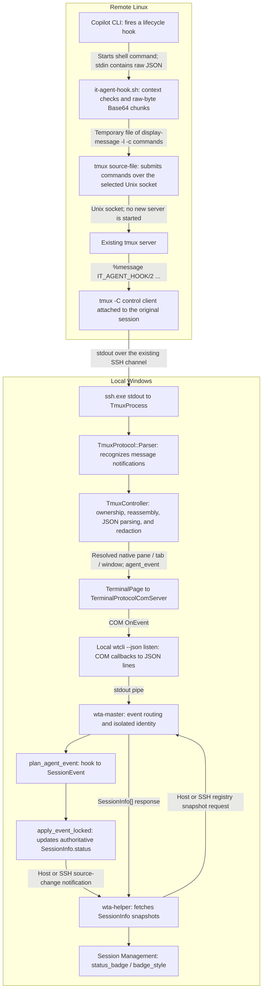
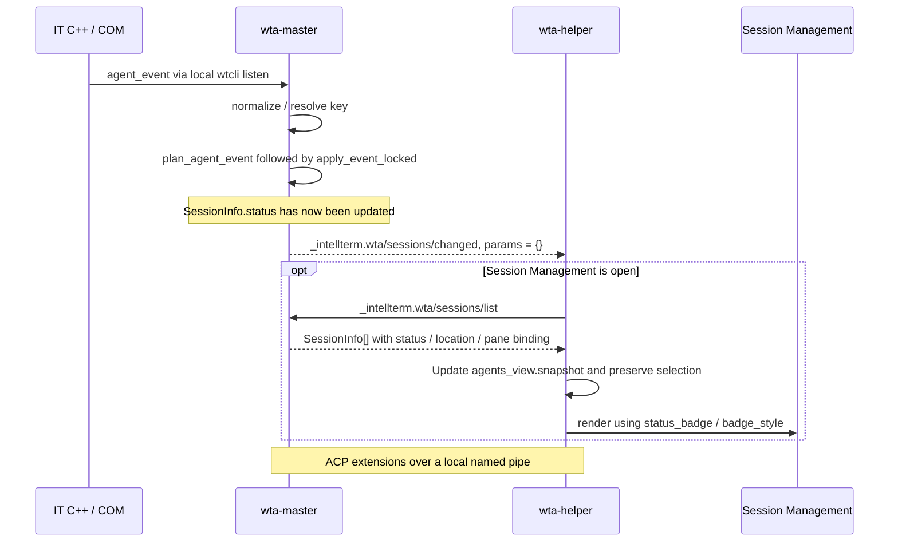

# Remote tmux Agent Hooks: From Linux Copilot to Session Management

## 1. Scope and Responsibilities

This document describes the current `IT_AGENT_HOOK/2` implementation, using
Copilot CLI on Linux as an example. It explains how hook events travel to IT,
where status is computed, and how Session Management displays it.
The same transport supports Claude, Codex, Gemini, and OpenCode; see the
[remote hook setup guide](../../tools/wta/wt-agent-hooks/tmux/README.md)
for CLI-specific event configuration.

For agent CLIs in ordinary managed SSH shells, see
[ordinary SSH agent hooks](ordinary-ssh-agent-hooks.md). That path uses a
background v3 control channel and the existing SSH source registry; the
pane-scoped v2 path described here remains supported.

**The C++/COM/`wtcli listen` diagrams below describe v2 only.** V3's background
control stream is owned and processed directly by master; it does not publish
these COM hook events. See the ordinary SSH specification for the routing
rationale and the distinction between event listeners and state snapshots.

Responsibilities are divided as follows:

| Layer | Responsible for | Not responsible for |
|---|---|---|
| Linux shell hook | Checking tmux context, framing, chunking, and forwarding raw stdin | JSON parsing, redaction, or status computation |
| IT C++ on Windows | Receiving control-mode notifications, validating ownership, reassembling, parsing, redacting, and resolving native identity | Directly updating Session Management status from a hook |
| Local `wta-master` | Interpreting events, applying state transitions, and maintaining the authoritative session registry | Inferring status from remote screen content or LLM output |
| Local `wta-helper` | Fetching master snapshots, filtering rows, and rendering Session Management | Forwarding the same COM hook back to master |

This is neither a remote ACP session connection nor a remote history scan.
The remote machine does not need `wtcli`, WTA, Python, or `jq`; the sender
uses a POSIX shell and standard Linux utilities. It requires tmux 3.4 or newer
and an IT control client attached to the target session. The Windows side
still uses local `wtcli` to connect to IT's COM event service.

The local `wta-master` must be running, with Session Management rendered by
`wta-helper`. Managed tmux windows currently do not create local assistant
panes. Their sessions are visible from the ordinary Host-source Session
Management view when the backend is opaque or non-SSH. Supported direct SSH
backends instead join that target's Linux/SSH Session Management list, alongside
ordinary SSH sessions and remote history.

## 2. End-to-End Flow



The diagram uses SSH to illustrate cross-host transport. IT accepts an opaque
backend commandline; it does not detect SSH or extract remote login details.
For example:

```powershell
wtcli tmux "ssh.exe build-host tmux -C attach-session -t work"
```

The control-mode connection started by this command carries subsequent hook
messages. **Hooks do not establish a new SSH connection per event or write
their payload into an ordinary pane's display output.** WSL backends can use
the same mechanism without the cross-host SSH hop.

## 3. Transport and Processing at Each Step

### 3.1 Copilot Fires a Hook and Supplies JSON to the Shell

The remote hook configuration maps Copilot's native events to the shared
event vocabulary. For example, `UserPromptSubmit` invokes:

```sh
sh "$HOME/.local/lib/intelligent-terminal/it-agent-hook.sh" \
  --cli-source copilot --event agent.prompt.submit
```

Copilot writes the original hook JSON to that command's stdin, for example:

```json
{
  "session_id": "sid",
  "cwd": "/home/user/repo",
  "prompt": "Explain the failing test"
}
```

The event type comes from the configured `--event` argument, and the CLI
source comes from `--cli-source`. The shell does not infer the event from JSON
or read members such as `session_id` and `prompt`. Consequently, malformed
JSON can complete transport but will be rejected at IT's JSON boundary.

### 3.2 The Shell Validates Context and Selects the Original Session's Control Clients

Implementation: [it-agent-hook.sh](../../tools/wta/wt-agent-hooks/tmux/it-agent-hook.sh).

The script checks the following in order:

1. `TMUX` and `TMUX_PANE` are present, `WTA_TMUX_HOOKS_DISABLED` is not set
   to a nonempty value, and tmux is available.
2. Splitting `TMUX` at its last two commas yields the server PID, original
   session number, and socket path, preserving commas within the path.
   `TMUX_PANE` must have the form `%<digits>`.
3. The socket exists and tmux is version 3.4 or newer.
4. `list-panes -s -t <session>` confirms that the pane still belongs to the
   original session.
5. `list-clients -t <session>` selects only clients with
   `client_control_mode == 1` and a matching `session_id`.

Every tmux invocation explicitly uses `-N -S <socket>` to connect to an
existing server rather than start a new one. A window linked into another
session does not cause a broadcast to that other session. If a pane has moved
out of its original session, the script does not guess its new owner.

Missing tmux, an unsupported version, execution outside tmux, stale session or
pane membership, and no attached control client are successful no-ops.
Unexpected failures write fixed diagnostics to stderr. Stdout remains empty
and the final exit code is 0, so optional status reporting does not reject
Copilot's work.

### 3.3 The Shell Encodes, Chunks, and Submits the Raw Bytes

The script uses a private temporary directory for the raw bytes, Base64 data,
and command file, sets `umask 077`, and cleans up on exit. Raw stdin is limited
to 1 MiB; reading one extra byte detects overflow. **The sender does not
truncate JSON and then forward the truncated body.**

Each group of 4,500 raw bytes produces at most 6,000 Base64 characters.
The script creates a transfer ID for each invocation and writes one command
per chunk and target control client:

```text
display-message -l -c '<client>' 'IT_AGENT_HOOK/2 ...'
```

One `tmux source-file <commands>` invocation asks the server to execute the
command file. Arguments are restricted to validated tokens or Base64
characters; the original payload is never executed as shell or tmux syntax.
`-l` disables tmux format expansion, so content such as `#{...}`, percent
signs, and quotes retains its original meaning.

The worker has a 3.2-second overall `timeout`. Stdin reading and individual
tmux invocations each have a 1-second limit, with additional time reserved for
termination and cleanup. The sender is not a persistent remote daemon.

### 3.4 The tmux Server Sends Notifications Through Existing Control Clients

When targeting a control client, `display-message -l -c <client>` produces a
`%message` notification. The complete line format is:

```text
%message IT_AGENT_HOOK/2 <session> <pane> <source> <event> <transfer> <index> <count> <data>
```

For example, this single-chunk payload decodes to `{"session_id":"sid"}`:

```text
%message IT_AGENT_HOOK/2 $0 %1 copilot agent.stop transfer-id 0 1 eyJzZXNzaW9uX2lkIjoic2lkIn0=
```

| Field | Meaning |
|---|---|
| `session` / `pane` | tmux `$<id>` / `%<id>`, not the Copilot session ID |
| `source` / `event` | Supported CLI ID and shared hook event name |
| `transfer` | Correlation token for this transfer, not an authentication credential or agent session ID |
| `index` / `count` | Zero-based chunk index and total chunk count, up to 234 chunks |
| `data` | Standard Base64, at most 6,000 characters; non-final chunks must contain exactly 6,000 characters without padding |

Fields are separated by single ASCII spaces. Empty stdin uses `index=0`,
`count=1`, and empty data, preserving the separator before the data field.
tmux generates the `%message` prefix; the shell hook does not print it.

`tmux -C` selects control mode for a client; **`display-message -C` is not a
broadcast switch**. Ordinary status-line messages, user options, and
`wait-for` do not automatically replace this payload transport.

### 3.5 Windows C++ Receives, Reassembles, and Resolves Native Ownership

[TmuxProcess.cpp](../../src/cascadia/TerminalApp/TmuxProcess.cpp) reads backend
stdout. The incremental parser in
[TmuxProtocol.h](../../src/cascadia/TerminalApp/TmuxProtocol.h) recognizes
`Event::Kind::Notification` with `name == "message"`.

[TmuxController.cpp](../../src/cascadia/TerminalApp/TmuxController.cpp)
dispatches `IT_AGENT_HOOK/` messages to `_agentHook()` on the UI thread:

1. `ParseAgentHookChunk()` validates the version, fields, size, and Base64
   chunk format.
2. The controller verifies ownership against its attached session and pane
   inventory.
3. `AgentHookAssembler::Append()` reassembles by transfer ID. Incomplete
   transfers do not produce agent events.
4. Once complete, Base64 decoding restores the original bytes.
5. The controller obtains the local connection GUID from the corresponding
   `TermControl`, finds the native tab through the complete backend layout,
   and obtains the native window ID from `TerminalPage`.
6. `BuildAgentHookParams()` processes the JSON and constructs publishable
   event parameters.

Using the complete backend layout rather than only the visible pane tree
allows status from zoom-hidden panes to reach the correct tab. Remote
payload data cannot select the local pane, tab, or window.

Reassembly limits are defined in
[TmuxAgentHook.h](../../src/cascadia/TerminalApp/TmuxAgentHook.h):

| Limit | Current value or behavior |
|---|---|
| Individual hook message | At most 8 KiB, excluding the outer `%message ` prefix |
| Complete raw payload | At most 1 MiB |
| Pending transfers | At most 16 per controller |
| Pending encoded data | At most 4 MiB in aggregate per controller |
| Chunk consistency | Session, pane, source, event, and count must match; indices must be consecutive |
| Lifetime | 10 seconds from the first chunk; subsequent parsable hooks trigger expiry cleanup, not an independent timer |
| Context changes | Changing the attached session or stopping the controller clears pending transfers |

Ordinary non-hook messages are ignored, and the old v1 format is no longer
accepted. Oversized, missing, duplicate, or inconsistent chunks do not
produce partially successful status updates. Optional hook parsing failures
produce diagnostics rather than failing the terminal transport.

### 3.6 IT Parses and Redacts JSON, Then Publishes a Local `agent_event`

`NormalizeAgentHookPayload()` validates the complete payload's UTF-8 and
JSON, rejecting raw NUL bytes, duplicate JSON keys, trailing content, invalid
structure, and invalid or conflicting session IDs. Empty stdin, whitespace,
JSON `null`, and an empty object may follow the empty-metadata path.

Only consumer-used metadata is retained, such as `cwd`, tool names,
notification information, error reasons, and agent session IDs. `tool_input`
retains only the text subfields read by the consumer. The code then reuses
`BuildAgentHookEventJson()` in
[wtcli_functions.h](../../src/tools/wtcli/wtcli_functions.h) to restrict
user-input tool arguments and apply the existing redaction and size controls.
The complete published event remains subject to an 8 KiB budget.

The published structure looks like this, with all native identities supplied
by IT:

```json
{
  "type": "event",
  "method": "agent_event",
  "params": {
    "event": "agent.prompt.submit",
    "cli_source": "copilot",
    "agent_session_id": "sid",
    "pane_id": "aaaaaaaa-bbbb-cccc-dddd-eeeeeeeeeeee",
    "tab_id": "native-tab-id",
    "window_id": "2",
    "payload": {
      "session_id": "sid",
      "cwd": "/home/user/repo"
    },
    "tmux": {
      "session_id": "$0",
      "pane_id": "%1",
      "session_name": "work",
      "socket_path": "/tmp/tmux-1000/default"
    }
  }
}
```

The original `prompt` does not appear in this example's local broadcast.
Note the distinction: `session_id` inside the payload is the Copilot ID,
whereas `params.tmux.session_id` identifies the tmux session.

`TerminalPage::_RaiseProtocolEvent()` publishes JSON through
`ProtocolVtSequenceReceived`. Reusing this event channel's name **does not
mean that a VT/OSC sequence is injected into the terminal**.
[TerminalProtocolComServer.cpp](../../src/cascadia/WindowsTerminal/TerminalProtocolComServer.cpp)
enqueues the event into each COM subscriber's bounded queue.

### 3.7 Local `wtcli listen` Delivers COM Events to `wta-master`

The master's
[CliChannel::start_reader()](../../tools/wta/src/shell/wt_channel/cli_channel.rs)
starts local `wtcli --json listen` to subscribe to COM.
[wtcli's EventSink](../../src/tools/wtcli/main.cpp) writes each callback's
JSON as a line to stdout and flushes it. The Rust reader parses that line
and delivers it to the master's event loop.

The call chain in [master/mod.rs](../../tools/wta/src/master/mod.rs) is:

```text
handle_master_wt_event()
  -> handle_master_agent_event()
  -> tmux_hooks::normalize()
  -> ssh_sessions::tmux_hook_event() for controller-resolved SSH targets
     or resolve_master_hook_key() for opaque/non-SSH backends
  -> plan_agent_event()
  -> source registry.apply_event()
  -> session_registry::apply_event_locked()
```

## 4. Session Identity and Status Computation

### 4.1 Session Identity Ownership

[tmux_hooks.rs](../../tools/wta/src/tmux_hooks.rs) validates optional
`params.tmux.ssh_target` metadata supplied by the native controller. This is
not copied from remote hook JSON. A direct SSH backend such as
`ssh.exe -T -o BatchMode=yes wsl-ubuntu tmux -C a -t test-s` joins the existing
`wsl-ubuntu` SSH source registry, keyed by destination/alias, user, explicit port,
and provider. The raw agent session ID merges with remote history, preserving
the native pane binding and live status during later title refreshes.

The supported launch subset uses direct `ssh`/`ssh.exe`, `-p`/`-l`, `-t`/`-T`,
`--`, and optional `-o BatchMode=yes|no`, followed by a direct tmux command.
Literal POSIX quoting from the SSH tmux session browser is supported, including
quoted session IDs such as `'$42'` and escaped quotes in session names.
Shell wrappers, unquoted expressions, and other configuration overrides do not establish
an SSH source suitable for resume; they retain isolated tmux tracking with a diagnostic
for unrepresentable direct SSH commands. Use the same SSH source spelling as
the viewing profile; host-alias equivalence is not inferred.

For opaque or non-SSH backends, normalization retains an isolated identity:

```text
registry key = tmux namespace
            + native pane GUID
            + CLI source
            + original Copilot session ID
```

The actual key uses length-prefixed encoding to avoid ambiguity when IDs
contain colons, Unicode, or other special text. The tmux socket, session,
and pane metadata is retained in `SessionLocation::Tmux`. Different native
panes or CLIs do not share a registry key even if their original IDs match.
An event without an original session ID can only use an existing live tmux
binding for the same native pane and provider. It cannot fall back to
another recently active session. If no matching binding exists, master does
not create an authoritative session row.

Master and helper ignore Copilot `sidekick-*` IDs before namespace conversion.
If multiple IT control clients map the same backend to different native
panes, cross-frontend deduplication is not guaranteed. The isolation scope
is the local native pane, not a global remote-session identity.

### 4.2 Where Status Is Actually Updated

[app.rs::plan_agent_event()](../../tools/wta/src/app.rs) is a pure event
interpreter. It translates an external hook into internal `SessionEvent`
values without modifying the registry itself.

**[session_registry.rs::apply_event_locked()](../../tools/wta/src/session_registry.rs)
is where `SessionInfo.status` is updated in the master's authoritative
registry.** It also maintains pane bindings, `current_tool`,
`attention_reason`, `last_error`, and the last-activity timestamp.

The current Copilot subscriptions map as follows:

| Copilot hook | Transport event | Internal `SessionEvent` | Status and display |
|---|---|---|---|
| `SessionStart` | `agent.session.start` | `SessionStarted` | New row becomes `Idle`; existing Working/Attention/Idle is preserved |
| `UserPromptSubmit` | `agent.prompt.submit` | `ToolStarting("prompt")` | `Working`, shown as green Active |
| `Notification` | `agent.notification` | `Notification` | `Attention`, shown as yellow waiting for input |
| `Stop` | `agent.stop` | `ToolCompleted` | `Working` / `Attention` becomes `Idle` |
| `StopFailure` | `agent.error` | `ConnectionFailed` | `Error`, shown in red |
| `SessionEnd` | `agent.session.end` | `SessionStopped` | The remote shell session becomes `Ended` and loses its pane binding |

The transition rules are more than unconditional status assignments:

- `Stop` ends a turn, not the CLI process, and does not directly clear `Error`.
- `notification_type == "idle_prompt"` is ignored so an idle reminder does
  not produce Attention.
- A late `SessionStart` preserves existing Working / Attention. Only new or
  revived sessions receive a new baseline.
- An activity event with a usable ID can synthesize `SessionStarted` for an
  unknown session before applying activity. An unknown session's `SessionEnd`
  does not fabricate an Ended row.
- Late tool or notification events do not resurrect Ended/Historical rows.
- The current Copilot configuration has no per-tool subscriptions. Prompt
  submission drives Working, and the turn-level Stop drives Idle. Other
  providers can use `agent.tool.starting`, with user-input tools additionally
  producing Attention.

Hooks are the status source; no LLM inference, terminal screen scraping, or
remote file watcher is needed. Master marks hook ownership so the local
fallback watcher does not overwrite activity supplied by real hooks.

## 5. How Session Management Refreshes

After modifying the registry, master notifies helpers that data changed
rather than pushing complete rows:



Relevant implementation:

| Stage | Implementation |
|---|---|
| Master sends a change notification | `handle_master_agent_event()` calls `broadcast_ext_to_helpers()` |
| Protocol names and snapshot format | [session_registry.rs](../../tools/wta/src/session_registry.rs) |
| Helper receives ACP extension notifications | [protocol/acp/client.rs](../../tools/wta/src/protocol/acp/client.rs) |
| Notification triggers a refetch | `AppEvent::SessionsChanged` in [app_events.rs](../../tools/wta/src/app_events.rs) |
| Request coalescing, snapshot loading, and selection preservation | `schedule_agents_refetch_for_tab()` and `handle_agents_snapshot_loaded()` in [app.rs](../../tools/wta/src/app.rs) |
| List filtering and rendering | [ui/agents_view.rs](../../tools/wta/src/ui/agents_view.rs) |

Opening the view triggers a fetch. Open views refresh on change notifications,
with periodic refresh as a fallback. Further refreshes are coalesced while
a request is in flight instead of fetching a full list concurrently for each
hook. Normal Session Management uses master snapshots; it does not consume
raw Linux JSON directly.

Helpers can also observe the same event through their own COM subscriptions.
They ignore SSH-backed tmux hooks locally and render the shared SSH snapshot;
for opaque backends they only maintain local pane/session binding mirrors. They do not
report the hook again. Multiple helpers observing an event therefore do not
cause master to apply that COM event repeatedly. This is not an end-to-end
exactly-once or replay-deduplication guarantee.

The final `status_badge()` / `badge_style()` mapping is:

| Registry status | Badge | Color |
|---|---|---|
| `Working` | Localized Active | Green |
| `Attention` | Localized waiting for input | Yellow |
| `Error` | Localized Error | Red |
| `Idle` | Localized Idle | Soft white |
| `Ended` / `Historical` | No live badge | Default |

SSH-backed tmux rows appear only in the matching Linux/SSH source view, with
their live status and native pane binding on the same row as remote history.
They share ordinary SSH title refresh and resume: Enter focuses a live native
pane, or launches the remote CLI over ordinary SSH for an ended conversation.
This does not restore the old tmux layout.

Opaque/non-SSH tmux rows remain in the default Host-source view and can display
a suffix such as `· copilot · work %1 (tmux)`. They remain isolated from explicit
WSL/SSH views and do not launch a local CLI resume on Windows. Both kinds of live
row focus the stored native pane; leave zoom mode before focusing a hidden pane.
The controller publishes pane-close notifications before removing backend panes
or stopping, including zoom-hidden panes, so shared SSH bindings cannot remain
live after their native focus target disappears.

## 6. A Typical Copilot Interaction

```text
SessionStart
  -> agent.session.start -> SessionStarted -> Idle

The user submits a prompt
  -> agent.prompt.submit -> ToolStarting("prompt") -> Working / Active

Copilot needs permission or user input
  -> agent.notification -> Notification -> Attention / waiting for input

Copilot emits Stop for the current turn
  -> agent.stop -> ToolCompleted -> Idle

Copilot exits and emits SessionEnd
  -> agent.session.end -> SessionStopped -> Ended, clearing the pane binding
```

This is an event-driven illustration, not a guarantee that every CLI emits
every event on every run. The user's answer is not a separately subscribed
event in this configuration; the next valid hook determines the subsequent
state.

## 7. Reliability, Security, and Troubleshooting Boundaries

- **Prerequisites belong to the hook's execution environment.** Installing tmux
  on the host is insufficient if a confined CLI cannot execute it or access
  its socket. The tested Copilot Snap can read the managed hook script but
  has neither tmux nor visibility of the host's default tmux socket. Plugin
  registration can therefore succeed while every hook silently no-ops at the
  transport prerequisite gate. Installation readiness must account for the
  actual CLI runtime, not just its plugin list or the login shell's environment.
- **No end-to-end ACK or replay.** A shell exit code of 0 prevents rejection
  of the CLI's work; it does not mean IT/WTA applied the state. Disconnected
  control clients do not receive historical hook messages.
- **UI refresh does not query remote Copilot.** `sessions/list` retrieves
  master's existing data. It neither repairs missing remote lifecycle events
  nor scans remote session files.
- **Reassembly never emits partial status.** Incomplete transfers may remain
  in memory within the count, size, and lifetime limits. Subsequent hooks
  trigger 10-second expiry cleanup; no per-second cleanup runs without new
  hooks.
- **Local event queues also apply backpressure.** The controller limits
  pending UI work. COM subscribers use bounded queues, so slow consumers
  can lose older events.
- **Raw payloads are not redacted on the tmux side.** The server and other
  control clients attached to the same session can read original prompts,
  tool data, and other content. Base64 is transport encoding, not
  confidentiality protection. Redaction occurs before IT publishes to local
  COM subscribers.
- **Hooks are not authorization credentials.** Processes with access to the
  tmux socket can spoof status. Session/pane checks and native GUID mapping
  provide reliable routing, not proof of agent identity or user approval.
- Remote launches already tracked through ACP or another path should set
  `WTA_TMUX_HOOKS_DISABLED` to avoid duplicate reporting. OpenCode also
  recognizes `OPENCODE_CLIENT=acp`.

Troubleshoot each boundary in order: the shell's `it-agent-hook:` stderr;
whether the control stream contains v2 `%message` lines; C++ rejection of
chunks, ownership, or JSON; master's `master_wt_event` log; delivery of
`sessions/changed` and a fresh snapshot; and UI source, CLI, or search filters.
Master's `processed COM agent hook` entry records `final_status`, which helps
confirm that the state reached the registry.

## 8. Related Files and Verification Entry Points

| Area | Files |
|---|---|
| Linux sending, installation, removal, and timeout behavior | [tmux hook README](../../tools/wta/wt-agent-hooks/tmux/README.md), [it-agent-hook.sh](../../tools/wta/wt-agent-hooks/tmux/it-agent-hook.sh) |
| Real tmux transport verification | [Test-TmuxAgentHook.ps1](../../tools/wta/wt-agent-hooks/tmux/Test-TmuxAgentHook.ps1), [test-tmux-hooks.sh](../../tools/wta/wt-agent-hooks/tmux/test-tmux-hooks.sh) |
| v2 chunk parsing, reassembly, and JSON normalization | [TmuxAgentHook.h](../../src/cascadia/TerminalApp/TmuxAgentHook.h) |
| Native session/pane/tab routing | [TmuxController.cpp](../../src/cascadia/TerminalApp/TmuxController.cpp) |
| Raw-capture interoperability with the native parser | `ConsumesCapturedShellMessages` in [TmuxAgentHookTests.cpp](../../src/cascadia/ut_app/TmuxAgentHookTests.cpp) |
| XAML pane/tab routing verification | `TmuxAgentHooksUseOwningPaneAndTab` in [TabTests.cpp](../../src/cascadia/LocalTests_TerminalApp/TabTests.cpp) |
| Master/helper identity boundary | [tmux_hooks.rs](../../tools/wta/src/tmux_hooks.rs) |
| Master status updates | [master/mod.rs](../../tools/wta/src/master/mod.rs), [session_registry.rs](../../tools/wta/src/session_registry.rs) |
| Event interpretation and UI snapshot coordination | [app.rs](../../tools/wta/src/app.rs) |
| Session Management rendering | [ui/agents_view.rs](../../tools/wta/src/ui/agents_view.rs) |
| Packaging | [CascadiaPackage.wapproj](../../src/cascadia/CascadiaPackage/CascadiaPackage.wapproj), which includes only the remote runtime script |

Real tmux transport tests cover raw-byte preservation, cross-session
isolation, concurrent transfers, the 1 MiB boundary, overflow, and cleanup.
Native tests cover reassembly, JSON validation, redaction, and real captured
traffic. These do not constitute full end-to-end verification of the native
XAML interface. The XAML routing case compiles, but its execution environment
still has a TAEF UAP host failure while initializing local RPC authentication
(`0x8007000E`).

A separate real run with the official non-Snap Linux Copilot CLI 1.0.85
confirmed delivery from an actual Copilot conversation in tmux to the deployed
IT event stream and master registry. The observed order was prompt submission,
session start, turn stop, and session end; master recorded Working, Working,
Idle, and Ended respectively. This confirms the runtime event/state path,
including preservation of Working across a late session start, rather than
claiming complete visual UI coverage. The confined Snap runtime limitation
described above remains a separate transport prerequisite.

For additional context, see the
[tmux frontend documentation](../wtcli-commands.md#native-tmux-control-windows),
[security model](../security-model.md), and
[local hook/fallback tracking](hybrid-agent-session-tracking.md).
